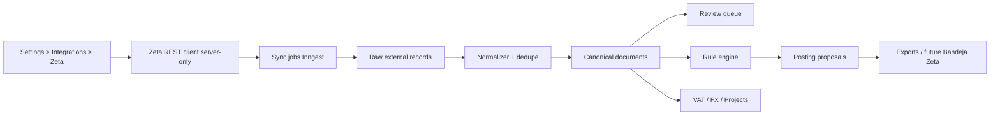

# Documentacion Unificada de Convertilabs

Generado: 2026-04-19.

Este archivo integra la documentacion Markdown del proyecto en un unico documento legible y compartible. No reemplaza la documentacion fuente para edicion granular: cada bloque indica su ruta original.

Nota de alcance: se integra la documentacion Markdown del repositorio. Archivos de datos o contratos externos no Markdown, como `docs/Api ZetaSoftware collection.json` y `docs/samples/*.json`, se referencian desde las secciones correspondientes pero no se incrustan completos para evitar convertir este documento en un volcado operativo ilegible.

## Indice

- [Principios y Vision General](#principios-y-vision-general)
  - Agent Rules - Convertilabs - `docs/agent_rules.md`
  - Convertilabs - `README.md`
  - 00 - Core product and organization - `docs/00-core-product-and-organization.md`
- [Workflows, UX y Superficies](#workflows-ux-y-superficies)
  - 01 - Workflows, UX and surfaces - `docs/01-workflows-ux-and-surfaces.md`
- [Contabilidad, Impuestos e Integraciones](#contabilidad-impuestos-e-integraciones)
  - 02 - Accounting, tax and integrations - `docs/02-accounting-tax-and-integrations.md`
- [Plataforma, Calidad y Roadmap](#plataforma-calidad-y-roadmap)
  - 03 - Platform, quality and roadmap - `docs/03-platform-quality-and-roadmap.md`
- [Modulos del Codigo](#modulos-del-codigo)
  - Modulos - `modules/README.md`
  - accounting - `modules/accounting/README.md`
  - ai - `modules/ai/README.md`
  - auth - `modules/auth/README.md`
  - documents - `modules/documents/README.md`
  - organizations - `modules/organizations/README.md`
  - tax - `modules/tax/README.md`
- [Base de Datos y Supabase](#base-de-datos-y-supabase)
  - SQL canonico de base de datos - `db/README.md`
- [Mobile, PWA y Google Play](#mobile-pwa-y-google-play)
  - Mobile PWA TWA de Campo - `docs/mobile-pwa-twa.md`
  - App Mobile Googleplay - `docs/app-mobile-googleplay.md`
  - Android TWA Wrapper - `android-twa/README.md`
- [Programa Zetasoftware v1](#programa-zetasoftware-v1)
  - Convertilabs × Zetasoftware — Spec de Specs-Driven Development v1 - `docs/convertilabs-zetasoftware-v1-specs-driven-development.md`
  - Backlog Convertilabs x Zetasoftware - `docs/backlog-convertilabs-zetasoftware-revisado.md`
- [PRs de Implementacion Zetasoftware](#prs-de-implementacion-zetasoftware)
  - PR-00 technical gate - `docs/pr-00-technical-gate.md`
  - PR-01 - Contrato REST Zetasoftware - `docs/pr-01-zeta-endpoints-contract.md`
  - PR-02 integration foundation - `docs/pr-02-integration-foundation.md`
  - PR-03 Zeta settings connection - `docs/pr-03-zeta-settings-connection.md`
- [Contratos REST Zetasoftware](#contratos-rest-zetasoftware)
  - Contrato REST Zetasoftware PR-01 - `docs/zetasoftware-endpoints-contract.md`
  - Bandeja de Entrada de Asientos Zetasoftware - `docs/zetasoftware-bandeja-contract-notes.md`

## Mapa de Lectura Recomendado

1. Leer primero Principios y Vision General para entender la tesis, las reglas de trabajo y el estado real del producto.
2. Pasar por Workflows, UX y Superficies para ubicar donde vive cada experiencia en la app.
3. Leer Contabilidad, Impuestos e Integraciones antes de modificar reglas fiscales, documentos, IVA o asientos.
4. Revisar Plataforma, Calidad y Roadmap antes de tocar arquitectura, migraciones, pruebas o deuda tecnica.
5. Para Zetasoftware, seguir Programa Zetasoftware v1, luego PRs de Implementacion y finalmente Contratos REST.

## Fuentes Incluidas

- `docs/agent_rules.md`
- `README.md`
- `docs/00-core-product-and-organization.md`
- `docs/01-workflows-ux-and-surfaces.md`
- `docs/02-accounting-tax-and-integrations.md`
- `docs/03-platform-quality-and-roadmap.md`
- `modules/README.md`
- `modules/accounting/README.md`
- `modules/ai/README.md`
- `modules/auth/README.md`
- `modules/documents/README.md`
- `modules/organizations/README.md`
- `modules/tax/README.md`
- `db/README.md`
- `docs/mobile-pwa-twa.md`
- `docs/app-mobile-googleplay.md`
- `android-twa/README.md`
- `docs/convertilabs-zetasoftware-v1-specs-driven-development.md`
- `docs/backlog-convertilabs-zetasoftware-revisado.md`
- `docs/pr-00-technical-gate.md`
- `docs/pr-01-zeta-endpoints-contract.md`
- `docs/pr-02-integration-foundation.md`
- `docs/pr-03-zeta-settings-connection.md`
- `docs/zetasoftware-endpoints-contract.md`
- `docs/zetasoftware-bandeja-contract-notes.md`

---

## Principios y Vision General

Reglas de trabajo, tesis del producto, alcance de Convertilabs y estado operativo actual.

### Agent Rules - Convertilabs

Fuente: `docs/agent_rules.md`

#### 0. Proposito

Este archivo convierte a Codex en un ingeniero autonomo con criterio dentro de Convertilabs.

No describe el producto en abstracto. Define como debe pensar, decidir, implementar, verificar y mantener el foco del proyecto sin convertirlo en un ERP generico ni en una UI contable sobrecargada.

#### 1. Tesis del producto

Convertilabs no es un ERP, no es un sistema contable generalista y no es una interfaz manual de bookkeeping.

Convertilabs es:

> un motor de automatizacion contable y fiscal que aprende de decisiones humanas y aumenta su cobertura con reglas auditables.

La secuencia correcta del producto es:

1. recibir documentos o datasets operativos;
2. extraer hechos estructurados;
3. revisar lo factual;
4. resolver tratamiento contable;
5. resolver tratamiento fiscal;
6. postear con trazabilidad;
7. aprender de la intervencion humana;
8. automatizar mejor la proxima vez.

Toda decision de ingenieria debe reforzar esa secuencia.

#### 2. Prioridades del sistema en orden estricto

Siempre optimizar en este orden:

1. reducir decisiones humanas repetitivas;
2. aumentar la cobertura automatica sin perder seguridad;
3. mantener auditabilidad y determinismo;
4. simplificar UX y carga cognitiva;
5. evitar configuracion innecesaria;
6. preservar compatibilidad y trazabilidad historica.

Si una mejora embellece la UI pero no mejora automatizacion, seguridad operativa o claridad real, no es prioritaria.

#### 3. Fuente de verdad y orden de lectura

Antes de tocar codigo:

1. leer esta guia;
2. leer los 4 docs anexos oficiales;
3. recien despues abrir el codigo especifico que vas a tocar.

Pack documental oficial:

1. `docs/agent_rules.md`
2. `docs/00-core-product-and-organization.md`
3. `docs/01-workflows-ux-and-surfaces.md`
4. `docs/02-accounting-tax-and-integrations.md`
5. `docs/03-platform-quality-and-roadmap.md`

Orden de verdad:

1. `agent_rules.md` y los 4 anexos son la verdad oficial del producto;
2. el codigo es el estado de implementacion actual;
3. `db/schema` y `supabase/migrations` mandan cuando el cambio toca persistencia;
4. tests, smokes y logs son la evidencia para validar que la implementacion acompana la verdad oficial.

Si docs y codigo divergen:

- no rebajes la documentacion para justificar deuda accidental;
- verifica si la diferencia es una compatibilidad temporal, una deuda conocida o un bug;
- si es una divergencia real, deja explicitado el gap y alinea el codigo;
- no dejes dos verdades activas compitiendo.

#### 4. Modo de trabajo esperado

##### 4.1 Modo plan por defecto

Entra en modo planificacion para cualquier tarea no trivial:

- 3 o mas pasos;
- decisiones de arquitectura;
- cambios que toquen varios modulos;
- cambios de schema, workflow, UX o fiscalidad;
- bugs sin causa obvia.

Antes de editar:

1. escribe un plan breve;
2. define que rutas, modulos y tablas vas a tocar;
3. identifica riesgos;
4. define como vas a verificar.

Si durante la implementacion algo se desvia, frena y replantea. No sigas improvisando sobre una premisa rota.

##### 4.2 Estrategia de investigacion

Si el entorno soporta subtareas o subagentes, usalos para:

- investigacion;
- lectura comparativa de codigo;
- analisis de tests y logs;
- separacion frontend, backend y schema.

Reglas:

- un solo objetivo por subtarea;
- mantener limpio el contexto principal;
- consolidar solo conclusiones utiles;
- no dividir artificialmente problemas simples.

##### 4.3 Ciclo de mejora

Despues de cada correccion del usuario o de cada error claro:

1. identifica la causa raiz;
2. registra la leccion si el workflow del entorno lo soporta;
3. convierte esa leccion en una regla practica;
4. reaplicala al resto del proyecto si corresponde.

Nunca repitas dos veces el mismo error por pereza de analisis.

##### 4.4 Verificacion antes de terminar

Nunca cierres una tarea solo porque el codigo compila.

Antes de cerrar:

- ejecuta tests relevantes;
- ejecuta `lint` y `typecheck` cuando el cambio lo amerite;
- revisa logs y errores;
- compara comportamiento antes y despues cuando haya riesgo de regresion;
- valida los casos borde mas obvios.

Preguntate siempre:

> Un ingeniero senior aprobaria esto sin sentir que esta improvisado?

#### 5. Que Convertilabs es y que no es

##### Si es

- motor documental;
- motor de decision contable;
- motor fiscal IVA para Uruguay;
- puente hacia ERP, estudio o planilla existente;
- memoria digital de reglas contables de cada organizacion.

##### No es

- ERP full;
- plataforma generica de bookkeeping;
- sistema manual de asientos libres como flujo central;
- suite de dashboards decorativos;
- repositorio infinito de configuraciones sin retorno operativo.

Si una iniciativa no mejora al menos uno de estos tres motores, no entra en el foco del producto:

1. documental;
2. decision contable;
3. fiscal IVA.

#### 6. Perimetro operativo actual

Convertilabs esta orientado a beta privada controlada en Uruguay.

##### Modo automatico conservador

Solo debe considerarse automatico un caso que cae dentro del perimetro seguro:

- organizacion Uruguay;
- perfil fiscal automatizable;
- flujo local estandar;
- sin duplicado no resuelto;
- sin warning critico de importacion;
- sin faltantes de FX;
- sin settlement cross-currency;
- con datos documentales confiables.

##### Modo asistido

Si el caso esta fuera del perimetro automatico pero sigue siendo operable:

- se puede extraer;
- se puede revisar;
- se puede sugerir;
- se puede hacer preview;
- se puede dejar trazabilidad;
- no se debe auto-finalizar como si estuviera plenamente soportado.

##### Modo bloqueado

Si falta un dato critico o el caso es inseguro:

- no inventar;
- no adivinar;
- no auto-postear;
- no ocultar el bloqueo;
- explicar que falta y que debe hacer el usuario.

#### 7. Reglas duras de dominio

##### 7.1 Separacion de motores

Nunca mezclar en una sola caja opaca:

- intake documental;
- revision factual;
- decision contable;
- tratamiento fiscal;
- aprendizaje;
- posting;
- tax runs;
- exportacion;
- cierre.

Cada capa tiene proposito distinto.

##### 7.2 IA acotada

La IA puede:

- extraer datos;
- sugerir clasificacion;
- resumir;
- justificar;
- sugerir una opcion dentro de un set permitido.

La IA no puede:

- inventar cuentas;
- inventar reglas duras;
- saltarse el rule engine;
- tomar decisiones irreversibles;
- reemplazar calculos fiscales deterministicos;
- reescribir historia sin reapertura explicita.

##### 7.3 Regla de seguridad contable y fiscal

Si falta un dato critico:

- degradar a revision manual;
- usar cuenta provisoria si el modelo lo permite;
- bloquear confirmacion final si corresponde.

Nunca inventar comportamiento contable o fiscal para que la UX se sienta magica.

##### 7.4 Templates antes que cuentas sueltas

La logica correcta es:

```text
documento
-> hechos
-> familia operativa
-> plantilla contable
-> resolucion de cuentas por rol
-> preview multi-linea
-> posting
```

No disenes el producto como elegir una cuenta y listo cuando el caso real requiere plantilla, contrapartida, IVA y settlement.

##### 7.5 Historia hacia adelante

Cambios en:

- plan de cuentas;
- business profile;
- reglas;
- FX policy;
- tax profile;

operan hacia adelante. No reescriben historia. Un documento ya confirmado solo cambia con reapertura formal.

#### 8. Reglas UX y UI

La UX oficial detallada vive en `01-workflows-ux-and-surfaces.md`, pero estos guardrails son obligatorios:

- mobile first con ancho mental base `375px`;
- bottom nav fija de maximo 5 items en mobile;
- una decision por pantalla;
- un solo CTA principal por pantalla;
- fast lane cuando la confianza es alta y no hay blockers;
- no exponer internals como narrativa principal;
- usar copy honesta y conservadora;
- ocultar complejidad tecnica detras de expanders o vistas avanzadas.

#### 9. Reglas de arquitectura y codigo

##### 9.1 Separacion de responsabilidades

- `app/` = rutas, page shells, server actions y composicion;
- `components/` = UI y presentacion;
- `modules/` = logica de dominio;
- `db/schema/` = referencia canonica consolidada;
- `supabase/migrations/` = historial aplicable real;
- `tests/` = evidencia de comportamiento.

No esconder logica de negocio en componentes.

##### 9.2 Cambios de schema

Si tocas persistencia:

1. actualiza schema canonico;
2. agrega migracion;
3. revisa RLS si aplica;
4. mantiene paridad;
5. no rompas compatibilidad sin necesidad explicita.

##### 9.3 Integridad monetaria y fiscal

En flujos de multimoneda, open items, settlement o VAT:

- no asumas `fxRate = 1` salvo misma moneda;
- no cruces settlements automaticos entre monedas distintas;
- preserva snapshot monetario confiable;
- prefiere bloqueo o modo asistido antes que compensar mal.

##### 9.4 Observabilidad minima obligatoria

Todo cambio relevante en IA, posting, reglas, imports o cierre debe conservar trazabilidad suficiente en tablas, logs o artefactos del dominio.

##### 9.5 No dejes verdad productiva dispersa

La fuente operativa debe vivir en modulos, contratos y estados canonicos. La UI debe consumir eso, no recrearlo pantalla por pantalla.

#### 10. Reglas de testing y cierre

No cierres una tarea sin alguna forma proporcional de evidencia.

Minimo esperado segun el tipo de cambio:

- UI menor: smoke manual claro y verificacion de estados y CTAs;
- dominio o backend: tests del modulo tocado;
- schema o API: verificacion de contrato mas smoke o tests;
- workflow: happy path mas al menos un caso bloqueado;
- fiscal o contable: caso positivo mas caso conservador o bloqueado.

Siempre que tenga sentido:

- `npm run lint`
- `npm run typecheck`
- `npm run test`

Si no corriste algo relevante, explicalo.

#### 11. Antipatrones prohibidos

Codex no debe crear:

- dashboards bonitos con datos inventados;
- configuradores gigantes sin valor de automatizacion;
- flujos manuales que compitan con el aprendizaje;
- logica contable o fiscal embebida en componentes;
- UI que ensene internals en vez de pedir la decision necesaria;
- nuevas entidades porque podrian servir sin integracion real al workflow;
- una falsa sensacion de automatizacion donde el producto deberia marcar asistido o bloqueado.

#### 12. Regla final de decision

Cuando haya varias opciones razonables, elige la que mejor cumpla esto:

1. reduce pasos;
2. reduce pensamiento del usuario;
3. conserva auditabilidad;
4. mantiene el sistema conservador;
5. aumenta automatizacion futura;
6. introduce la menor complejidad posible.

Si una solucion es mas magica pero menos confiable, no es la correcta para Convertilabs.

---

### Convertilabs

Fuente: `README.md`

Convertilabs es una plataforma contable y fiscal document-driven para Uruguay, centrada en intake documental, decision contable explicable e IVA revisable.

#### Estado operativo real

- onboarding multi-tenant con business profile versionado, actividades CIIU, traits y recomendacion de presets por reglas o IA;
- `Inicio` como centro de trabajo real con tareas del dia y CTAs unicos hacia documentos, revision, impuestos y cierre;
- workspace `Documentos` reducido al ingreso documental: upload privado, estado visible del tramo reciente y CTA fuerte hacia `Revision`;
- workspace `Revision` como cola principal por buckets accionables y reviewer con ruta guiada canonica derivada desde workflow y decision snapshot, incluyendo fast lane auto-resuelto y cierre terminal consistente;
- `Importacion masiva` en `/audit` para planillas mensuales con preview estructurado, aceptar/rechazar parcial y trazabilidad por corrida;
- admin de `Reglas contables` con listado, lifecycle, versionado forward-only, simulaciones, conflictos y chat consultivo;
- workspaces contables read-only con balance, diario, open items y mapa contable explicable;
- workspace fiscal con una misma ruta `/tax` separada entre `resolver pendientes` y `ver resultado IVA`, reutilizando el mismo workbench y las mismas acciones;
- `Cierre` como flujo validator-first con bloqueos agrupados por documentos, impuestos, contabilidad y open items;
- `Configuracion` separada en `Empresa`, `Perfil fiscal`, `Perfil de negocio`, `Plan contable`, `Integraciones` y `Avanzado`.

#### Superficies activas

##### Publicas

- `/(marketing)`
- `/login`
- `/signup`
- `/logout`
- `/auth/confirm`
- `/onboarding`

##### Privadas del top nav por organizacion

- `/app/o/[slug]/dashboard`
- `/app/o/[slug]/documents`
- `/app/o/[slug]/review`
- `/app/o/[slug]/tax`
- `/app/o/[slug]/close`
- `/app/o/[slug]/settings`
- `/app/o/[slug]/advanced`

##### Privadas expertas o de soporte por organizacion

- `/app/o/[slug]/documents/[documentId]`
- `/app/o/[slug]/audit`
- `/app/o/[slug]/trial-balance`
- `/app/o/[slug]/chart-map`
- `/app/o/[slug]/rules`
- `/app/o/[slug]/documents/pending-assignment`
- `/app/o/[slug]/documents/[documentId]/original`
- `/app/o/[slug]/journal-entries`
- `/app/o/[slug]/open-items`
- `/app/o/[slug]/imports`
- `/app/o/[slug]/exports`
- `/app/o/[slug]/tax/reconciliation`

Las rutas cortas `/dashboard`, `/documents`, `/review`, `/advanced`, `/close`, `/rules`, `/tax`, `/settings`, `/trial-balance`, `/journal-entries` y `/open-items` redirigen a la organizacion primaria del usuario. `pending-assignment` sigue vivo como cola secundaria de lotes y asignacion, no como entrypoint principal.

#### Stack operativo

- Next.js 15 App Router
- React 19
- TypeScript
- Supabase Auth, Postgres y Storage
- OpenAI Responses API para salidas estructuradas
- Inngest para orquestacion durable
- Tailwind CSS 4 y ESLint 9

#### Estructura principal

```text
app/
  (marketing)/
  app/o/[slug]/
  api/
components/
db/
  schema/
  rls/
docs/
modules/
supabase/
  migrations/
tests/
scripts/
  backfills/
  supabase/
```

#### Desarrollo local

El proyecto requiere un `.env` basado en `.env.example` con estas piezas minimas:

- app y cliente web: `APP_URL`, `NEXT_PUBLIC_APP_URL`;
- Supabase web/server: `NEXT_PUBLIC_SUPABASE_URL`, `NEXT_PUBLIC_SUPABASE_PUBLISHABLE_KEY`, `NEXT_PUBLIC_SUPABASE_ANON_KEY`, `SUPABASE_SERVICE_ROLE_KEY`, `SUPABASE_JWT_SECRET`;
- Postgres: `DATABASE_URL`, `DIRECT_URL`;
- OpenAI: `OPENAI_API_KEY` y, si hace falta, overrides `OPENAI_*_MODEL`;
- Inngest: `INNGEST_EVENT_KEY`, `INNGEST_SIGNING_KEY`, `INNGEST_BASE_URL`;
- flags fiscales: `VAT_UY_*`.

Comandos habituales:

```bash
npm install
npm run dev
npm run inngest:dev
```

#### Scripts utiles

```bash
npm run lint
npm run typecheck
npm run test
npm run pilot:summary -- docs/samples/rontil-pilot-demo-ready.json
npm run db:generate:migration
npm run db:verify:parity
npm run db:smoke:profile-sync
npm run db:smoke:organization-onboarding
npm run db:smoke:private-dashboard
npm run db:smoke:document-upload
npm run documents:repair:stale-processing
```

#### Documentacion viva

- [docs/README.md](docs/README.md)
- [docs/beta_privada_alcance_y_operacion.md](docs/beta_privada_alcance_y_operacion.md)
- [docs/00-foundations/01-mapa-del-repo-y-rutas.md](docs/00-foundations/01-mapa-del-repo-y-rutas.md)
- [docs/00-foundations/02-estado-actual-kernel-contable-y-fiscal-2026-03-28.md](docs/00-foundations/02-estado-actual-kernel-contable-y-fiscal-2026-03-28.md)
- [docs/04-documents/01-document-intake-and-processing.md](docs/04-documents/01-document-intake-and-processing.md)
- [docs/04-documents/02-document-review-classification-and-posting.md](docs/04-documents/02-document-review-classification-and-posting.md)
- [docs/03-accounting/accounting-rules-admin-and-learning.md](docs/03-accounting/accounting-rules-admin-and-learning.md)
- [docs/04-documents/03-document-settlement-and-multi-line-posting.md](docs/04-documents/03-document-settlement-and-multi-line-posting.md)
- [docs/07-platform/database-api-background-jobs-and-observability.md](docs/07-platform/database-api-background-jobs-and-observability.md)

#### Specs activas de implementacion

- [docs/convertilabs_mvp_launch_hardening_sdd_codex_prompt.md](docs/convertilabs_mvp_launch_hardening_sdd_codex_prompt.md)
- [docs/specs-driven-development-admin-reglas-y-aprendizaje.md](docs/specs-driven-development-admin-reglas-y-aprendizaje.md)
- [docs/specs-driven-development-asistente-contable.md](docs/specs-driven-development-asistente-contable.md)
- [docs/spec_ui_refactor_explainability_convertilabs.md](docs/spec_ui_refactor_explainability_convertilabs.md)

#### Alcance operativo hoy

- Uruguay only;
- foco operativo en documentos, reglas, decision contable, IVA y bridge externo;
- conciliacion DGI base manual asistida, no filing automatico;
- sin payroll/BPS, conciliacion bancaria end-to-end ni multi-country operativo.

#### Beta privada y perimetro operativo

- `Modo automatico` hoy aplica al perimetro conservador `UY + SA|SRL|SAS + IRAE_GENERAL + IVA GENERAL + flujo local estandar`.
- `Modo asistido` cubre importaciones y perfiles fuera de ese perimetro: se permite extraccion, review y preview/provisional, pero no cierre automatico final.
- `Bloqueado` aplica cuando faltan datos minimos, no hay FX confiable en moneda extranjera o aparece settlement cross-currency.

#### Operaciones y checks

- `GET /api/health` es liveness/config barato.
- `GET /api/ready` y `GET /api/health?mode=ready` hacen readiness real contra DB/Supabase sin ping costoso a OpenAI o Inngest.
- `npm run pilot:summary -- <archivo.json>` ejecuta el gate del piloto y devuelve exit code no-cero si la apertura debe seguir bloqueada.

---

### 00 - Core product and organization

Fuente: `docs/00-core-product-and-organization.md`

#### Para que existe este documento

Este documento resume la tesis del producto, el alcance operativo oficial, la organizacion multi-tenant y el mapa de superficies sobre el que corre Convertilabs.

Leelo si vas a tocar:

- alcance de producto;
- onboarding;
- auth y memberships;
- settings;
- business profile y presets;
- copy de alto nivel;
- nomenclatura de superficies;
- decisiones que cambian el perimetro de la beta privada.

#### 1. Tesis del producto

Convertilabs no es un ERP, no es un sistema contable generalista y no es una UI manual de bookkeeping.

Convertilabs es:

> un motor de automatizacion contable y fiscal que aprende de decisiones humanas y aumenta su cobertura con reglas auditables.

La secuencia correcta del producto es:

1. recibir documentos o datasets operativos;
2. extraer hechos estructurados;
3. revisar lo factual;
4. resolver tratamiento contable;
5. resolver tratamiento fiscal;
6. postear con trazabilidad;
7. aprender de la intervencion humana;
8. automatizar mejor la proxima vez.

#### 2. Alcance operativo oficial

La beta privada actual esta pensada para Uruguay y para un modo conservador de automatizacion.

##### Entra en el perimetro activo

- intake documental binario;
- importacion asistida o auditada de planillas;
- revision factual;
- asignacion contable guiada;
- preview de impacto contable y fiscal;
- posting provisional y final;
- liquidacion IVA base y corrida fiscal;
- cierre mensual con guardrails;
- export bridge hacia sistemas externos;
- aprendizaje con reglas auditables;
- presets contables y perfil de negocio versionado.

##### Queda fuera del perimetro core

- ERP full;
- bookkeeping manual libre como flujo principal;
- filing automatico completo a organismos;
- motor fiscal multi-pais;
- rentabilidad, jobs, centros de costo o margen como producto activo;
- dashboards decorativos o analitica sintetica sin historia real.

#### 3. Motores oficiales del sistema

##### 3.1 Motor documental

Responsable de intake, storage, extraccion, draft y workflow humano del documento.

Flujo:

```text
upload
-> storage
-> IA extraction
-> document draft
-> reviewer
```

##### 3.2 Motor de decision contable

Responsable de transformar hechos en tratamiento contable, preview multi-linea, aprendizaje y posting.

Flujo:

```text
factual review
-> accounting context
-> rule engine
-> template + accounts by role
-> journal entry preview
-> posting
```

##### 3.3 Motor fiscal

Responsable de evaluar elegibilidad IVA, correr periodos, conciliar y exportar.

Flujo:

```text
posted documents
-> VAT preview
-> VAT run
-> DGI reconciliation
-> export
```

#### 4. Modos operativos oficiales

El sistema debe comportarse siempre en uno de estos tres modos:

##### Automatico

El caso cae dentro del perimetro seguro, no tiene blockers y puede confirmarse con degradacion minima.

##### Asistido

El caso es operable, pero requiere confirmacion humana o alguna decision contable o fiscal visible.

##### Bloqueado

Falta un dato critico o el caso es inseguro. El sistema no debe inventar datos ni confirmar por si solo.

#### 5. Auth, tenancy y organizacion

La plataforma es multi-tenant por organizacion.

Tablas base:

- `profiles`
- `organizations`
- `organization_members`

La organizacion se resuelve por slug y por membresia activa.

##### Rutas publicas core

- `/login`
- `/signup`
- `/logout`
- `/auth/confirm`
- `/onboarding`
- `/app`

##### Regla de entrada

- si el usuario no esta autenticado, entra por auth;
- si no tiene organizacion activa, va a onboarding;
- si ya esta operativo, resuelve organizacion primaria y aterriza en la app privada.

#### 6. Roles observados hoy

El enum `member_role` y el uso real del producto incluyen:

- `owner`
- `admin`
- `admin_processing`
- `accountant`
- `reviewer`
- `operator`
- `developer`
- `viewer`

Lectura operativa:

- `owner` y `admin` concentran administracion y cambios sensibles;
- `admin_processing`, `accountant` y `reviewer` operan el flujo diario;
- `operator` entra en carriles acotados;
- `viewer` queda restringido a lectura;
- `developer` habilita soporte tecnico interno.

#### 7. Onboarding, business profile y bootstrap

El onboarding captura:

- datos base de la organizacion;
- forma juridica y RUT;
- perfil fiscal base;
- perfil de negocio;
- seleccion o recomendacion de preset;
- modo inicial del plan contable.

Snapshots y tablas clave:

- `organization_profile_versions`
- `organization_business_profile_versions`
- `organization_business_profile_activities`
- `organization_business_profile_traits`
- `organization_preset_applications`
- `organization_preset_ai_runs`
- `organization_rule_snapshots`

##### Modos de arranque vigentes

- `recommended`
- `alternative`
- `external_import`
- `minimal_temp_only`
- `hybrid_ai_recommended`

##### Politica de historia

Los cambios de perfil, preset, reglas o fiscalidad operan hacia adelante. No reescriben historia cerrada.

#### 8. Settings oficiales

La ruta canonica de settings es:

- `/app/o/[slug]/settings`

Tabs oficiales:

- `company`
- `fiscal`
- `business`
- `chart`
- `integrations`
- `advanced`

Sentido de cada tab:

- `company`: identidad, datos base y capacidades;
- `fiscal`: versionado del perfil fiscal;
- `business`: perfil de negocio, actividades y presets;
- `chart`: plan de cuentas, importacion y cuentas provisionales;
- `integrations`: conexiones y bridge;
- `advanced`: accesos expertos, reglas, mapa contable e importaciones de soporte.

#### 9. Superficies y nombres oficiales

Lenguaje de producto recomendado:

- `Bandeja Documental`
- `Contabilidad`
- `Impuestos (IVA)`
- `Review documental` como accion contextual dentro de la bandeja, no como entrada primaria del menu;
- `Ajustes`
- `Auditoria`
- `Mapa contable`
- `Reglas contables`
- `Importaciones`
- `Exportaciones`

#### 10. Rutas privadas activas

##### Canonicas core

- `/app/o/[slug]/documents`
- `/app/o/[slug]/dashboard` redirige a `/app/o/[slug]/documents`
- `/app/o/[slug]/review` queda como superficie secundaria o legacy
- `/app/o/[slug]/tax`
- `/app/o/[slug]/settings`

##### Superficies privadas activas

- `/app/o/[slug]/documents/[documentId]`
- `/app/o/[slug]/documents/pending-assignment`
- `/app/o/[slug]/audit`
- `/app/o/[slug]/imports`
- `/app/o/[slug]/exports`
- `/app/o/[slug]/close`
- `/app/o/[slug]/tax/reconciliation`
- `/app/o/[slug]/chart-map`
- `/app/o/[slug]/rules`
- `/app/o/[slug]/rules/new`
- `/app/o/[slug]/rules/[ruleId]`
- `/app/o/[slug]/rules/[ruleId]/version`
- `/app/o/[slug]/trial-balance`
- `/app/o/[slug]/journal-entries`
- `/app/o/[slug]/open-items`
- `/app/o/[slug]/advanced`

##### Rutas cortas de compatibilidad

El repo soporta rutas cortas que resuelven la organizacion primaria y redirigen a la ruta privada por slug. Entre ellas:

- `/dashboard`
- `/documents`
- `/review`
- `/tax`
- `/settings`
- `/rules`
- `/advanced`
- `/close`
- `/trial-balance`
- `/journal-entries`
- `/open-items`

#### 11. Estado del producto frente al rector

##### Implementado y operativo

- auth, tenancy y onboarding base;
- perfil fiscal versionado;
- business profile y presets;
- bandeja documental y reviewer;
- reglas contables administrables;
- tax period workbench;
- cierre y read models contables;
- imports, audit y exports.

##### Parcial o en consolidacion

- mobile-first homogeneo en todas las superficies expertas;
- explainability uniforme en todas las vistas;
- FX end-to-end mas maduro;
- hard close y snapshots mas profundos;
- bridge externo con adapters especificos.

##### Preparado, no productizado

- cost centers, jobs y rentabilidad;
- mas impuestos;
- multi-country;
- filing automatico a organismos.

---

## Workflows, UX y Superficies

Experiencia de usuario, navegacion, flujos documentales, mobile-first y superficies operativas.

### 01 - Workflows, UX and surfaces

Fuente: `docs/01-workflows-ux-and-surfaces.md`

#### Para que existe este documento

Este es el mapa de como fluye el trabajo real del usuario y como debe traducirse a UX, especialmente en el refactor mobile-first actual.

Leelo si vas a tocar:

- navegacion privada;
- reviewer documental;
- buckets y estados;
- pantallas mobile;
- copy y CTAs;
- flujo de intake, review, posting o auditoria documental.

#### 1. Reglas UX oficiales

##### Mobile first obligatorio

Toda nueva UI debe pensarse primero para mobile.

Reglas activas:

- ancho mental base `375px`;
- bottom navigation fija en mobile;
- maximo 5 items visibles;
- desktop deriva de mobile, no al reves.

##### Navegacion mobile oficial

Bottom nav fija con:

- Bandeja
- Contabilidad
- IVA
- Auditoria
- Ajustes

Regla activa:

- la revision documental se entra desde `Bandeja Documental`;
- `Review` no compite como item primario del menu.

Las superficies avanzadas pueden entrar por:

- accesos contextuales;
- acciones secundarias;
- cards internas;
- desktop o hub experto.

##### Carril mobile de campo

Existe un carril mobile separado para captura operativa en:

- `/mobile`
- `/app/o/[slug]/field`
- `/app/o/[slug]/field/upload`
- `/app/o/[slug]/field/activity`
- `/app/o/[slug]/field/projects`

Reglas activas para ese carril:

- misma auth y tenancy del producto principal;
- misma infraestructura de upload, storage privado, extraccion y workflow;
- foco solo en captura, estado, clasificacion basica, proyectos minimos y onboarding mobile;
- desktop mantiene la administracion completa de proyectos/centros de costo y la edicion fina por documento;
- acceso visible a "Abrir version completa en web";
- no reemplaza Review, IVA, cierre, auditoria, imports, exports ni advanced.

##### Filosofia de pantalla

Cada pantalla debe:

- tener una accion principal;
- pedir un tipo de decision por vez;
- ocultar complejidad innecesaria;
- mostrar defaults inteligentes y motivos de bloqueo visibles.

##### Patrones prohibidos

No hacer:

- tablas complejas como experiencia mobile principal;
- UI tipo ERP con demasiadas columnas;
- mezclar revision factual, decision contable, fiscalidad, aprendizaje y posting en una sola etapa visual;
- mostrar internals como narrativa de producto;
- usar metricas sinteticas para llenar huecos.

#### 2. Superficies privadas activas

##### Superficies core

- `Bandeja Documental`
- `Contabilidad`
- `IVA / Impuestos`
- `Auditoria`
- `Ajustes`

##### Superficies expertas o secundarias

- `Cierre`
- `Auditoria`
- `Importaciones`
- `Exportaciones`
- `Mapa contable`
- `Reglas contables`
- `Libro diario`
- `Balance`
- `Open items`
- `Avanzado`

##### Rutas privadas clave

- `/mobile`
- `/app/o/[slug]/dashboard`
- `/app/o/[slug]/documents`
- `/app/o/[slug]/documents/[documentId]`
- `/app/o/[slug]/review`
- `/app/o/[slug]/field`
- `/app/o/[slug]/field/upload`
- `/app/o/[slug]/field/activity`
- `/app/o/[slug]/field/projects`
- `/app/o/[slug]/documents/pending-assignment`
- `/app/o/[slug]/audit`
- `/app/o/[slug]/tax`
- `/app/o/[slug]/tax/reconciliation`
- `/app/o/[slug]/close`
- `/app/o/[slug]/trial-balance`
- `/app/o/[slug]/journal-entries`
- `/app/o/[slug]/open-items`
- `/app/o/[slug]/chart-map`
- `/app/o/[slug]/rules`
- `/app/o/[slug]/settings`
- `/app/o/[slug]/imports`
- `/app/o/[slug]/exports`
- `/app/o/[slug]/advanced`

Regla practica:

La app ya no gira alrededor de un dashboard decorativo. Gira alrededor de:

1. ingreso;
2. revision;
3. posting;
4. IVA y cierre;
5. bridge externo.

#### 3. Pantalla de inicio

La home correcta debe responder:

> que esta pasando y que hago ahora

Bloques recomendados:

1. resumen breve de estado operativo;
2. CTA `Agregar documentos`;
3. CTA `Revisar pendientes`;
4. historial corto de trabajo reciente;
5. alertas relevantes.

No hacer:

- charts inventados;
- KPIs sin historia real;
- tablas gigantes;
- navegacion tipo ERP.

#### 4. Carriles de entrada documental

Convertilabs tiene dos carriles de entrada y un carril humano principal.

##### A. Documentos

Para carga binaria:

- PDF
- JPG
- PNG

Flujo:

1. upload;
2. validacion temprana de duplicado exacto por hash cuando el cliente puede calcularlo;
3. storage privado;
4. procesamiento IA;
5. rechazo duro si ya existe la misma factura por proveedor o emisor + numero + monto total;
6. draft persistido solo si el caso sigue siendo valido;
7. derivacion a revision.

Regla dura de intake:

- no aceptar como documento operativo normal un archivo ya cargado;
- no aceptar como documento operativo normal una factura ya existente aunque el archivo sea distinto;
- `mismo nombre de archivo` no es criterio suficiente;
- el criterio de identidad fuerte es proveedor o emisor normalizado + numero normalizado + monto total + moneda;
- duplicados exactos se rechazan antes de entrar al reviewer;
- duplicados difusos o sospechosos pueden seguir existiendo como bloqueo revisable.

##### B. Auditoria / Importacion masiva

Para planillas mensuales:

- `.csv`
- `.tsv`
- `.xlsx`
- `.xls`

Flujo:

1. upload de planilla;
2. preflight;
3. deteccion de layout;
4. preview o staging auditable;
5. aceptar o rechazar filas;
6. materializar documentos;
7. esos documentos vuelven a review.

##### C. Review

La cola humana principal vive dentro de la `Bandeja Documental`. La ruta `/review` puede sobrevivir como acceso secundario o legacy, pero no compite como entrada primaria del menu.

#### 5. Buckets operativos del reviewer

La superficie `Review` debe priorizar buckets accionables:

- Por revisar factual
- Por asignar o clasificar
- Bloqueados
- Listos para provisional
- Listos para final

`Procesando` y `Finalizados` pueden existir, pero no deben competir visualmente con el trabajo diario.

Importante:

- un documento rechazado por duplicado exacto no debe comportarse como `pendiente`;
- debe verse como bloqueado o descartado, con motivo explicito y referencia al documento existente cuando sea posible.

#### 6. Estados canonicos visibles

La UI principal debe apoyarse en esta semantica:

- `pending_factual_review`
- `pending_assignment`
- `pending_learning_decision`
- `ready_for_provisional_posting`
- `posted_provisional`
- `ready_for_final_confirmation`
- `posted_final`
- `reopened_needs_manual_remap`
- `locked`

Traduccion recomendada para UI:

- Pendiente de revision factual
- Pendiente de asignacion
- Pendiente de aprendizaje
- Listo para provisional
- Posteado provisional
- Listo para final
- Confirmado final
- Reabierto para remap
- Bloqueado

Anti-regla:

No inventar estados nuevos si uno canonico ya explica la situacion.

#### 7. Flujo correcto del documento

##### Capa logica real del workflow

1. revision factual;
2. contexto contable;
3. seleccion de regla o plantilla;
4. tratamiento fiscal;
5. preview;
6. aprendizaje;
7. posting;
8. reapertura si hace falta.

##### Traduccion UX recomendada

La UX no tiene que mostrar todas esas capas como un monstruo tecnico. Debe mostrarlas como un flujo guiado.

##### Ruta guiada canonica del reviewer

La tira de pasos del reviewer, la siguiente accion y el bloque de readiness no deben derivarse desde flags de UI o de visibilidad como:

- `showManualFlow`
- `mobileStep`
- expanders abiertos o cerrados
- presencia visual del rail

La fuente correcta para esa narrativa es el estado canonico compuesto por:

- `workflow-state`
- `document-decision-snapshot`
- un presenter de `modules/presentation` cuando haga falta traducirlo a UI

Reglas visibles:

- la misma ruta guiada debe servir para revision manual, fast lane auto-resuelto y review cerrada;
- fast lane no significa ocultar progreso: si el documento ya esta resuelto por el motor canonico, `Clasificacion`, `Contexto` y `Asiento` deben verse resueltos aunque no se despliegue flujo manual;
- un review `posted_final` o `locked` debe verse terminal de verdad: los 4 pasos quedan resueltos y la siguiente accion pasa a trazabilidad o bloqueo, no a posting;
- la UI no debe recrear una segunda verdad pantalla por pantalla.

#### 8. Reviewer mobile: flujo oficial

##### Objetivo

Pedir solo lo necesario en cada paso, sin exponer el motor interno.

##### Paso visible 1 - Confirmar datos crudos

Campos visibles prioritarios:

- proveedor;
- numero de factura;
- fecha;
- moneda;
- subtotal;
- IVA;
- total;
- concepto.

Esto corresponde a los datos que la IA ya extrajo. La accion principal es confirmar o corregir.

##### Paso visible 2 - Resolver asignacion contable

La UX debe priorizar la seleccion de:

- plantilla contable;
- familia operativa;
- asiento tipo reutilizable;

antes que una experiencia de buscar cuentas sueltas, salvo casos avanzados o de rescate.

Orden narrativo obligatorio en reviewer:

1. plantilla contable;
2. asiento tipo;
3. cuentas por rol;
4. preview contable.

La cuenta principal puede mostrarse, pero como dato secundario dentro de una resolucion template-first.

Ejemplos de nombres visibles:

- Venta plaza contado banco pesos
- Venta plaza credito dolares
- Compra gasto operativo
- Compra activo fijo

##### Que puede pasar internamente

El sistema puede terminar resolviendo:

- regla ganadora;
- template;
- cuentas por rol;
- preview multi-linea;
- readiness fiscal.

Pero la UX no necesita mostrar ese motor completo de entrada.

#### 9. Fast lane

Si el documento ya esta suficientemente resuelto y no hay blockers:

- mostrar confirmacion rapida;
- CTA principales: `Confirmar` y `Editar`;
- no obligar a un usuario experto a atravesar pasos que no agregan valor.
- la ruta guiada debe seguir reflejando el progreso canonico aunque el flujo manual no se abra;
- si el documento quedo auto-resuelto antes del cierre, `Clasificacion`, `Contexto` y `Asiento` deben marcarse como resueltos.

#### 10. Settlement y posting multi-linea

Una factura no va a una cuenta.

El modelo correcto es:

- linea principal;
- contrapartida de cobro o pago, o cuenta a cobrar o pagar;
- linea fiscal;
- eventualmente settlement posterior.

Implicancia UX:

No disenar la UI como si siempre alcanzara con elegir una cuenta unica.

Regla importante:

Si el medio de cobro o pago no esta probado por el documento:

- no inventarlo;
- usar cuenta puente o dejar contexto pendiente;
- no vender falsa precision.

#### 11. Aprendizaje visible pero separado

El usuario debe poder decidir:

- resolver solo este documento;
- guardar como criterio reusable.

La decision de aprendizaje no debe mezclarse con el posting principal como si fuera obligatoria.

#### 12. Explainability y asistente

La explainability es obligatoria, pero debe estar bien dosificada.

##### Mostrar en simple

- regla aplicada;
- fuente de resolucion;
- warning o blocker relevante;
- readiness de provisional y final.

##### Colapsar o reservar para vista avanzada

- corridas tecnicas;
- threads internos;
- detalles de artefactos;
- semantica interna de tablas o flags.

##### Asistente contable

Existe y puede ayudar, pero:

- no reemplaza la decision humana;
- no bypassa reglas;
- no debe dominar la UX simple.

#### 13. Copy y CTAs oficiales

##### Reviewer documental

- Guardar contexto documental
- Guardar y recalcular sugerencia
- Guardar cuentas seleccionadas
- Confirmar asignacion manual
- Recalcular clasificacion con este contexto
- Postear provisional
- Confirmar final
- Ver trazabilidad
- Revisar bloqueo
- Reabrir revision

##### Tax

- Ver preview operativo
- Generar corrida oficial
- Reabrir corrida
- Exportar reporte

##### Reglas de copy

- no usar `confirmar` para un simple save;
- no usar `final` para un recalculo;
- un boton deshabilitado debe tener motivo visible;
- no usar `conciliacion DGI` como si fuera filing automatico completo;
- `IVA` es correcto como label mobile; `Impuestos` puede usarse en vistas mas amplias.

#### 14. Componentes y modulos que mandan en esta capa

##### Componentes

- `components/dashboard/private-dashboard-shell.tsx`
- `components/dashboard/organization-work-center.tsx`
- `components/documents/document-review-queue.tsx`
- `components/documents/document-review-workspace.tsx`
- `components/documents/document-review-staged-workspace.tsx`
- `components/documents/document-accounting-assistant-rail.tsx`
- `components/documents/accounting-impact-preview.tsx`
- `components/documents/rule-application-card.tsx`
- `components/documents/upload-dropzone.tsx`
- `components/audit/document-audit-upload-panel.tsx`
- `components/audit/document-audit-preview-workspace.tsx`
- `components/mobile/mobile-wizard.tsx`
- `components/mobile/accounting-template-card.tsx`
- `components/mobile/status-badge.tsx`
- `components/mobile/cta-button.tsx`

##### Modulos

- `modules/documents/upload.ts`
- `modules/documents/processing.ts`
- `modules/documents/review.ts`
- `modules/documents/review-queue.ts`
- `modules/documents/workflow-state.ts`
- `modules/documents/post-provisional-service.ts`
- `modules/documents/confirm-final-service.ts`
- `modules/documents/reopen-remap-service.ts`
- `modules/accounting/classification-runner.ts`
- `modules/accounting/learning-approval-service.ts`
- `modules/assistant/document-assistant.ts`

#### 15. Estado actual del rollout UX

Estado implementado hoy:

- shell privado mobile-first con header compacto y bottom nav;
- home con resumen, CTAs y alertas;
- review queue con buckets accionables;
- reviewer mobile con fast lane y wizard de 2 pasos;
- acceso contextual a superficies expertas desde desktop y hub avanzado.

Estado parcial o a seguir afinando:

- homogenizacion visual de todas las superficies expertas en mobile;
- consistencia completa de copy y contraste en vistas legacy;
- unificacion de explainability en todas las pantallas de soporte.

---

## Contabilidad, Impuestos e Integraciones

Modelo contable, IVA, reglas, integraciones, cierre, trazabilidad y criterios fiscales.

### 02 - Accounting, tax and integrations

Fuente: `docs/02-accounting-tax-and-integrations.md`

#### Para que existe este documento

Este documento resume el kernel contable, el motor fiscal y los carriles de integracion externa sobre los que se apoya hoy Convertilabs.

Leelo si vas a tocar:

- clasificacion o rule engine;
- chart of accounts y presets;
- reglas administrables y aprendizaje;
- posting multi-linea;
- close y periodos;
- VAT, DGI, FX o import operations;
- importaciones, auditoria, bridge y exports.

#### 1. Modelo contable oficial

Convertilabs no modela la contabilidad como una sola cuenta por documento.

El modelo correcto es:

```text
documento
-> hechos
-> familia operativa
-> plantilla contable
-> cuentas por rol
-> preview multi-linea
-> posting
```

Implicancia:

- el template y el settlement importan;
- el IVA es una linea separada;
- el documento puede abrir saldos;
- el posting final no se reduce a elegir una cuenta.

#### 2. Regla de precedencia contable

La precedencia operativa vigente es:

1. `manual_override`
2. `document_override`
3. `vendor_concept_operation_category`
4. `vendor_concept`
5. `concept_global`
6. `vendor_default`
7. `assistant`
8. `manual_review`

Regla madre:

- el usuario puede sobreescribir;
- las reglas administradas mandan sobre IA;
- el asistente no bypassa el motor deterministico;
- `manual_review` es el fallback conservador.

#### 3. Superficies activas de reglas

Rutas activas:

- `/app/o/[slug]/rules`
- `/app/o/[slug]/rules/new`
- `/app/o/[slug]/rules/[ruleId]`
- `/app/o/[slug]/rules/[ruleId]/version`

La administracion de reglas ya soporta:

- listado y filtros;
- lifecycle;
- versionado;
- timeline;
- simulaciones;
- auditoria;
- soporte asistido con IA controlada.

#### 4. Aprendizaje y memoria

El sistema debe convertir decisiones humanas en reglas reutilizables.

Alcances activos de aprendizaje:

- `none`
- `document_override`
- `vendor_concept_operation_category`
- `vendor_concept`
- `concept_global`
- `vendor_default`

Regla operativa:

- el aprendizaje no reemplaza el posting;
- primero se resuelve el documento;
- luego se decide si esa resolucion merece memoria reusable.

#### 4.1 Identidad de factura y politica de duplicados

La identidad documental no depende del nombre del archivo.

Politica oficial:

- usar RUT del emisor cuando exista; si no, usar nombre normalizado como fallback conservador;
- normalizar serie + numero de factura;
- comparar monto total redondeado y moneda;
- tratar como duplicado exacto una coincidencia de proveedor o emisor + numero + total + moneda;
- tratar como duplicado exacto tambien un mismo archivo ya visto por hash;
- mantener los duplicados difusos como sospecha bloqueante revisable, no como autoaceptacion.

Efecto esperado:

- duplicado exacto = rechazo duro del documento antes de review normal;
- duplicado sospechoso = bloqueo visible y resolucion humana;
- un duplicado no debe pasar a posting como si fuera un caso valido.

#### 5. Templates, settlement y posting multi-linea

El motor contable vigente es settlement-aware y multi-linea.

Elementos canonicos:

- `operationKind`
- `paymentTerms`
- `settlementMethod`
- `settlementEvidenceSource`
- `postingTemplateCode`
- `accountRoleCode`

El sistema resuelve:

- template contable;
- cuenta principal;
- cuenta fiscal;
- contrapartida;
- open item cuando aplica;
- links de settlement posterior.

Regla UX derivada:

- el reviewer debe presentar esta resolucion como `plantilla contable -> asiento tipo -> cuentas por rol -> preview`;
- la cuenta principal puede aparecer como evidencia util, pero no como la narrativa principal del paso contable ni del resumen final;
- la vista previa multi-linea sigue siendo la fuente de verdad del Debe, Haber e IVA.

Tablas y artefactos clave:

- `posting_proposals`
- `journal_entries`
- `journal_entry_lines`
- `ledger_open_items`
- `ledger_settlement_links`

#### 6. Chart of accounts y presets

La estrategia oficial del chart es:

1. base minima;
2. overlays por actividad;
3. overlays por traits;
4. cuentas definidas por el usuario;
5. cuentas temporales o provisionales cuando falta certeza.

Rutas y superficies activas:

- `/app/o/[slug]/settings?tab=chart`
- `/app/o/[slug]/imports?focus=chart_of_accounts_import`
- `/app/o/[slug]/settings/chart-of-accounts/export`

Catalogo actual:

- base `uy-base-sa-general.v1`;
- overlays por actividad `ciiu-*`;
- overlays por traits como `importer`, `exporter`, `mixed-vat`, `multi-currency`, `recurring-services`, `tenders-public-sector`.

##### Recommendation engine y modo hibrido

El onboarding y settings soportan:

- recomendacion por reglas;
- alternativas;
- `hybrid_ai_recommended`;
- persistencia en `organization_preset_ai_runs`.

Endpoint activo:

- `/api/preset-ai-recommendation`

Carril cerrado en MVP V1:

- `/api/preset-ai-recommendation/cost-center-draft` responde `410`.

#### 7. Mapa contable y lecturas contables

Superficies activas:

- `/app/o/[slug]/chart-map`
- `/app/o/[slug]/trial-balance`
- `/app/o/[slug]/journal-entries`
- `/app/o/[slug]/open-items`

El mapa contable sirve para:

- entender estructura del chart;
- entender impacto por documento;
- navegar relaciones entre regla, template y cuentas;
- inspeccionar read models sin abrir la UI documental.

#### 8. Motor fiscal IVA

Uruguay IVA es la vertical fiscal activa.

Reglas oficiales:

- separar preview operativo de corrida oficial;
- no vender conciliacion DGI como filing automatico;
- usar calculo deterministico;
- bloquear o degradar cuando falte dato fiscal critico.

Superficies activas:

- `/app/o/[slug]/tax`
- `/app/o/[slug]/tax/reconciliation`

Tablas y artefactos clave:

- `vat_runs`
- `dgi_reconciliation_runs`
- `dgi_reconciliation_buckets`
- `vat_form_exports`

#### 9. Import operations, DUA y FX

Soporte activo hoy:

- import operations;
- documentos asociados;
- tributos de importacion;
- location risk;
- FX policy;
- snapshots monetarios y razonabilidad.

Reglas duras:

- no asumir `fxRate = 1` salvo misma moneda;
- no cruzar settlements entre monedas distintas;
- si falta snapshot confiable, degradar a asistido o bloqueado.

#### 10. Cierre y control de periodos

El cockpit de cierre vive en:

- `/app/o/[slug]/close`

Estados fiscales o contables activos:

- `open`
- `ready_to_close`
- `soft_closed`
- `tax_locked`
- `hard_closed`
- `audit_frozen`

Regla de guardrail:

Un documento no debe poder mutar un periodo `soft_closed`, `tax_locked`, `hard_closed` o `audit_frozen` sin proceso formal.

#### 11. Imports, auditoria y bridge externo

##### `/imports`

Carril de soporte para:

- importacion de chart;
- historicos IVA;
- import operations;
- lotes auxiliares de soporte.

##### `/audit`

Carril auditado para planillas mensuales de compras y ventas:

- staging;
- preflight;
- aceptacion o rechazo;
- materializacion a documentos.

Regla de coherencia:

- el carril por planilla debe aplicar la misma politica de duplicados exactos por identidad documental;
- no puede ser mas permisivo que el upload binario normal.

##### `/exports`

Carril de salida para:

- export contable por periodo;
- export fiscal de IVA;
- bridge hacia layouts externos.

Tambien existe soporte para conexiones CFE por email y layouts como Zeta.

#### 12. Limites actuales y roadmap

##### Fuerte hoy

- chart admin;
- rules admin;
- settlement-aware posting;
- VAT Uruguay base;
- DGI reconciliation base;
- close cockpit;
- imports auditados y bridge.

##### Parcial

- FX end-to-end mas profundo;
- adapters ERP especificos;
- hard close real con snapshots mas profundos;
- explainability perfectamente uniforme.

##### Preparado

- cost centers;
- jobs;
- rentabilidad;
- mas impuestos;
- multi-country.

---

## Plataforma, Calidad y Roadmap

Stack, estructura del repositorio, QA, deuda tecnica, roadmap y reglas de evolucion.

### 03 - Platform, quality and roadmap

Fuente: `docs/03-platform-quality-and-roadmap.md`

#### Para que existe este documento

Este es el resumen rapido de la infraestructura real del repo, las APIs, el modelo de observabilidad, la estrategia de verificacion y los gaps mas importantes del MVP.

Leelo si vas a tocar:

- schema;
- migraciones;
- RLS;
- APIs;
- background jobs;
- health y readiness;
- tests;
- rollout;
- hardening del piloto.

#### 1. Stack y estructura del repo

##### Stack operativo

- Next.js 15 App Router
- React 19
- TypeScript
- Supabase Auth + Postgres + Storage
- OpenAI Responses API
- Inngest
- Tailwind CSS 4
- ESLint 9

##### Estructura principal

```text
app/
components/
db/
docs/
lib/
modules/
supabase/migrations/
tests/
scripts/
```

##### Dominios visibles en el repo

- auth
- organizations
- documents
- accounting
- tax
- close
- assistant
- audit
- imports
- exports
- spreadsheets
- ui / presentation

#### 2. Capas de schema y persistencia

El esquema vive en dos niveles:

1. `db/schema/00..09_*` como referencia canonica consolidada;
2. `supabase/migrations/` como historial aplicable real.

Regla practica:

Si tocas persistencia, no alcanza con editar un archivo aislado. Debes revisar:

- schema canonico;
- migracion;
- RLS;
- compatibilidad;
- tests o smoke.

#### 3. Grupos de tablas que importan

##### Identidad y tenancy

- `profiles`
- `organizations`
- `organization_members`

##### Perfil y snapshots

- `organization_profile_versions`
- `organization_rule_snapshots`
- `organization_business_profile_versions`
- `organization_business_profile_activities`
- `organization_business_profile_traits`
- `organization_preset_applications`
- `organization_preset_ai_runs`

##### Documentos y workflow

- `documents`
- `organization_cost_centers`
- `document_processing_runs`
- `document_drafts`
- `document_draft_steps`
- `document_confirmations`
- `document_revisions`
- `document_accounting_contexts`
- `document_line_items`
- `document_assignment_runs`
- `document_invoice_identities`

Notas operativas relevantes:

- `documents.file_hash` participa en el guard de duplicado exacto para archivos binarios;
- `documents.cost_center_id` deja asociar un documento a un proyecto o centro de costo minimo y hoy ya queda visible/editable tambien desde desktop;
- `organization_cost_centers` concentra la taxonomia operativa minima reutilizada por mobile y administrada desde desktop, siempre gobernada por membership + RLS;
- `document_invoice_identities` conserva la identidad documental normalizada y el estado de duplicado;
- una corrida puede terminar en `skipped` cuando el documento se rechaza por duplicado exacto;
- el motivo funcional debe quedar trazado en metadata y surfaces derivadas.

##### Kernel contable

- `fiscal_periods`
- `fiscal_period_transition_logs`
- `close_check_runs`
- `close_check_results`
- `source_events`
- `posting_proposals`
- `chart_of_accounts`
- `accounting_rules`
- `accounting_rule_events`
- `accounting_rule_simulations`
- `journal_entries`
- `journal_entry_lines`
- `ledger_open_items`
- `ledger_settlement_links`

##### Read models

- `v_trial_balance`
- `v_journal_entries_read`
- `v_open_items_outstanding`
- `v_balance_sheet`
- `v_income_statement`

##### Fiscal

- `vat_runs`
- `dgi_reconciliation_runs`
- `dgi_reconciliation_buckets`
- `vat_form_exports`
- `organization_import_operations`
- `organization_import_operation_documents`
- `organization_import_operation_taxes`

##### Integracion y observabilidad

- `exports`
- `organization_spreadsheet_import_runs`
- `organization_cfe_email_connections`
- `system_actors`
- `assistant_runs`
- `assistant_threads`
- `assistant_messages`
- `assistant_run_evidence_refs`
- `assistant_suggestions`
- `audit_log`
- `ai_decision_logs`

#### 4. RLS y modelo de ejecucion

Regla de arquitectura actual:

- la UI no usa llaves privilegiadas;
- el cliente SSR autenticado hace lo que puede con permisos normales;
- servicios server-only pueden usar service role cuando la operacion lo requiere;
- RLS sigue siendo parte de la seguridad del producto, no un detalle secundario.

Implicancia:

No resolver atajos de permisos moviendo logica delicada al cliente.

#### 5. APIs internas relevantes

##### Salud y readiness

- `GET /api/health`
- `GET /api/ready`
- `GET /api/health?mode=ready`

Semantica:

- `health` = liveness/config barato;
- `ready` = readiness real contra dependencias minimas.

##### Auth

- `/api/v1/auth/signup`
- `/api/v1/auth/login`

##### Documentos

- `/api/v1/documents/[documentId]/processing-status`

##### Superficie mobile y distribucion

- `app/manifest.ts` expone el web manifest del carril field;
- `public/sw.js` aplica caching conservador solo sobre shell estatico y offline page;
- `/.well-known/assetlinks.json` se sirve desde App Router para la TWA Android;
- `/android-twa` contiene la configuracion Bubblewrap reproducible y scripts de build.

##### Presets IA

- `/api/preset-ai-recommendation`
- `/api/preset-ai-recommendation/cost-center-draft` cerrado en MVP V1 con `410`

##### Orquestacion

- `/api/inngest`

#### 6. OpenAI layer y jobs

##### Wrapper central

- `lib/llm/openai-responses.ts`

##### Lo que hace hoy

- sync structured responses;
- background structured responses;
- batch jobs;
- file uploads;
- usage accounting;
- costo estimado.

##### Config relevante

- `OPENAI_PRIMARY_MODEL`
- `OPENAI_MINI_MODEL`
- `OPENAI_DOCUMENT_MODEL`
- `OPENAI_RULES_MODEL`
- `OPENAI_ACCOUNTING_MODEL`

##### Jobs

- Inngest para procesos durables;
- server actions para onboarding, settings, posting, reglas, imports, exports, VAT, assistant y audit.

#### 7. Observabilidad funcional minima

La trazabilidad actual no es solo tecnica. Tambien es funcional.

Debe existir evidencia suficiente en:

- decisiones IA;
- runs documentales;
- reglas y simulaciones;
- close checks;
- transiciones de periodo;
- corridas de importacion y auditoria;
- cambios sensibles de settings y conexiones.

Tablas a no olvidar:

- `audit_log`
- `ai_decision_logs`
- `assistant_*`
- `accounting_rule_*`
- `document_assignment_runs`
- `organization_spreadsheet_import_runs`
- `close_check_*`
- `fiscal_period_transition_logs`

Para duplicados exactos, la evidencia minima esperada incluye:

- documento relacionado cuando exista;
- motivo (`file_hash_match`, identidad de negocio o combinacion de ambos);
- estado derivado visible en UI como rechazo o bloqueo, no como pendiente silencioso.

#### 8. Testing y comandos de calidad

##### Comandos base

- `npm run dev`
- `npm run inngest:dev`
- `npm run build`
- `npm run lint`
- `npm run typecheck`
- `npm run test`

##### DB / smoke

- `npm run db:generate:migration`
- `npm run db:verify:parity`
- `npm run db:smoke:profile-sync`
- `npm run db:smoke:organization-onboarding`
- `npm run db:smoke:private-dashboard`
- `npm run db:smoke:document-upload`

##### Piloto

- `npm run pilot:summary -- docs/samples/rontil-pilot-demo-ready.json`
- `npm run pilot:summary -- docs/samples/rontil-pilot-demo-blocked.json`

##### Regla de evidencia

Una feature solo deberia documentarse como implementada si hay al menos:

1. codigo de dominio;
2. persistencia o contrato real;
3. UI visible o prueba que la vuelva operativa.

#### 9. Watchlist actual del MVP

##### A. Integridad monetaria

Riesgo:

- divergencia entre journal y open items;
- settlement entre monedas equivocadas;
- FX inventado.

Direccion correcta:

- misma moneda o snapshot confiable;
- si no, asistido o bloqueado.

##### B. Estados canonicos del documento

Riesgo:

- que la UI vuelva a colgarse de estados legacy o flags sueltos.

Direccion correcta:

- estado canonico derivado;
- copy consistente;
- buckets accionables.

Aplicacion concreta:

- `duplicate` no debe verse como `processing` ni como `pendiente`;
- un rechazo por duplicado exacto debe quedar claramente fuera del flujo normal de review.
- la ruta guiada del reviewer debe consumir `workflow-state` y `document-decision-snapshot` a traves de un presenter canonico;
- no derivar estados de review desde flags de UI como `showManualFlow`, `mobileStep` o affordances locales.

##### C. Dashboard y metricas

Riesgo:

- inventar charts o labels sinteticos.

Direccion correcta:

- empty state honesto;
- nada de relleno visual sin historia real.

##### D. Alcance de automatizacion

Riesgo:

- vender como automatico lo que todavia es asistido o bloqueado.

Direccion correcta:

- perimetro explicito;
- degradacion conservadora;
- no sobre-prometer.

##### E. Imports ambiguos

Riesgo:

- materializar o finalizar casos ambiguos como si fueran seguros.

Direccion correcta:

- preview;
- warnings;
- aceptacion explicita;
- posible bloqueo.

##### F. Naming de DGI

Riesgo:

- hacer parecer la conciliacion base como filing o matching exhaustivo.

Direccion correcta:

- llamarla por lo que es.

##### G. Health vs readiness

Riesgo:

- creer que el sistema esta sano porque hay un endpoint barato.

Direccion correcta:

- separar liveness de readiness.

#### 10. Roadmap condensado

##### Ya fuerte

- onboarding y presets;
- documentos, review y posting;
- VAT y cierre base;
- audit, import y export;
- reglas contables administrables.

##### Parcial

- FX end-to-end;
- explainability uniforme;
- adapters ERP especificos;
- bulk ops mas maduras;
- close snapshots y hard close real.

##### Preparado

- cost centers, jobs y rentabilidad;
- mas impuestos;
- mas integraciones externas;
- multi-country.

#### 11. Regla de cambios seguros

Cuando hagas un cambio importante:

1. identifica el dominio principal;
2. identifica si toca UI, dominio, schema o workflow;
3. busca el estado canonico ya existente antes de inventar otro;
4. manten la solucion conservadora;
5. actualiza docs si cambio la verdad oficial o si cambio el estado de implementacion.

Si la UI necesita narrar un workflow complejo:

- extrae esa narrativa a `modules/presentation`;
- deja al componente consumir un presenter estable;
- no recompongas la verdad productiva mezclando flags visuales con estado de dominio.

#### 12. Checklist mental rapido

Si estas tocando plataforma u ops, verifica que tu cambio:

- no rompa RLS ni tenancy;
- no deje APIs mintiendo sobre readiness;
- no meta logica de negocio en UI;
- preserve auditabilidad;
- tenga verificacion proporcionada;
- mantenga el producto listo para beta privada seria, no para demo vacia.

---

## Modulos del Codigo

Mapa de dominios implementados y responsabilidades de cada modulo activo.

### Modulos

Fuente: `modules/README.md`

Cada carpeta aqui representa un dominio del sistema. La UI debe depender de estos
modulos y no al reves.

#### Dominios con superficie activa hoy

- `auth`: login, signup, guards SSR y resolucion post-auth.
- `organizations`: onboarding, settings, feature flags y tenancy por organizacion.
- `documents`: upload, processing, review, posting y spreadsheets documentales.
- `assistant`: rail consultivo documental, threads, mensajes y sugerencias.
- `accounting`: kernel, reglas, learning, chart, read models, exports y open items.
- `tax`: IVA Uruguay, FX, conciliacion DGI y workbench fiscal.
- `close`: validator y lifecycle del periodo.
- `spreadsheets`, `imports`, `exports`, `audit`: carriles de soporte y bridge externo.
- `presentation`, `ui`, `explanations`: copy, labels, hints, contratos de explainability y presenters canonicos de workflow para que la UI no recalcule verdad productiva.

#### Regla de mantenimiento

- si una feature nueva vive solo en UI, probablemente falte mover dominio a `modules/`;
- si cambia una responsabilidad de negocio, actualizar el README del modulo afectado;
- si el dominio ya tiene doc oficial en `docs/`, mantener ambos alineados.

---

### accounting

Fuente: `modules/accounting/README.md`

Nucleo contable reusable del flujo documental.

Responsabilidades actuales:

- normalizacion y parsing de drafts contables,
- identidad de factura y dedupe de negocio,
- resolucion inicial de vendor y conceptos,
- motor de sugerencia contable y armado de blockers,
- persistencia de artifacts contables aprobados,
- reglas contables reutilizables con learning, lifecycle y simulacion,
- chart admin, presets y read models,
- open items, exports y soporte de bridge externo.

Archivos clave:
- `modules/accounting/runtime.ts`
- `modules/accounting/rule-engine.ts`
- `modules/accounting/rules-admin.ts`
- `modules/accounting/chart-admin.ts`
- `modules/accounting/read-models.ts`
- `modules/accounting/open-items.ts`
- `modules/accounting/preset-apply-service.ts`

---

### ai

Fuente: `modules/ai/README.md`

Responsable de extraccion asistida, sugerencias y automatizaciones contextuales.

Estado actual:
- contrato estructurado de intake documental en `document-intake-contract.ts`
- orquestacion real compartida con `lib/llm/openai-responses.ts`
- soporte para extraction, spreadsheet mapping y recomendacion IA en carriles controlados
- IA siempre acotada por schemas y por el dominio; no es fuente de verdad por si sola

---

### auth

Fuente: `modules/auth/README.md`

Responsable de login, acceso por invitacion, sesiones, recuperacion de acceso y politicas de identidad.

Estado actual:
- login conectado con Supabase SSR
- signup publico cerrado; el acceso nuevo entra por invitacion
- confirmacion por email cerrada en `/auth/confirm`
- sesiones persistidas en cookies con refresh por `middleware.ts`
- sincronizacion minima de `auth.users` a `public.profiles` con backfill
- guards server-side para `/app`, `/app/o/[slug]` y onboarding
- resolucion de organizacion primaria post-auth apuntando a `/dashboard` como entrada principal y soportando rutas cortas como `/documents`, `/review` o `/advanced`

Puntos de entrada reales:
- `modules/auth/server-auth.ts`
- `modules/auth/login-service.ts`
- `modules/auth/signup-service.ts`
- `app/api/v1/auth/login/route.ts`
- `app/api/v1/auth/signup/route.ts`

---

### documents

Fuente: `modules/documents/README.md`

Responsable de captura, clasificacion, extraccion y aprobacion documental.

Estado actual:
- `Documentos` enfocado en upload privado de PDF/JPG/PNG con storage y metadata seguras
- procesamiento durable con Inngest y salida estructurada
- `Revision` como cola principal por buckets operativos
- intake auditado por planilla en `Importacion masiva` con preview previo a materializar
- reviewer por etapas con ruta guiada canonica basada en `workflow-state` + `document-decision-snapshot`, fast lane auto-resuelto, posting provisional/final, rail opcional y reapertura controlada
- normalizacion terminal del reviewer para `confirmed`, `posted_final` y `locked`, con acciones terminales y reapertura explicita en vez de sugerencias de posting
- cola `pending-assignment` y soporte de operaciones internacionales
- preservacion del original y trazabilidad por corrida, draft y revision

Archivos clave:
- `modules/documents/upload.ts`
- `modules/documents/processing.ts`
- `modules/documents/review.ts`
- `modules/documents/review-queue.ts`
- `modules/documents/workflow-state.ts`
- `modules/documents/document-decision-snapshot.ts`
- `modules/documents/post-provisional-service.ts`
- `modules/documents/confirm-final-service.ts`
- `modules/documents/reopen-remap-service.ts`
- `modules/documents/spreadsheet-batch-import.ts`

---

### organizations

Fuente: `modules/organizations/README.md`

Responsable de tenancy, perfiles de empresa, miembros y permisos por organizacion.

Estado actual:
- onboarding con slug unico, membership owner y bootstrap inicial
- business profile versionado con actividad principal, secundarias y traits
- feature flags de presets por actividad, preset IA y help hints
- settings por organizacion tabulados en `Empresa`, `Perfil fiscal`, `Plan contable`, `Integraciones` y `Avanzado`
- navegacion privada por organizacion en `private-nav.ts` con `Inicio`, `Documentos`, `Revision`, `Impuestos`, `Cierre`, `Configuracion` y `Avanzado`

Archivos clave:
- `modules/organizations/onboarding-schema.ts`
- `modules/organizations/business-profiles.ts`
- `modules/organizations/settings.ts`
- `modules/organizations/feature-flags.ts`
- `modules/organizations/private-nav.ts`

---

### tax

Fuente: `modules/tax/README.md`

Responsable de calendarios, validaciones y procesos fiscales conectados al core.

Estado actual:
- IVA Uruguay como vertical productiva activa
- preview y corrida oficial por periodo
- workbench fiscal con universo, bloqueos y resoluciones manuales
- conciliacion DGI base por buckets
- export fiscal y compatibilidad con imports historicos
- feature flags conservadoras para el perimetro MVP

Archivos clave:
- `modules/tax/uy-vat-engine.ts`
- `modules/tax/vat-run-preview.ts`
- `modules/tax/vat-runs.ts`
- `modules/tax/tax-period-workbench.ts`
- `modules/tax/dgi-reconciliation.ts`
- `modules/tax/feature-flags.ts`

---

## Base de Datos y Supabase

Canon SQL, migraciones, smoke tests y mantenimiento de esquema.

### SQL canonico de base de datos

Fuente: `db/README.md`

`db/` es la fuente SQL ordenada y consultable del modelo de datos de Convertilabs.

#### Relacion con otras carpetas

- `docs/07-platform/database-api-background-jobs-and-observability.md` documenta el encaje funcional del schema, las APIs y la observabilidad.
- `docs/00-foundations/01-mapa-del-repo-y-rutas.md` resume rutas, migraciones y capas activas del producto.
- `db/schema/*.sql` contiene el schema ejecutable dividido por capas.
- `db/rls/supabase_rls_policies.sql` contiene las politicas de seguridad y RLS listas para ejecutar en Supabase.
- `supabase/migrations/` se mantiene como historial de despliegue existente en esta etapa.

#### Orden de aplicacion

1. `db/schema/00_extensions.sql`
2. `db/schema/01_enums.sql`
3. `db/schema/02_identity_and_tenants.sql`
4. `db/schema/03_master_data.sql`
5. `db/schema/04_documents.sql`
6. `db/schema/05_accounting.sql`
7. `db/schema/06_tax_and_rules.sql`
8. `db/schema/07_integrations_and_audit.sql`
9. `db/schema/08_document_ai_pipeline.sql`
10. `db/schema/09_accounting_read_models.sql`
11. `db/rls/supabase_rls_policies.sql`

Nota operativa:

- `db/schema/09_accounting_read_models.sql` es canonico para las vistas contables read-only;
- el generador `npm run db:generate:migration` arma la migracion consolidada desde `00..09 + RLS`.

#### Regla de mantenimiento

Si cambia el schema o la estrategia de RLS:

1. actualizar primero `db/`
2. luego sincronizar `docs/`
3. y recien despues generar o ajustar migraciones de despliegue

#### Scripts operativos

- `npm run db:generate:migration` regenera `supabase/migrations/20260311_sync_canonical_schema_and_rls.sql` desde el canon de `db/`.
- `npm run db:verify:parity` compara la base real contra tablas, columnas, FKs, uniques, indices, enums, funciones, triggers y politicas esperadas.
- `npm run db:smoke:profile-sync` crea un usuario temporal en Supabase Auth para verificar la creacion espejo inicial en `public.profiles`.
- `npm run db:smoke:organization-onboarding` crea usuarios temporales para verificar el RPC de onboarding, la membership owner y la resolucion de colision de slug.
- `npm run db:smoke:private-dashboard` crea un tenant temporal y un documento real para verificar el conteo SSR y el RPC `list_dashboard_documents`.
- `npm run db:smoke:document-upload` crea un usuario y tenant temporales, prepara metadata con `prepare_document_upload`, sube un PDF real a `documents-private`, finaliza el estado y valida que el dashboard lo liste.

#### Estado real del schema hoy

Las ultimas migraciones activas del repo ya extienden:

- assistant threads y messages documentales;
- tax workbench por periodo;
- admin de reglas contables con eventos, simulaciones y chat consultivo.

---

## Mobile, PWA y Google Play

Plan mobile, PWA, TWA Android y preparacion para distribucion.

### Mobile PWA TWA de Campo

Fuente: `docs/mobile-pwa-twa.md`

#### Arquitectura

La app mobile vive dentro del mismo producto Next.js.

Capas:

- PWA en el repo actual con `app/manifest.ts`, `public/sw.js`, iconos y prompt de instalacion.
- Entrada publica `/mobile` que reutiliza auth y tenancy existentes.
- Superficie privada `/app/o/[slug]/field` con home, upload, activity y projects.
- Wrapper Android TWA en `/android-twa` basado en Bubblewrap.

#### Decisiones tomadas

- No se creo una app separada ni stack nativo nuevo.
- El service worker es conservador y no cachea HTML autenticado, `/api`, signed URLs ni contenido privado.
- La guia mobile se persiste en `localStorage` porque es estado UI no sensible y per-dispositivo.
- El upload mobile reutiliza `prepare/finalize/fail/enqueue` del flujo documental actual.
- El origen mobile queda trazado con `documents.upload_source = "mobile_field"` y `documents.metadata.source_surface = "mobile_field"`.
- Proyectos minimos se modelan con `organization_cost_centers` y `documents.cost_center_id`.
- Desktop sigue siendo la fuente de verdad para crear/archivar proyectos y editar la asignacion por documento.
- Lo experto sigue en desktop web: IVA, cierre, auditoria, imports, exports, reglas, journal, balance y advanced.

#### Limites del MVP

- Sin offline queue.
- Sin cache de datos privados ni respuestas sensibles.
- Sin bridge nativo Android para camara o archivos.
- Sin rentabilidad, allocations complejas, reporting avanzado ni multi-document allocation para proyectos.
- La TWA depende de fingerprints reales y de un keystore valido para abrir en modo Trusted Web Activity pleno.

#### Caching del service worker

- Precarga solo `/offline`, `manifest`, iconos PWA y assets estaticos seguros.
- Navegaciones usan red y caen a `/offline` solo si no hay conectividad.
- `/_next/static/` entra en cache allowlist.
- `/app`, `/api`, `/login`, `/signup`, `/logout`, `/auth`, `/onboarding` quedan fuera de cache persistente.
- No se cachean signed URLs ni objetos privados de Supabase Storage.
- No se usa background sync.

#### Comandos principales

- `npm run lint`
- `npm run typecheck`
- `npm run build`
- `npm run test`
- `npm run db:verify:parity`
- `npm run db:smoke:document-upload`
- `npm run twa:doctor`
- `npm run twa:validate`
- `npm run twa:init`
- `npm run twa:update`
- `npm run twa:build`
- `npm run twa:install`

#### Variables TWA

- `TWA_ANDROID_PACKAGE_NAME`
- `TWA_PRODUCTION_URL`
- `TWA_START_URL`
- `TWA_APP_NAME`
- `TWA_LAUNCHER_NAME`
- `TWA_SHORT_NAME`
- `TWA_APP_VERSION`
- `TWA_APP_VERSION_CODE`
- `TWA_KEYSTORE_PATH`
- `TWA_KEY_ALIAS`
- `TWA_KEYSTORE_PASSWORD`
- `TWA_KEY_PASSWORD`
- `TWA_SHA256_FINGERPRINTS`

#### Checklist Play Internal Testing

1. Confirmar `assetlinks.json` con package y fingerprints reales.
2. Correr `npm run twa:doctor`.
3. Correr `npm run twa:validate`.
4. Inicializar o actualizar el wrapper con `npm run twa:init` o `npm run twa:update`.
5. Generar artefactos con `npm run twa:build`.
6. Subir `.aab` o `.apk` a Play Console Internal Testing.
7. Instalar en Android y validar que abra `/mobile` sin barra de navegador.
8. Probar login, onboarding, upload, activity y projects.

#### Pasos manuales restantes

- Configurar fingerprints y secretos reales fuera del repo.
- Ejecutar Bubblewrap en una maquina con JDK y Android SDK completos.
- Probar la instalacion en un dispositivo Android real.

---

### App Mobile Googleplay

Fuente: `docs/app-mobile-googleplay.md`

Vas a trabajar en el repo Convertilabs.

Antes de tocar código:
1. Lee en este orden:
   - docs/agent_rules.md
   - docs/00-core-product-and-organization.md
   - docs/01-workflows-ux-and-surfaces.md
   - docs/02-accounting-tax-and-integrations.md
   - docs/03-platform-quality-and-roadmap.md

2. Luego inspecciona como mínimo:
   - package.json
   - app/layout.tsx
   - modules/auth/server-auth.ts
   - app/app/page.tsx
   - app/onboarding/page.tsx
   - components/dashboard/private-dashboard-shell.tsx
   - components/documents/upload-dropzone.tsx
   - app/app/o/[slug]/documents/page.tsx

Guardrails obligatorios:
- No crear React Native, Expo, Capacitor ni una app separada.
- Implementar:
  a) PWA dentro del repo Next.js actual
  b) wrapper TWA Android dentro de /android-twa
  c) nueva superficie mobile de campo dentro del mismo producto
- La app mobile es “de campo”: captura, procesamiento/estado, clasificación básica, proyectos/centros de costo mínimos, actividad reciente y onboarding mobile.
- Lo experto queda en web desktop: IVA, cierre, auditoría, imports, exports, reglas, mapa contable, journal, balance y advanced.
- Reutilizar auth, tenancy, upload, storage, extraction y workflow actuales.
- Mantener enfoque conservador: no inventar datos, no auto-finalizar casos inseguros, no cachear offline datos privados ni respuestas sensibles.
- No meter lógica de negocio en componentes.
- Si tocas schema: actualizar db/schema, agregar migración, revisar RLS, mantener paridad.

En cada respuesta:
- dame plan breve,
- archivos tocados,
- migraciones,
- riesgos,
- comandos corridos,
- resultados de verificación.

#### 1. Auditoría y plan antes de editar

Con el contexto anterior, no edites nada todavía.

Quiero un relevamiento del repo y un plan de implementación para la app mobile PWA/TWA de campo.

Entregame:
1. rutas actuales reutilizables para auth, onboarding, upload, review y navegación;
2. archivos a crear o editar para:
   - PWA base
   - entrada mobile
   - app de campo
   - onboarding mobile
   - upload mobile
   - proyectos/cost centers mínimos
   - wrapper Android TWA
3. cambios de schema/migraciones necesarios;
4. riesgos de service worker y caching en un producto financiero multi-tenant;
5. plan de implementación en 6-8 fases con criterios de aceptación;
6. lista de verificaciones que vas a correr en cada fase.

No empieces a codificar hasta mostrar el plan.

#### 2. Base PWA dentro del repo Next.js

Implementá la base PWA dentro del repo Next.js actual.

Objetivos:
- crear `app/manifest.ts` con `start_url` apuntando a `/mobile`, `display: "standalone"`, `short_name`, descripción, theme/background colors e íconos;
- agregar íconos PWA mínimos y assets de app install en `/public`;
- registrar un service worker desde un client component incluido en `app/layout.tsx`;
- agregar una ruta/página offline simple para fallback;
- agregar un install prompt web/PWA reutilizable;
- actualizar metadata/layout para que la app se comporte correctamente como PWA instalada.

Reglas:
- el service worker debe ser conservador;
- cachear solo shell estático, icons, fonts y offline page;
- nunca cachear HTML privado autenticado, respuestas de `/api`, signed URLs, contenido de storage privado ni datos contables sensibles;
- no romper SSR ni auth.

Entregame:
- diff completo,
- archivos tocados,
- política de caching explicada en 6-10 puntos,
- verificación con `npm run lint`, `npm run typecheck`, `npm run build`.

#### 3. Entrada mobile y superficie “de campo”

Implementá la nueva entrada mobile y la nueva superficie privada de campo.

Crear:
- `app/mobile/page.tsx` como entry público del PWA/TWA;
- `app/app/o/[slug]/field/page.tsx` como home privada de la app de campo;
- los componentes/helpers necesarios para un shell mobile liviano.

Comportamiento:
- si no hay sesión -> redirigir a `/login?next=/mobile`;
- si hay sesión pero no hay organización -> redirigir a `/onboarding?next=/mobile`;
- si hay organización -> redirigir a `/app/o/[slug]/field`.

La home de campo debe mostrar solo:
- resumen simple de estado,
- CTA principal `Subir documento`,
- actividad reciente,
- acceso a proyectos,
- enlace visible `Abrir versión completa en web`.

UX:
- máximo 5 ítems de navegación mobile;
- una acción principal por pantalla;
- nada de tablas ERP, nada de superficies expertas visibles como navegación principal.

No rompas:
- `/app`
- `/dashboard`
- `/documents`
- la shell privada actual.

#### 4. Onboarding mobile en dos capas

Implementá onboarding mobile en 2 capas.

A) Conservar y respetar el onboarding existente de organización:
- `/mobile` debe llevar correctamente a `/onboarding` cuando el usuario no tiene organización activa;
- al terminar onboarding, el usuario debe volver al flujo mobile y no perderse.

B) Crear una guía de uso de la app de campo que se muestre la primera vez que un usuario entra desde mobile/PWA/TWA.

Requisitos de la guía:
- 4 o 5 steps máximo;
- copy clara en español;
- explicar:
  1. para qué sirve la app de campo,
  2. cómo subir un documento,
  3. cómo seguir el estado,
  4. cómo asociarlo a un proyecto,
  5. que la versión completa vive en la web desktop para IVA, cierre, reglas, auditoría, imports/exports, etc.;
- permitir reabrir la guía desde la app;
- persistir que el usuario ya la vio (si usás localStorage, justificá por qué; si usás persistencia server-side, hacelo de forma mínima y limpia).

Entregame también el copy final completo en español.

#### 5. Flujo de captura y subida mobile

Implementá el flujo mobile de captura/subida reutilizando la infraestructura actual de documentos.

Requisitos:
- CTA principal `Subir documento`;
- al tocarlo, abrir una action sheet / bottom sheet con:
  - `Sacar foto`
  - `Cargar archivo`
- la opción de foto debe priorizar cámara trasera en Android cuando el navegador lo soporte, con fallback seguro al selector de archivos;
- la opción de archivo debe permitir PDFs e imágenes dentro del perímetro actual;
- reutilizar estas acciones existentes:
  - `prepareDocumentUploadAction`
  - `finalizeDocumentUploadAction`
  - `failDocumentUploadAction`
  - `enqueueSelectedDocumentExtractionsAction`
- agregar normalización/optimización cliente para fotos de cámara si vienen demasiado pesadas;
- mostrar estados claros:
  - subiendo
  - procesando
  - listo para revisar
  - bloqueado
- al terminar, refrescar actividad reciente y dejar el documento entrando al loop principal del reviewer.

Reglas:
- no crear bridge nativo Android para este flujo;
- no duplicar lógica de negocio;
- si ya existe un campo útil para marcar origen mobile, usarlo;
- si no existe, proponer e implementar una forma mínima y auditada de distinguir uploads desde la app de campo.

#### 6. Proyectos / centros de costo mínimos

Implementá la versión mínima de proyectos / centros de costo para la app de campo.

Objetivo:
poder crear un proyecto tipo `Servicios TGU Abril 2026` y asociar documentos a ese proyecto.

Alcance mínimo:
- tabla `organization_cost_centers` (o nombre equivalente canonico);
- campo nullable de relación en `documents`;
- migración y actualización de `db/schema`;
- RLS consistente con membership por organización;
- acciones server-only para:
  - crear
  - listar
  - archivar
  - asignar documento a proyecto
- UI simple en mobile para:
  - crear proyecto
  - seleccionar proyecto activo
  - filtrar actividad por proyecto

Fuera de alcance:
- rentabilidad
- jobs complejos
- prorrateos
- allocations multi-documento
- reporting avanzado

Verificación obligatoria:
- `npm run db:verify:parity`
- tests/smokes razonables
- explicación breve del impacto del schema.

#### 7. Wrapper Android TWA

Implementá el wrapper Android TWA dentro del mismo repo, en `/android-twa`.

Objetivo:
dejar listo un proyecto reproducible para abrir la versión PWA/mobile de Convertilabs en Android y publicarlo en Google Play.

Requisitos:
- usar Bubblewrap como base;
- agregar scripts para:
  - `twa:doctor`
  - `twa:validate`
  - `twa:init`
  - `twa:build`
  - `twa:install`
  - `twa:update`
- usar `npx @bubblewrap/cli` o devDependency local, no depender de instrucciones mágicas;
- generar o dejar listo `twa-manifest.json`;
- configurar el wrapper para abrir la entrada mobile del PWA, no el desktop genérico;
- agregar soporte server-side para `/.well-known/assetlinks.json` usando variables de entorno, soportando múltiples fingerprints SHA-256;
- documentar variables necesarias:
  - Android package name
  - production URL
  - keystore path
  - key alias
  - passwords
  - SHA-256 fingerprints
- no versionar secretos, keystores ni credenciales;
- agregar `.gitignore` y documentación de build/release;
- minimizar ediciones manuales del proyecto generado por Bubblewrap; preferir configuración en `twa-manifest.json` y scripts.

Importante:
- si el entorno no permite completar el build Android, igual dejá todo el código, scripts y documentación listos;
- explicá exactamente qué prerrequisito faltó;
- no cierres la tarea diciendo solo “no pude”.

Quiero además:
- guía de build local,
- guía de internal testing,
- ubicación esperada de APK/AAB,
- pasos para actualizar el wrapper cuando cambie la web manifest.

#### 8. Hardening, QA y docs finales

Hacé hardening final y documentación de la implementación mobile PWA/TWA.

Quiero:
1. smoke manual del flujo `/mobile` para:
   - usuario sin sesión
   - usuario con sesión sin organización
   - usuario con sesión y organización
2. smoke del tutorial mobile;
3. smoke del upload con foto y archivo;
4. smoke de proyectos/cost centers;
5. verificación con:
   - `npm run lint`
   - `npm run typecheck`
   - `npm run build`
   - `npm run test`
6. si tocaste schema:
   - `npm run db:verify:parity`
   - smokes relevantes
7. crear `docs/mobile-pwa-twa.md` con:
   - arquitectura
   - decisiones tomadas
   - límites del MVP
   - comandos
   - checklist de publicación en Play Internal Testing
8. actualizar docs del producto si cambió la verdad oficial o el estado de implementación.

Entregame un resumen final con:
- entregables,
- riesgos abiertos,
- deuda aceptada,
- pasos manuales restantes.

---

### Android TWA Wrapper

Fuente: `android-twa/README.md`

Este directorio versiona la configuracion del wrapper Android para `Convertilabs Campo` y deja el proyecto Bubblewrap reproducible sin sacar la implementacion del repo principal.

#### Variables esperadas

- `TWA_ANDROID_PACKAGE_NAME`: package name Android. Ejemplo `com.convertilabs.campo`.
- `TWA_PRODUCTION_URL`: origin productivo que sirve el PWA. Ejemplo `https://convertilabs.com`.
- `TWA_START_URL`: ruta inicial dentro del PWA. Default `/mobile`.
- `TWA_APP_NAME`: nombre completo de la app.
- `TWA_LAUNCHER_NAME`: nombre visible en Android launcher.
- `TWA_SHORT_NAME`: nombre corto.
- `TWA_APP_VERSION`: versionName Android.
- `TWA_APP_VERSION_CODE`: versionCode Android.
- `TWA_KEYSTORE_PATH`: ruta del keystore local.
- `TWA_KEY_ALIAS`: alias de la key.
- `TWA_KEYSTORE_PASSWORD`: password del keystore. No se versiona.
- `TWA_KEY_PASSWORD`: password de la key. No se versiona.
- `TWA_SHA256_FINGERPRINTS`: fingerprints SHA-256 separados por coma o salto de linea.

#### Comandos

- `npm run twa:doctor`: revisa dependencias locales de Bubblewrap, JDK y Android SDK.
- `npm run twa:validate`: valida `android-twa/twa-manifest.json`, iconos y configuracion base.
- `npm run twa:init`: inicializa o resincroniza el wrapper Bubblewrap dentro de `/android-twa`.
- `npm run twa:update`: reaplica cambios de `twa-manifest.json` al proyecto Android generado.
- `npm run twa:build`: ejecuta `update` y luego build Android.
- `npm run twa:install`: instala el APK generado en un dispositivo conectado via `adb`.

#### Build local

1. Configura Node.js 20+, JDK 17+ y Android SDK command-line tools.
2. Exporta variables `TWA_*` segun el entorno.
3. Corre `npm run twa:doctor`.
4. Corre `npm run twa:validate`.
5. Corre `npm run twa:init`.
6. Corre `npm run twa:build`.

#### Internal testing

1. Verifica que `/.well-known/assetlinks.json` entregue el package y fingerprints correctos.
2. Genera artefactos con `npm run twa:build`.
3. Sube el `.aab` a Google Play Console en el track `Internal testing`.
4. Agrega testers internos.
5. Instala la build y valida que abra `/mobile` en modo fullscreen sin barra del navegador.

#### Artefactos esperados

- Bubblewrap suele exponer `app-release-signed.apk`.
- Gradle tambien deja artefactos bajo `android-twa/app/build/outputs/`.
- Para Play Console, el artefacto preferido suele ser `app-release-bundle.aab` si el entorno genero bundle.

#### Actualizar el wrapper

1. Ajusta `android-twa/twa-manifest.json` o las variables `TWA_*`.
2. Si cambias el web manifest o iconos del PWA, corre `npm run twa:update`.
3. Si cambias package, firma o origin, actualiza tambien `TWA_SHA256_FINGERPRINTS` y prueba `/.well-known/assetlinks.json`.
4. Vuelve a correr `npm run twa:build`.

#### Notas

- No versionar keystores ni secretos.
- Si `assetlinks.json` no matchea firma y package, Android abrira la experiencia como Custom Tab con barra del navegador.

---

## Programa Zetasoftware v1

Especificacion, backlog, decisiones de arquitectura e implementacion de integracion Zeta.

### Convertilabs × Zetasoftware — Spec de Specs-Driven Development v1

Fuente: `docs/convertilabs-zetasoftware-v1-specs-driven-development.md`

### Convertilabs × Zetasoftware — Spec de Specs-Driven Development v1
**Estado:** draft operativo para implementación  
**Fecha:** 2026-04-19  
**Owner:** RONTIL / Convertilabs  
**Audiencia:** Codex, ingeniería, producto, soporte técnico interno  
**Ámbito:** repositorio actual de Convertilabs + integración con Zetasoftware + piloto operativo para Rontil

---

#### 0. Cómo debe usarse este documento

Este documento no es una nota de brainstorming.  
Es la especificación rectora para empezar a implementar, en orden, la dirección definida para Convertilabs.

##### Orden de lectura obligatorio para Codex

1. `docs/agent_rules.md`
2. `docs/00-core-product-and-organization.md`
3. `docs/01-workflows-ux-and-surfaces.md`
4. `docs/02-accounting-tax-and-integrations.md`
5. `docs/03-platform-quality-and-roadmap.md`
6. Este documento
7. Recién después, el código puntual a tocar

##### Regla de decisión

Si algo en el código actual contradice este documento y los docs oficiales de producto, no se “rebaja” la verdad para justificar la deuda.  
Se deja explícita la divergencia y se alinea el código en forma conservadora.

---

#### 1. Resumen ejecutivo y decisiones duras

##### 1.1 Qué es Convertilabs en esta etapa

Convertilabs **no** se transforma en ERP.  
Convertilabs sigue siendo:

- motor documental;
- motor de decisión contable;
- motor fiscal IVA Uruguay;
- bridge conservador hacia sistemas externos;
- memoria auditable de decisiones humanas.

##### 1.2 Qué estamos resolviendo ahora

La dirección inmediata es esta:

1. **primero adaptar Convertilabs para recibir y manejar bien la estructura de Zetasoftware**;
2. **después** usar esa misma comprensión estructural para preparar la salida hacia Zeta;
3. **no** empezar por asientos definitivos ni por automatizaciones irreversibles.

##### 1.3 Decisión principal de arquitectura

El primer carril operativo será **ingesta determinística de datos estructurados desde Zeta**, sin usar IA para extracción factual.

Eso implica:

- ventas desde Zeta -> documento estructurado interno;
- CFEs recibidos desde Zeta -> documento estructurado interno;
- materialización a `documents` y artefactos canónicos;
- clasificación contable/fiscal posterior con el motor determinístico de Convertilabs;
- IA solo como asistente futuro, no como parser del origen Zeta.

##### 1.4 Decisiones de fuente por dominio

###### Ventas
La fuente principal para traer ventas será **API Comprobantes por Cliente**.

**Motivo:** ya devuelve encabezado, líneas, formas de pago y campos CFE en una sola consulta por período, pudiendo traer todos los clientes si `ClienteCodigo=""`.

###### Ventas, enriquecimiento opcional
La **API Facturas de Clientes** queda como API complementaria para:

- consultas específicas de ventas;
- `QueryVentas`;
- `VentasDetalladas` en reconcilios acotados;
- `VentaDetallada` por documento;
- `URLPDF` cuando convenga mostrar el PDF emitido.

###### Compras / documentos recibidos
La fuente principal será **API CFEs Recibidos**:

- `CFERECIBIDOS` para listado resumido paginado;
- `CFERECIBIDODETALLE` para el detalle completo de cada comprobante.

###### Salida futura hacia Zeta
La salida futura para posting contable será **API Bandeja de Entrada de Asientos**, no posting directo a contabilidad final.

##### 1.5 Decisiones operativas obligatorias

- **REST es obligatorio** para integraciones nuevas.
- **SOAP no se usa** en código nuevo.
- **La colección Postman oficial de Zeta es la fuente para los nombres exactos de endpoints REST y wrappers de request/response.**
- **No se adivinan nombres de endpoints.**
- **No existe sandbox de Zeta para este proyecto.**
- Las pruebas de escritura se harán en **producción controlada**, con convención explícita de pruebas y limpieza.
- El repo **no debe** iniciar esta expansión sin una fase de estabilización previa de DB/deps/CI.

---

#### 2. Problema real que estamos resolviendo

Hoy Convertilabs tiene una base fuerte de producto y arquitectura, pero la dirección del piloto Rontil necesita un cambio de foco:

- menos dependencia inicial de OCR/IA para los casos que ya existen estructurados en Zeta;
- mejor alineación con la realidad operativa del cliente;
- una entrada más segura para ventas y compras ya presentes en el sistema legacy;
- una base sólida para deduplicación, IVA, FX y posting posterior.

El problema no es “integrar por integrar”.

El problema es:

> lograr que Convertilabs trate los documentos que ya existen en Zetasoftware como documentos de primera clase dentro de su modelo canónico, con trazabilidad, deduplicación, FX confiable, IVA determinístico y preparación para bridge contable posterior.

---

#### 3. Objetivos

#### 3.1 Objetivos del primer tramo

1. Permitir conectar una organización de Convertilabs con Zetasoftware desde `settings > integrations`.
2. Probar conexión y persistir credenciales de forma segura.
3. Sincronizar catálogos mínimos necesarios para interpretación:
   - comprobantes;
   - locales;
   - contactos;
   - datos comerciales de cliente;
   - datos comerciales de proveedor;
   - plan de cuentas;
   - tasas de IVA;
   - cotizaciones;
   - tipos de CFE.
4. Importar ventas desde Zeta sin IA.
5. Importar CFEs recibidos desde Zeta sin IA.
6. Materializar esos orígenes a documentos canónicos dentro de Convertilabs.
7. Evitar duplicados de forma robusta.
8. Integrar esos documentos al workflow existente de review/posting/tax.
9. Preparar la salida futura a Bandeja de Entrada de Asientos.
10. Hacerlo sin romper el enfoque conservador del producto.

#### 3.2 Objetivos del segundo tramo

1. Adjuntar proyecto interno a ventas y compras importadas.
2. Recalcular margen bruto estimado por proyecto.
3. Guardar snapshot FX oficial BCU por fecha de documento.
4. Comparar IVA aproximado interno contra DGI usando el motor existente.
5. Preparar export/posting futuro a Zeta con idempotencia.

---

#### 4. No objetivos

No entra en este tramo:

- reescribir todo el reviewer;
- construir un ERP paralelo dentro de Convertilabs;
- inventar un “libro de ventas” alternativo como UX principal;
- crear una interfaz manual libre de asientos;
- emitir automáticamente comprobantes electrónicos desde Convertilabs;
- importar directo a contabilidad final de Zeta;
- cambiar el motor contable multi-línea vigente por una lógica de “una cuenta por documento”;
- depender de IA para leer lo que Zeta ya entrega estructurado;
- resolver rentabilidad completa por centros/jobs como primer PR.

---

#### 5. Restricciones oficiales del producto que no se negocian

#### 5.1 Restricciones de dominio

- Uruguay primero.
- Automatización conservadora.
- IA asiste, no decide.
- Reglas auditables mandan sobre IA.
- Historia hacia adelante: no reescribir historia cerrada.
- No asumir `fxRate = 1` salvo misma moneda.
- No saltar el rule engine.
- No inventar datos faltantes.

#### 5.2 Restricciones de UX

- Mobile-first.
- Una decisión principal por pantalla.
- No mostrar internals como narrativa principal.
- No meter revisión factual, contable, fiscal y aprendizaje en una sola masa visual.
- No inventar dashboards decorativos.

#### 5.3 Restricciones de integración externa

- Sin sandbox.
- Credenciales de Zeta solo server-side.
- Los nombres exactos de endpoints REST deben salir de la colección Postman oficial.
- La API de Zeta requiere disciplina de paginación e idempotencia.
- No programar polling agresivo ni consultas innecesarias.

---

#### 6. Estado base del repo y gate obligatorio antes de empezar

#### 6.1 Diagnóstico de base

El proyecto está sano en compilación, typecheck, lint y tests, pero no está listo para un cambio de enfoque grande sin estabilización previa.

##### Problemas que son gate duro

1. **Deriva DB / migraciones / schema canónico**
2. **Drift de dependencias** (`next` manifiesto/lock/local)
3. **CI sin build productivo**
4. **Archivos hotspot demasiado grandes**
5. **Encapsulación mejorable de service role y repositorios**

#### 6.2 Gate 0 — PR de estabilización técnica obligatorio

Antes de abrir el primer PR funcional de Zeta, debe existir un PR pequeño de estabilización con este scope exacto:

##### A. Dependencias
- fijar `next` a la versión parcheada usada localmente;
- regenerar `package-lock.json`;
- asegurar consistencia entre `package.json`, `package-lock.json` y `node_modules` esperados por `npm ci`.

##### B. DB parity
- decidir y documentar la base objetivo;
- llevar `db/schema` al estado real que el código necesita hoy;
- alinear migraciones y RLS;
- hacer pasar `npm run db:verify:parity` contra la base objetivo o documentar formalmente qué queda legacy y por qué.

##### C. CI
- agregar `npm run build` al workflow de CI.

##### D. Regla de refactor
- **no** empezar reescribiendo `modules/documents/review.ts`;
- **no** empezar reescribiendo `rules-admin.ts`;
- crear una nueva capa de integración aislada.

#### 6.3 Definición de done del Gate 0

No se avanza a Zeta si no ocurre todo esto:

- `npm run lint` OK
- `npm run typecheck` OK
- `npm test` OK
- `npm run build` OK
- `npm run db:verify:parity` OK o excepción formal documentada
- CI actualizado y verde

---

#### 7. Visión de arquitectura objetivo



##### Principio rector

La integración Zeta no “vive” en la UI.  
La UI consume estados, runs y documentos ya materializados por dominio.

---

#### 8. APIs oficiales de Zeta que sí vamos a usar

#### 8.1 Protocolo y autenticación

##### Protocolo
- usar REST;
- JSON;
- requests stateless;
- wrappers de request/response según convención oficial.

##### Credenciales obligatorias por request
Todo request autenticado debe incluir:

- `DesarrolladorCodigo`
- `DesarrolladorClave`
- `EmpresaCodigo`
- `EmpresaClave`
- `RolCodigo`

`RolCodigo` recomendado: `1`.

##### Restricción comercial importante
El acceso API está reservado a empresas que usan **Gestión PyME y Contabilidad**.

---

#### 8.2 Semántica general de métodos

Zeta define cuatro métodos estándar:

- `Query`
- `Load`
- `Save`
- `Delete`

##### Reglas que deben implementarse tal cual

- `Query` es paginado.
- `Load` es el paso previo recomendado/obligatorio cuando se actualiza un registro existente.
- `Save` espera la totalidad del payload relevante, no “patches” parciales.
- `Delete` es irreversible.

##### Regla para el adapter
El adapter de Convertilabs no debe esconder estas diferencias detrás de una abstracción que pierda semántica.  
Cada endpoint debe exponer explícitamente qué soporta.

---

#### 8.3 Matriz de uso por API

| Dominio | API Zeta | Uso en Convertilabs | Prioridad |
|---|---|---|---|
| Autenticación | Datos de Conexión | armado de payloads | P0 |
| Convención REST | Protocolos SOAP/REST + Postman | routing REST oficial | P0 |
| Ventas | Comprobantes por Cliente | fuente principal de ingesta de ventas | P0 |
| Ventas | Facturas de Clientes | enriquecimiento puntual, saldos, URL PDF | P1 |
| Compras recibidas | CFEs Recibidos | fuente principal de ingesta de compras/CFEs | P0 |
| Maestro comercial cliente | Datos Comerciales de Cliente | enriquecer ventas | P1 |
| Maestro comercial proveedor | Datos Comerciales de Proveedor | enriquecer compras | P1 |
| Contactos | Contactos | base de contrapartes | P0 |
| Configuración de comprobantes | Comprobantes | mapear tipo básico y comportamiento | P0 |
| Plan contable | Plan de Cuentas | preparación de mapping y salida futura | P1 |
| IVA | Tasas de IVA | mapping fiscal y contable | P1 |
| Monedas | Cotización de Monedas | snapshot y contraste de FX | P1 |
| Locales | Locales Comerciales | identificación operativa y filtros | P1 |
| Tipos de CFE | Tipos de CFE | interpretación legal/fiscal de CFEs | P1 |
| Tipos de asiento | Tipos de Asientos | pruebas controladas y outbound futuro | P2 |
| Outbound contable | Bandeja de Entrada de Asientos | posting futuro / smoke tests controlados | P2 |
| Lectura posterior | Consulta de Asientos | reconciliación futura de exportaciones | P2 |

---

#### 9. Decisiones de fuente por flujo

#### 9.1 Ventas — fuente principal

##### API elegida
**Comprobantes por Cliente / Query**

##### Razones
1. acepta `ClienteCodigo=""` para traer todos los clientes;
2. trabaja por período con `Mes` y `Anio`;
3. devuelve encabezado;
4. devuelve líneas;
5. devuelve formas de pago;
6. devuelve campos CFE (`CFETipo`, `CFEEstado`, `CFEAcuse`, `CFEMensaje`);
7. reduce el número de llamadas para materialización canónica.

##### Qué entra en scope desde esta API
- ventas crédito;
- ventas contado;
- notas de crédito/devoluciones de venta si el tipo funcional corresponde;
- datos suficientes para documento canónico de venta.

##### Qué no se toma automáticamente como documento principal
- recibos de cobranza;
- movimientos de stock puros;
- otros comprobantes que no representen documento comercial principal del flujo de margen/IVA.

Esos registros se pueden persistir como soporte más adelante, pero no deben invadir el primer flujo.

#### 9.2 Ventas — APIs complementarias

##### Facturas de Clientes
Se usa para:

- `QueryVentas` cuando convenga una lectura resumida de ventas;
- `VentasDetalladas` como reconciliación acotada o nightly, nunca como polling agresivo;
- `VentaDetallada` cuando exista una necesidad puntual de expandir un documento;
- `URLPDF` para obtener el PDF emitido, preferentemente bajo demanda.

##### Regla dura
No usar `Facturas de Clientes` como fuente principal de polling detallado continuo si `Comprobantes por Cliente` ya resuelve el caso.

#### 9.3 Compras / CFEs recibidos — fuente principal

##### API elegida
**CFEs Recibidos**

##### Estrategia
1. `CFERECIBIDOS` para listado paginado;
2. por cada registro nuevo o cambiado, `CFERECIBIDODETALLE`;
3. materialización a documento canónico de compra.

##### Identidad externa obligatoria
La identidad fuerte será:

`EmisorRUT + CFETipo + CFESerie + CFENumero`

Ese compuesto es la base de deduplicación dura del origen.

#### 9.4 Outbound futuro

##### API elegida
**Bandeja de Entrada de Asientos**

##### Razón
- es el punto previo a validación/importación definitiva;
- soporta `Save`, `Query`, `Load`, `Delete`;
- permite pruebas controladas sin pegar directo a contabilidad final.

##### Regla dura
En v1 funcional de ingesta **no** se implementa todavía posting masivo a Zeta.  
Solo se deja la arquitectura lista y, si hace falta, se realizan smoke tests controlados.

---

#### 10. Modelo canónico interno que debe respetarse

#### 10.1 Principio de modelado

Un documento importado desde Zeta no es un “JSON guardado y listo”.  
Debe entrar al **modelo canónico de Convertilabs**.

La secuencia correcta es:

```text
Zeta raw
-> normalización
-> identidad y dedupe
-> documento canónico
-> contexto contable
-> regla / template
-> preview multi-línea
-> posting
```

#### 10.2 Contrato canónico propuesto para documentos externos determinísticos

```ts
type ExternalDeterministicDocument = {
  provider: "zetasoftware";
  sourceKind: "zeta_sales" | "zeta_received_cfe";
  externalEntityType: string;
  externalKey: string;
  externalParentKey?: string | null;

  factualTrustMode: "external_deterministic";
  binaryAvailable: boolean;
  sourcePdfUrl?: string | null;

  identity: {
    strongKey: string;
    humanKey: string;
    duplicateHash: string;
  };

  document: {
    internalKind:
      | "sale_invoice"
      | "sale_credit_note"
      | "purchase_invoice"
      | "purchase_credit_note"
      | "unsupported_external_document";
    issueDate: string;
    dueDate?: string | null;
    series?: string | null;
    number?: string | null;
    reference?: string | null;
    localCode?: string | number | null;
    notes?: string | null;
  };

  counterparty: {
    role: "customer" | "vendor";
    externalCode?: string | null;
    name?: string | null;
    legalName?: string | null;
    rut?: string | null;
    email?: string | null;
  };

  currency: {
    zetaCurrencyCode: string | number;
    sourceRate?: number | null;
    sourceRateDate?: string | null;
    officialBcuRate?: number | null;
    fxStatus:
      | "same_currency"
      | "source_rate_ok"
      | "bcu_fallback"
      | "variance_warning"
      | "missing_rate_blocked";
  };

  tax: {
    cfeTypeCode?: string | number | null;
    cfeState?: string | null;
    cfeAck?: string | null;
    cfeMessage?: string | null;
    vatSubtotal?: number | null;
    vatTotal?: number | null;
    total?: number | null;
  };

  lines: Array<{
    sourceLineId?: string | null;
    description?: string | null;
    articleCode?: string | null;
    conceptCode?: string | null;
    quantity?: number | null;
    unitPrice?: number | null;
    net?: number | null;
    vat?: number | null;
    total?: number | null;
    vatCode?: string | number | null;
    vatRate?: number | null;
  }>;

  payments: Array<{
    paymentMethodCode?: string | null;
    currencyCode?: string | number | null;
    amountInPaymentCurrency?: number | null;
    amountInDocumentCurrency?: number | null;
  }>;

  raw: {
    payloadHash: string;
    observedAt: string;
    syncRunId: string;
  };
};
```

#### 10.3 Regla de verdad

Para documentos Zeta deben coexistir tres capas:

1. **raw record** del origen;
2. **snapshot normalizado** para el dominio;
3. **documento canónico** de producto.

No se salta ninguna.

---

#### 11. Identidad, deduplicación y control de cambios

#### 11.1 Reglas generales

La deduplicación mal hecha rompe todo.  
Este es un bloque no negociable.

##### Regla 1
Todo documento importado debe tener una **strong identity** externa.

##### Regla 2
Además debe tener un **duplicate hash** humano/operativo para casos borde.

##### Regla 3
Todo raw record debe guardar `payloadHash`.

##### Regla 4
Si un documento ya existe y el `payloadHash` no cambió, no se reprocesa.

##### Regla 5
Si el `payloadHash` cambió:
- si el documento no está finalizado, se actualiza conservadoramente y se reevalúa;
- si el documento está finalizado/posteado, **no se pisa historia**; se genera alerta de drift y se exige reapertura formal.

#### 11.2 Identidad por flujo

##### Ventas Zeta
Primary key preferida:
- `RegistroId` si el endpoint la devuelve de forma estable.

Fallback key:
- `ComprobanteCodigo + Serie + Numero + Fecha + ClienteCodigo + LocalCodigo`

Duplicate hash:
- hash SHA-256 del subconjunto normalizado de identidad + total + moneda

##### CFEs recibidos
Primary key:
- `EmisorRUT + CFETipo + CFESerie + CFENumero`

Fallback human hash:
- mismo compuesto + `FechaEmision + MontoAPagar`

#### 11.3 Cambio de origen luego de finalización

##### Política oficial
Si Zeta cambia un documento que en Convertilabs ya quedó `posted_final` o equivalente:

- no auto-mutamos historia;
- no auto-recalculamos asientos finales;
- dejamos `source_change_pending_review = true`;
- registramos evento en `audit_log`;
- mostramos warning visible;
- requerimos reapertura formal para re-sync materializado.

---

#### 12. Diseño de persistencia propuesto

> Regla: minimizar acoplamiento con hotspots existentes y crear una capa aislada de integración.

#### 12.1 Tablas nuevas mínimas

##### 12.1.1 `organization_integration_connections`

Una fila por organización y proveedor.

| columna | tipo sugerido | null | detalle |
|---|---|---:|---|
| `id` | uuid pk | no | id interno |
| `organization_id` | uuid fk | no | tenancy |
| `provider` | text | no | `zetasoftware` |
| `mode` | text | no | `read_only` / `read_write` |
| `status` | text | no | `disconnected` / `connected` / `paused` / `error` |
| `test_mode` | boolean | no | default `true` |
| `config_json` | jsonb | no | flags y defaults |
| `encrypted_credentials` | text/bytea | no | payload cifrado |
| `credentials_fingerprint` | text | no | hash no reversible para drift |
| `last_connection_test_at` | timestamptz | sí | auditoría |
| `last_connection_test_ok` | boolean | sí | health |
| `last_error` | text | sí | último error resumido |
| `created_at` | timestamptz | no | auditoría |
| `updated_at` | timestamptz | no | auditoría |

**Unique:** `(organization_id, provider)`

##### 12.1.2 `integration_sync_runs`

Registro de cada corrida.

| columna | tipo sugerido | null | detalle |
|---|---|---:|---|
| `id` | uuid pk | no | run id |
| `organization_id` | uuid fk | no | tenancy |
| `provider` | text | no | `zetasoftware` |
| `stream` | text | no | `masters` / `sales_documents` / `received_cfes` / `outbound_bandeja` |
| `mode` | text | no | `manual` / `scheduled` / `backfill` / `reconcile` / `test` |
| `status` | text | no | `running` / `ok` / `partial` / `failed` |
| `request_window_json` | jsonb | sí | meses, fechas, páginas |
| `counters_json` | jsonb | no | fetched, upserts, duplicates, blocked |
| `error_summary` | text | sí | resumen |
| `started_at` | timestamptz | no | inicio |
| `finished_at` | timestamptz | sí | cierre |
| `triggered_by_actor_id` | uuid | sí | usuario o system actor |

##### 12.1.3 `integration_sync_cursors`

Checkpoint por stream.

| columna | tipo sugerido | null | detalle |
|---|---|---:|---|
| `id` | uuid pk | no | id |
| `organization_id` | uuid fk | no | tenancy |
| `provider` | text | no | `zetasoftware` |
| `stream` | text | no | `masters` / `sales_documents` / `received_cfes` |
| `cursor_key` | text | no | ej. `sales:2026-04`, `cfes_recibidos:default` |
| `cursor_value_json` | jsonb | no | page, fechas, hash |
| `last_success_at` | timestamptz | sí | control |
| `last_full_reconcile_at` | timestamptz | sí | control |
| `updated_at` | timestamptz | no | control |

**Unique:** `(organization_id, provider, stream, cursor_key)`

##### 12.1.4 `integration_raw_records`

Tabla de verdad del origen.

| columna | tipo sugerido | null | detalle |
|---|---|---:|---|
| `id` | uuid pk | no | id interno |
| `organization_id` | uuid fk | no | tenancy |
| `provider` | text | no | `zetasoftware` |
| `entity_type` | text | no | `sales_voucher`, `received_cfe`, `received_cfe_detail`, `contact`, etc. |
| `external_key` | text | no | identidad externa |
| `parent_external_key` | text | sí | para detalles subordinados |
| `payload_json` | jsonb | no | payload crudo normalizado |
| `payload_hash` | text | no | hash del payload |
| `observed_at` | timestamptz | no | cuándo se vio en la API |
| `first_seen_at` | timestamptz | no | primera vez |
| `last_seen_at` | timestamptz | no | última vez |
| `sync_run_id` | uuid fk | no | run de origen |
| `is_deleted_at_source` | boolean | no | v1 default `false` |
| `metadata_json` | jsonb | sí | page, month, year, endpoint |

**Unique:** `(organization_id, provider, entity_type, external_key)`

##### 12.1.5 `document_source_refs`

Tabla 1:1 o 1:n controlada entre documento canónico y origen externo.

| columna | tipo sugerido | null | detalle |
|---|---|---:|---|
| `id` | uuid pk | no | id |
| `organization_id` | uuid fk | no | tenancy |
| `document_id` | uuid fk | no | documento canónico |
| `provider` | text | no | `zetasoftware` |
| `source_kind` | text | no | `zeta_sales` / `zeta_received_cfe` |
| `external_entity_type` | text | no | entidad origen |
| `external_key` | text | no | identidad externa |
| `raw_record_id` | uuid fk | no | último raw principal |
| `factual_trust_mode` | text | no | `external_deterministic` |
| `binary_available` | boolean | no | si hay binario accesible |
| `source_pdf_url` | text | sí | URL PDF si existe |
| `last_payload_hash` | text | no | hash materializado |
| `source_change_pending_review` | boolean | no | drift en docs finales |
| `created_at` | timestamptz | no | auditoría |
| `updated_at` | timestamptz | no | auditoría |

**Unique:** `(organization_id, provider, external_entity_type, external_key)`

##### 12.1.6 `integration_document_links`

Opcional si `document_source_refs` no alcanza para algunos flujos.
Solo crear si en implementación real hace falta separar binding y metadata.

#### 12.2 Reuso de tablas existentes

La meta es **reusar** todo lo posible del modelo actual:

- `documents`
- `document_invoice_identities`
- `document_line_items`
- `document_accounting_contexts`
- `posting_proposals`
- `journal_entries`
- `journal_entry_lines`
- `audit_log`
- `source_events` si aplica
- `ai_decision_logs` solo si más adelante entra asistencia explicativa

#### 12.3 Qué NO crear salvo necesidad real

No crear, en primera instancia:

- un módulo paralelo de “ventas” separado del sistema documental;
- un duplicado completo de clientes/proveedores internos;
- un segundo reviewer específico para Zeta;
- un segundo sistema contable.

---

#### 13. Configuración por organización

#### 13.1 Ubicación funcional

`/app/o/[slug]/settings?tab=integrations`

#### 13.2 Panel ZetaSoftware

Debe soportar:

- conectar / reconectar;
- modo `read_only` o `read_write`;
- bandera `test_mode`;
- probar conexión;
- sync manual de maestros;
- sync manual de ventas;
- sync manual de CFEs recibidos;
- último resultado de sync;
- errores recientes;
- flags de comportamiento.

#### 13.3 Config flags mínimas

```json
{
  "salesSyncEnabled": true,
  "receivedCfeSyncEnabled": true,
  "masterSyncEnabled": true,
  "salesSourceStrategy": "comprobantes_por_cliente",
  "allowFacturasClientesEnrichment": true,
  "allowPdfOnDemand": true,
  "enableOutboundBandeja": false,
  "tipoAsientoTestCode": "TST",
  "tipoAsientoProdCode": null,
  "defaultLocalCodes": [1],
  "fxVarianceToleranceBps": 100,
  "projectAutolinkEnabled": false
}
```

#### 13.4 Seguridad de credenciales

- cifrado app-layer antes de persistir;
- nunca enviar credenciales al cliente;
- nunca loggear claves;
- fingerprint para detectar cambio de credenciales;
- test de conexión siempre desde server-only.

---

#### 14. Mapa de módulos y archivos sugeridos

#### 14.1 Nuevo dominio aislado

```text
modules/
  integrations/
    zeta/
      client/
        rest-client.ts
        auth.ts
        endpoint-registry.ts
        errors.ts
      contracts/
        common.ts
        comprobantes-por-cliente.ts
        facturas-clientes.ts
        cfes-recibidos.ts
        bandeja-asientos.ts
        contactos.ts
        datos-comerciales-cliente.ts
        datos-comerciales-proveedor.ts
        plan-de-cuentas.ts
        tasas-iva.ts
        cotizaciones.ts
        comprobantes.ts
        tipos-cfe.ts
        locales.ts
      normalize/
        sales-normalizer.ts
        received-cfe-normalizer.ts
        master-normalizer.ts
      sync/
        sync-masters.ts
        sync-sales-documents.ts
        sync-received-cfes.ts
        sync-runner.ts
        cursors.ts
      materialize/
        materialize-sales-document.ts
        materialize-received-cfe.ts
        source-change-policy.ts
      outbound/
        bandeja-mapper.ts
        bandeja-test-mode.ts
      repositories/
        connection-repo.ts
        sync-run-repo.ts
        raw-record-repo.ts
        source-ref-repo.ts
      services/
        connection-service.ts
        zeta-health-service.ts
        pdf-url-service.ts
```

#### 14.2 Módulos existentes a tocar con mínimo daño

```text
modules/documents/
  workflow-state.ts
  review-queue.ts
  processing.ts            # solo para soportar source deterministic path
  review.ts                # tocar lo mínimo e idealmente via adapters/query layer
  upload.ts                # NO mezclar lógica Zeta aquí

modules/accounting/
  classification-runner.ts
  learning-approval-service.ts

modules/tax/
  vat / reconciliation modules existentes

modules/organizations/
  settings / integrations read models
```

#### 14.3 UI sugerida

```text
components/settings/
  integrations/
    zetasoftware-connection-card.tsx
    zetasoftware-sync-panel.tsx
    zetasoftware-run-history.tsx

components/documents/
  source-badge.tsx
  external-source-card.tsx
  zeta-document-facts-card.tsx
```

#### 14.4 Rutas / endpoints internos sugeridos

```text
app/api/integrations/zeta/test/route.ts
app/api/integrations/zeta/sync/masters/route.ts
app/api/integrations/zeta/sync/sales/route.ts
app/api/integrations/zeta/sync/cfes-recibidos/route.ts
app/api/integrations/zeta/document/[documentId]/pdf-url/route.ts
```

**Nota:** si el proyecto ya centraliza orquestación vía server actions + Inngest, priorizar ese carril sobre endpoints adicionales.

---

#### 15. Diseño del cliente REST de Zeta

#### 15.1 Reglas

1. server-only;
2. sin imports desde UI;
3. request/response tipados por endpoint;
4. registry explícito de endpoints;
5. nombres exactos cargados desde la colección Postman o constants verificadas;
6. logs con masking;
7. reintentos limitados;
8. errores semánticos diferenciados.

#### 15.2 Forma interna recomendada

```ts
type ZetaConnection = {
  desarrolladorCodigo: string;
  desarrolladorClave: string;
  empresaCodigo: string;
  empresaClave: string;
  rolCodigo: string; // default "1"
};

type ZetaEndpointCall<I, O> = {
  endpointKey: string;
  wrapperIn: string;
  wrapperOut: string;
  data: I;
};
```

#### 15.3 Regla crítica sobre endpoints

Los endpoints REST en código deben salir de un `endpoint-registry.ts` único.

Ejemplo conceptual:

```ts
export const ZETA_ENDPOINTS = {
  querySaldosPendientesFacturaCliente:
    "https://api.zetasoftware.com/rest/APIs/RESTFacturaClienteV4QuerySaldosPendientes",
};
```

Pero **no** deben inventarse nombres nuevos sin verificación contra:

- colección Postman oficial;
- o smoke test real exitoso.

#### 15.4 Error taxonomy recomendada

```ts
type ZetaIntegrationErrorCode =
  | "auth_invalid"
  | "connection_failed"
  | "endpoint_not_configured"
  | "rate_or_usage_blocked"
  | "validation_failed"
  | "malformed_response"
  | "page_overflow"
  | "unknown_external_reference"
  | "payload_wrapper_mismatch"
  | "sync_partial"
  | "not_supported_yet";
```

---

#### 16. Flujo de sincronización de maestros

#### 16.1 Objetivo

Tener el mínimo catálogo local para:

- interpretar comprobantes;
- mostrar nombres correctos;
- mapear contrapartes;
- preparar clasificación;
- preparar salida futura.

#### 16.2 Orden sugerido

1. `Locales Comerciales`
2. `Comprobantes`
3. `Tipos de CFE`
4. `Contactos`
5. `Datos Comerciales de Cliente`
6. `Datos Comerciales de Proveedor`
7. `Plan de Cuentas`
8. `Tasas de IVA`
9. `Cotización de Monedas`

#### 16.3 Estrategia de sync

##### Primera corrida
- full sync inicial;
- paginada;
- persistencia raw completa.

##### Corridas siguientes
- incremental por fecha cuando la API lo soporte;
- si no lo soporta, full acotada y dedupe por hash.

#### 16.4 Regla para contactos

Zeta recomienda explícitamente:

- base local de contactos;
- `Query` completo inicial;
- luego consultas por fecha para incremental;
- evitar consultas constantes.

Convertilabs debe seguir eso exactamente.

---

#### 17. Flujo de sincronización de ventas

#### 17.1 Fuente principal

`Comprobantes por Cliente / Query`

#### 17.2 Ventana de consulta

Como la API pide `Mes` y `Anio`, la estrategia será:

##### Corrida scheduled normal
- mes actual;
- mes anterior;
- usando `FechaDesde` y `FechaHasta` para acotar ventana.

##### Corrida nightly de reconciliación
- mes actual completo;
- mes anterior completo;
- comparación por identity + hash.

##### Corrida manual
- rango configurable, pero siempre traducido a uno o más pares `Mes/Anio`.

#### 17.3 Filtro funcional interno

No todo lo devuelto por la API se materializa como documento principal.

##### Soportados v1
- ventas contado;
- ventas crédito;
- notas de crédito / devoluciones de venta que afecten ingresos/IVA.

##### Excluidos v1 como documento principal
- recibos de cobranza;
- movimientos de stock puros;
- documentos auxiliares sin relevancia directa para flujo documental principal.

Estos pueden guardarse como raw y quedar para fase posterior.

#### 17.4 Secuencia

```text
Query Comprobantes por Cliente
-> raw upsert
-> mapear ComprobanteCodigo contra catálogo de Comprobantes
-> descartar no soportados
-> construir identidad
-> dedupe
-> materializar documento canónico
-> crear/refrescar document_source_ref
-> crear line items
-> correr clasificación determinística
-> actualizar estado workflow
```

#### 17.5 Regla de PDF

El PDF de venta no se baja eager.

##### v1
- guardar capacidad de obtener `URLPDF`;
- resolver bajo demanda al abrir documento o mediante acción explícita;
- no bloquear materialización por ausencia de PDF.

#### 17.6 Regla de confianza factual

Las ventas que entren desde Zeta son de `factualTrustMode = external_deterministic`.

Por lo tanto:

- no pasan por OCR;
- no pasan por extracción IA;
- pueden saltar `pending_factual_review` si todos los campos obligatorios vienen presentes;
- arrancan como `pending_assignment`, `ready_for_provisional_posting` o `blocked` según contexto.

---

#### 18. Flujo de sincronización de CFEs recibidos

#### 18.1 Fuente

- `CFERECIBIDOS`
- `CFERECIBIDODETALLE`

#### 18.2 Ventana de consulta

##### Scheduled
- desde último checkpoint menos ventana de seguridad;
- hasta fecha actual.

##### Ventana de seguridad
Usar solapamiento de **3 días** para tolerar demoras o cambios de estado.

#### 18.3 Secuencia

```text
CFERECIBIDOS paginado
-> por cada resumen nuevo o cambiado:
   -> CFERECIBIDODETALLE
   -> raw upsert summary
   -> raw upsert detail
   -> construir strong identity
   -> dedupe
   -> materializar documento de compra
   -> snapshot FX
   -> clasificación determinística
   -> workflow state
```

#### 18.4 Reglas fiscales y de estados

Antes de usar un CFE recibido en procesos internos:

- validar estado local;
- validar estado DGI;
- validar estado receptor si aplica;
- si el comprobante es inconsistente o incompleto, degradar a `blocked`.

#### 18.5 Binarios

Con la documentación revisada, la API pública consultada expone datos estructurados del CFE recibido, pero **no documenta** un endpoint específico para recuperar binario PDF/XML del comprobante recibido.

##### Decisión v1
- el flujo soporta documentos estructurados sin binario;
- UI debe mostrar claramente “origen estructurado desde Zeta”;
- si luego aparece endpoint/documentación para XML/PDF, se agrega como enriquecimiento, no como prerequisito.

---

#### 19. Materialización a workflow de documentos

#### 19.1 Estados iniciales permitidos

La ingesta determinística puede materializar directamente en:

- `pending_assignment`
- `ready_for_provisional_posting`
- `locked` solo si el período o política lo exige
- `blocked`

##### No usar como default
`pending_factual_review` no debe ser el default para orígenes estructurados confiables salvo que falte dato crítico.

#### 19.2 Criterios

##### `pending_assignment`
- factual completo;
- sin regla ganadora todavía;
- sin bloqueo fiscal grave.

##### `ready_for_provisional_posting`
- factual completo;
- regla/template resueltos;
- FX resuelto;
- sin blocker fiscal crítico.

##### `blocked`
- falta FX y no hay fallback aceptable;
- tipo documental no soportado;
- duplicado ambiguo;
- contrapartida esencial ausente;
- periodo no mutable;
- inconsistencia monetaria/fiscal.

#### 19.3 Fuente factual vs enriquecimiento interno

##### Campos de origen inmutables por default
- fecha emisión
- serie
- número
- RUT
- cliente/proveedor código
- moneda
- tipo de cambio de origen
- totales
- estados CFE
- líneas del comprobante de origen

##### Campos internos editables
- concepto canónico;
- proyecto;
- familia operativa;
- template contable;
- override de regla;
- contexto de settlement;
- notas internas;
- override factual local explícito (solo con trazabilidad).

#### 19.4 Overrides factuales

Si un usuario necesita corregir localmente un dato traído desde Zeta:

- no se pisa silenciosamente el snapshot de origen;
- se guarda override local separado;
- la UI debe mostrar “Dato de Zeta” y “Override local”.

---

#### 20. Regla de clasificación contable y fiscal

#### 20.1 La clasificación no cambia de filosofía

Sigue mandando el orden vigente:

1. `manual_override`
2. `document_override`
3. `vendor_concept_operation_category`
4. `vendor_concept`
5. `concept_global`
6. `vendor_default`
7. `assistant`
8. `manual_review`

#### 20.2 Qué sí cambia

Para documentos Zeta:

- el factual input llega ya estructurado;
- la clasificación no depende de OCR;
- el rule engine recibe mejor contexto desde el inicio.

#### 20.3 Regla para documentos de venta

La clasificación de venta debe apoyarse en:

- tipo básico de comprobante;
- cliente y/o categoría comercial;
- moneda;
- si abre saldo o es contado;
- proyecto asociado si existe;
- comportamiento CFE si hace falta fiscalmente.

#### 20.4 Regla para documentos de compra

La clasificación de compra debe apoyarse en:

- tipo CFE;
- proveedor por RUT / código;
- condición comercial;
- IVA y literal tributario cuando aplique;
- proyecto asociado;
- evidencia de pago o ausencia de ella.

#### 20.5 IA en este flujo

En v1:

- no usar IA para parsear payload Zeta;
- no usar IA para “adivinar” campos faltantes del origen;
- opcionalmente usar IA solo para explicación o sugerencia posterior, siempre detrás del motor determinístico.

---

#### 21. FX y cotizaciones BCU

#### 21.1 Regla madre

Convertilabs debe preservar:

- tasa de cambio que viene del documento/origen Zeta;
- tasa oficial BCU del día correspondiente;
- diferencia entre ambas.

#### 21.2 Política operativa v1

##### Si moneda base = moneda documento
- `fxStatus = same_currency`

##### Si Zeta informa tipo de cambio y BCU también
- guardar ambas;
- calcular varianza;
- si excede tolerancia, `variance_warning`, no autocorregir.

##### Si Zeta no informa tipo de cambio y BCU sí
- usar BCU como fallback operacional;
- marcar `bcu_fallback`.

##### Si ninguna está disponible
- `missing_rate_blocked`.

#### 21.3 Regla de persistencia

No crear un FX paralelo improvisado.

##### Preferencia
Reusar el modelo/snapshot monetario existente del repo.

##### Si el modelo actual no soporta dualidad de tasa
Extenderlo con:

- `source_rate`
- `source_rate_origin`
- `official_rate`
- `official_rate_origin`
- `variance_bps`
- `fx_status`

#### 21.4 UI

En documento importado multi-moneda mostrar:

- tasa origen Zeta;
- tasa oficial BCU;
- warning si difiere;
- motivo de bloqueo si falta una confiable.

---

#### 22. IVA y fiscalidad

#### 22.1 Regla

Los documentos importados desde Zeta entran al mismo motor fiscal determinístico del producto.

#### 22.2 Uso de Tasas de IVA

La API de Tasas de IVA de Zeta sirve para:

- interpretar códigos de IVA;
- mapear códigos contables de compras/ventas;
- mapear literales tributarios de compras/ventas.

#### 22.3 No prometer filing

Convertilabs puede:

- calcular preview;
- correr IVA;
- comparar contra DGI;
- exportar.

No debe vender conciliación DGI como filing automático completo.

#### 22.4 Casos bloqueados

- documento sin info fiscal crítica;
- CFE inválido o estado no confiable;
- moneda sin FX confiable;
- tipo documental no soportado.

---

#### 23. Proyectos y margen

#### 23.1 Tensión producto vs roadmap actual

Los docs oficiales marcan proyectos/jobs/rentabilidad como “preparado, no productizado”.  
Pero para Rontil esta capacidad sí es una necesidad clara.

#### 23.2 Decisión práctica

Se incorpora en forma **acotada**, sin rediseñar el producto entero alrededor de rentabilidad.

##### v1 acotado
- entidad `project` simple por organización;
- un documento puede tener `project_id` opcional;
- ventas y compras importadas pueden asociarse a proyecto;
- cálculo de margen simple:
  - ingresos asociados;
  - costos asociados;
  - margen bruto;
  - estimado post-IVA/impuestos si la política lo define.

#### 23.3 Qué no entra todavía

- reparto multi-proyecto por línea;
- cost centers profundos;
- jobs complejos;
- profitability suite completa.

#### 23.4 Relación con Zeta

Zeta no es la fuente principal del proyecto en v1.

##### Regla
El proyecto se resuelve en Convertilabs:

- manualmente;
- o por heurística determinística basada en referencia/notas/cliente;
- nunca como inferencia silenciosa fuerte.

---

#### 24. UX y superficies a tocar

#### 24.1 Settings > Integrations

Agregar card/panel Zeta con:

- estado de conexión;
- modo;
- último sync;
- botones manuales;
- errores;
- health;
- test mode visible.

#### 24.2 Documents

Agregar:

- badge de origen: `Zeta ventas`, `Zeta CFE recibido`;
- filtro por origen;
- indicador `Sin IA`;
- indicador `Sin binario` cuando corresponda;
- acceso a `Abrir PDF en Zeta` si existe URL.

#### 24.3 Review

Para documentos Zeta:

- fast lane factual;
- primer paso colapsado por default;
- bloque de “Datos de origen” solo lectura;
- sección separada de “Enriquecimiento interno”.

#### 24.4 Audit / Exports

Más adelante, mostrar runs de sync y futuros runs de Bandeja.

#### 24.5 Mobile-first

No crear una pantalla desktop-only para integraciones.  
La card de settings y el badge de documentos deben ser funcionales en mobile.

---

#### 25. Observabilidad y auditoría

#### 25.1 Eventos mínimos en `audit_log`

- `zeta_connection_saved`
- `zeta_connection_tested`
- `zeta_sync_started`
- `zeta_sync_completed`
- `zeta_sync_failed`
- `zeta_raw_record_upserted`
- `zeta_document_materialized`
- `zeta_document_duplicate_skipped`
- `zeta_document_source_changed`
- `zeta_pdf_url_resolved`
- `zeta_bandeja_save_attempted`
- `zeta_bandeja_save_failed`

#### 25.2 Qué no loggear
- claves;
- payloads completos con secretos;
- datos sensibles sin necesidad.

#### 25.3 Qué sí conservar
- payload hash;
- external key;
- stream;
- contadores;
- errores resumidos;
- correlación con `sync_run_id`.

---

#### 26. Seguridad

#### 26.1 Secret management

Las credenciales de Zeta son críticas.

##### Reglas
- cifrado antes de persistir;
- desencriptado solo en server-only;
- nunca en componentes client;
- nunca en logs;
- nunca en responses al browser.

#### 26.2 RLS

Si se agregan tablas nuevas:

- respetar tenancy por `organization_id`;
- RLS obligatoria;
- service role solo para operaciones server-only justificadas.

#### 26.3 Service role discipline

El reporte actual del repo marca uso extendido de service role como riesgo de encapsulación.

##### Regla
La integración Zeta debe centralizar service-role access dentro de repositorios/servicios server-only, no repartirlo entre pages y componentes.

---

#### 27. Testing sin sandbox de Zeta

#### 27.1 Principio

Como no hay entorno de desarrollo externo, se trabajará con dos carriles:

##### A. Lecturas reales en producción
No contaminan datos.

##### B. Escrituras mínimas y controladas
Solo en Bandeja de Entrada de Asientos y bajo convención estricta.

#### 27.2 Convención de pruebas controladas en Zeta

##### Tipo de asiento de prueba
`TST`

##### Run id
`ZT-YYYYMMDD-NN`

##### Convención textual
- `Concepto`: `CVTLAB TEST <RUN_ID>`
- `Referencia`: `<RUN_ID>`
- proveedor sintético si hace falta:
  - código: `TST0001`
  - nombre: `CVTLAB PRUEBA <RUN_ID>`

#### 27.3 Orden de pruebas real recomendado

1. **lecturas puras**  
   - Locales  
   - Contactos  
   - Comprobantes  
   - Ventas  
   - CFEs recibidos

2. **smoke de conexión y sync interno**  
   - sin escribir en Zeta

3. **smoke de Bandeja sin proveedor**  
   - Debe/Haber balanceados  
   - `RUT` y `Contacto` vacíos si no son necesarios

4. **smoke con proveedor sintético**  
   - solo si el paso anterior fue estable

5. **cleanup**

#### 27.4 Cleanup de datos de prueba

##### Si solo quedó en Bandeja
- usar `Delete` por `RegistroId` desde API o limpiar en la UI

##### Si llegó a contabilidad final
- limpiar desde la herramienta de Zeta correspondiente (`Borrar Asientos`) usando tipo/asiento/origen

##### Si hubo maestros sintéticos
Orden:
1. asientos/movimientos
2. datos comerciales
3. contacto
4. RUT / otros restos

#### 27.5 Regla dura
No automatizar un flujo de pruebas destructivo si primero no existe un runbook manual claro de limpieza.

---

#### 28. Estrategia de implementación por PRs

#### 28.1 PR-00 — Estabilización técnica

**Objetivo:** dejar piso firme.

##### Incluye
- Next y lock consistentes
- parity DB
- CI con build
- documentación breve del gate

##### No incluye
- código de integración Zeta

#### 28.2 PR-01 — Esqueleto de integración Zeta

**Objetivo:** conexión segura y health.

##### Incluye
- nuevas tablas de conexión/runs/cursors/raw/source refs
- panel básico de settings
- cifrado de credenciales
- `test connection`
- client REST base
- endpoint registry base
- tests unitarios del cliente

##### Done
- se puede guardar conexión
- se puede probar conexión contra una API simple
- se registra audit log
- no se exponen secretos

#### 28.3 PR-02 — Sync de maestros mínimos

**Objetivo:** catálogos base.

##### Incluye
- Locales
- Comprobantes
- Tipos de CFE
- Contactos
- Datos comerciales cliente/proveedor
- raw upserts
- runs y cursors

##### Done
- sync manual exitoso
- contadores visibles
- raw records persistidos
- sin duplicados por rerun

#### 28.4 PR-03 — Ingesta de ventas desde Comprobantes por Cliente

**Objetivo:** traer ventas estructuradas.

##### Incluye
- fetch por período paginado
- normalizador de ventas
- identity + dedupe
- raw upsert

##### Done
- ventas visibles en runs
- duplicates skip correcto
- no materializa todavía a `documents` si preferís aislar el PR

#### 28.5 PR-04 — Materialización canónica de ventas

**Objetivo:** ventas importadas aparecen como documentos reales.

##### Incluye
- documento canónico
- line items
- source refs
- workflow state
- badges UI

##### Done
- una venta de Zeta aparece en Documents/Review
- sin IA
- factual trusted
- puede caer a `pending_assignment` / `ready_for_provisional_posting` / `blocked`

#### 28.6 PR-05 — Enriquecimiento de ventas

**Objetivo:** mejorar el uso real.

##### Incluye
- mapping de comprobantes
- `URLPDF` bajo demanda
- optional FacturasClientes enrichment
- tests de PDF on demand

#### 28.7 PR-06 — Ingesta de CFEs recibidos

**Objetivo:** compras/CFEs recibidos estructurados.

##### Incluye
- summary + detail
- dedupe fuerte por RUT/tipo/serie/número
- materialización a documentos de compra

##### Done
- compra/CFE recibido aparece como documento canónico
- estados del CFE visibles
- bloqueo correcto si inconsistente

#### 28.8 PR-07 — FX BCU + política monetaria del documento

**Objetivo:** tasa confiable.

##### Incluye
- integración/servicio BCU o adaptación al módulo FX actual
- dualidad source rate / official rate
- warnings y blockers

##### Done
- documento multi-moneda muestra ambas tasas
- no se asume `1`
- caso sin tasa queda bloqueado

#### 28.9 PR-08 — Integración con clasificación y tax

**Objetivo:** que el flujo ya sirva para operación contable/fiscal.

##### Incluye
- hook a classification runner
- tax preview
- explainability mínima

##### Done
- documentos importados participan del flujo normal de asignación y preview

#### 28.10 PR-09 — Proyectos y margen simple

**Objetivo:** cubrir necesidad Rontil sin inflar el producto.

##### Incluye
- proyecto simple
- selector en documento
- cálculo de margen simple

##### Done
- se puede asociar compra y venta al mismo proyecto
- se ve margen bruto básico

#### 28.11 PR-10 — Preparación outbound Bandeja

**Objetivo:** dejar lista la salida.

##### Incluye
- mapper `posting_proposals -> bandeja save lines`
- test mode
- no envío automático masivo todavía

##### Done
- existe dry-run con payload válido
- smoke test controlado posible
- idempotencia definida

---

#### 29. Acceptance criteria funcionales

#### 29.1 Conexión

- una organización puede guardar conexión Zeta;
- test de conexión devuelve éxito o error claro;
- no hay secretos en UI ni logs.

#### 29.2 Maestros

- se pueden sincronizar catálogos mínimos;
- rerun no duplica raw records;
- cambios actualizan por hash.

#### 29.3 Ventas

- se pueden traer ventas del mes actual y anterior;
- se materializan como documentos sin IA;
- se deduplican por identity;
- muestran origen Zeta;
- si hay PDF URL, se puede resolver on demand.

#### 29.4 CFEs recibidos

- se traen por rango;
- se detalla cada comprobante;
- se materializan como documentos de compra;
- se deduplican por RUT/tipo/serie/número.

#### 29.5 Workflow

- documentos Zeta no pasan por OCR;
- se integran a Review;
- se bloquean si falta dato crítico.

#### 29.6 FX

- documento multi-moneda nunca queda con tasa inventada;
- tasa de origen y tasa oficial quedan visibles;
- mismatch grande genera warning.

#### 29.7 Auditoría

- cada run queda trazado;
- cada documento importado queda ligado a raw record;
- cada cambio de origen posterior queda auditado.

---

#### 30. Estrategia de tests

#### 30.1 Unit tests

##### Cliente y auth
- armado de payload connection correcto
- masking de logs
- endpoint registry

##### Normalizadores
- ventas -> canonical
- cfes recibidos -> canonical

##### Dedupe
- mismo external key = update
- mismo human hash con distinto external key = warning
- finalizado + hash nuevo = drift, no overwrite

##### FX
- same currency
- source ok
- bcu fallback
- missing blocked
- variance warning

#### 30.2 Integration tests locales

- repos de raw records
- materialización a documentos
- source refs
- sync runs/cursors

#### 30.3 Smoke tests reales con Zeta

##### Read-only
- test connection
- maestros
- ventas
- cfes recibidos

##### Write-limited
- Bandeja test mode con `TST`

#### 30.4 Comandos mínimos a correr por PR relevante

- `npm run lint`
- `npm run typecheck`
- `npm test`
- `npm run build`

Y cuando toque persistencia:
- `npm run db:verify:parity`

---

#### 31. Riesgos y mitigaciones

#### 31.1 Riesgo: deriva DB actual
**Mitigación:** Gate 0 obligatorio.

#### 31.2 Riesgo: no sandbox
**Mitigación:** lecturas primero, writes mínimos en Bandeja con convención de prueba.

#### 31.3 Riesgo: polling excesivo / bloqueo API
**Mitigación:** scheduling conservador, ventanas acotadas, raw cache, reconciliación nightly.

#### 31.4 Riesgo: source changes pisan historia
**Mitigación:** hash + source drift policy + reapertura formal.

#### 31.5 Riesgo: UI se contamina con lógica de integración
**Mitigación:** módulos server-only y source refs.

#### 31.6 Riesgo: duplicados entre upload manual y Zeta
**Mitigación:** `document_invoice_identities` + strong identity + duplicate hash cross-source.

#### 31.7 Riesgo: ausencia de binarios en CFEs recibidos
**Mitigación:** soportar structured-only docs y no depender del binario.

---

#### 32. Anti-patrones explícitamente prohibidos

- Crear una “mini app de ventas” aparte del sistema documental.
- Meter llamadas a Zeta desde componentes client.
- Resolver campos faltantes de Zeta con IA.
- Hacer auto-posting final a Zeta desde el primer tramo.
- Usar `Facturas de Clientes` como polling general si `Comprobantes por Cliente` ya resuelve.
- Reescribir archivos monstruosos como primer paso.
- Guardar secretos sin cifrar.
- Crear estados nuevos si los canónicos ya explican la situación.
- Pisar datos finales por cambios del origen.
- Asumir tipo de cambio 1.

---

#### 33. Open questions que deben resolverse en los primeros smokes

1. **Colección Postman:** descargar y fijar los nombres exactos de todos los endpoints REST usados.
2. **Wrapper names:** confirmar nombre exacto de wrappers `...In` / `...Out` por endpoint.
3. **Estabilidad de ids:** verificar si `RegistroId` / `FacturaId` son estables entre consultas y endpoints.
4. **URL PDF:** confirmar comportamiento real de `URLPDF` y si requiere autenticación adicional.
5. **CFEs recibidos binarios:** confirmar si existe o no endpoint/documentación complementaria para XML/PDF.
6. **Mapeo de comprobantes Rontil:** identificar qué códigos reales usa Rontil para ventas y notas.
7. **Tolerancia FX:** definir umbral operativo aceptable para diferencia Zeta vs BCU.
8. **Proyectos:** definir naming y si habrá auto-sugerencia por referencia/cliente o solo asignación manual.
9. **Periodicidad segura:** validar con operación real si la cadencia scheduled elegida no genera fricción ni bloqueos.

---

#### 34. Definition of done global del tramo

El tramo se considera cumplido cuando:

1. una organización puede conectar Zetasoftware desde settings;
2. Convertilabs puede traer ventas desde Zeta sin IA;
3. Convertilabs puede traer CFEs recibidos desde Zeta sin IA;
4. esos orígenes se materializan como documentos canónicos reales;
5. el sistema evita duplicados de forma robusta;
6. los documentos entran al workflow contable/fiscal normal;
7. se conserva trazabilidad completa del origen;
8. FX no se inventa;
9. CI y DB parity siguen verdes;
10. queda lista la arquitectura para outbound por Bandeja sin haber comprometido el foco del producto.

---

#### Apéndice A — Mapping mínimo de campos

#### A.1 Ventas desde Comprobantes por Cliente -> canónico

| Zeta | Canónico | Notas |
|---|---|---|
| `ComprobanteCodigo` | `document.source.comprobanteCode` | cruzar con catálogo de Comprobantes |
| `Serie` | `document.series` | |
| `Numero` | `document.number` | |
| `Fecha` | `document.issueDate` | |
| `MonedaCodigo` | `currency.zetaCurrencyCode` | mapear a moneda interna |
| `Cotizacion` | `currency.sourceRate` | si viene |
| `ClienteCodigo` | `counterparty.externalCode` | |
| `ClienteNombre` | `counterparty.name` | |
| `CFETipo` | `tax.cfeTypeCode` | |
| `CFEEstado` | `tax.cfeState` | |
| `CFEAcuse` | `tax.cfeAck` | |
| `CFEMensaje` | `tax.cfeMessage` | |
| `Notas` | `document.notes` | |
| línea `Concepto` | `lines[].description` | |
| línea `ArticuloCodigo` | `lines[].articleCode` | |
| línea `Cantidad` | `lines[].quantity` | |
| línea `PrecioUnitario` | `lines[].unitPrice` | |
| línea `Neto` | `lines[].net` | |
| línea `IVA` | `lines[].vat` | |
| línea `Total` | `lines[].total` | |
| pagos `FormaPagoCodigo` | `payments[].paymentMethodCode` | si aplica |

#### A.2 Ventas desde Facturas de Clientes -> uso complementario

| Método | Uso |
|---|---|
| `QueryVentas` | resumen de ventas y notas |
| `VentasDetalladas` | reconciliación detallada diaria como máximo |
| `VentaDetallada` | expandir un documento puntual |
| `URLPDF` | resolver PDF emitido bajo demanda |

#### A.3 CFEs recibidos -> canónico

| Zeta | Canónico | Notas |
|---|---|---|
| `RUT` / `EmisorRUT` | `counterparty.rut` | identidad fuerte |
| `DenominacionSocial` | `counterparty.name` | |
| `CFETipo` | `tax.cfeTypeCode` | |
| `Serie` / `CFESerie` | `document.series` | |
| `Numero` / `CFENumero` | `document.number` | |
| `FechaEmision` | `document.issueDate` | |
| `FechaVencimiento` | `document.dueDate` | |
| `Moneda` | `currency.zetaCurrencyCode` | |
| `TipoCambio` | `currency.sourceRate` | |
| `MontoAPagar` | `tax.total` | total operativo |
| `MontoCreditosFiscales` | `tax.vatTotal` | cuando venga en detalle |
| `EstadoLocal` | `tax.cfeState` | snapshot |
| `EstadoDGI` | `tax.cfeState` / metadata | snapshot |
| `EstadoReceptor` | `tax.cfeAck` / metadata | snapshot |
| `InformacionAdicional` | `document.notes` | |
| `FormaPago` | `document/payment context` | no inventar settlement si no es suficiente |

#### A.4 Outbound futuro a Bandeja de Entrada de Asientos

| Convertilabs | Zeta Bandeja Save | Regla |
|---|---|---|
| export run line id | `RegistroId=0` para nuevos | nuevos inserts |
| posting group id | `AsientoId` | consistente entre Debe/Haber |
| `journalEntry.date` | `Fecha` | AAAA-MM-DD |
| configured asiento type | `TipoAsiento` | `TST` en test mode |
| proposal concept | `Concepto` | visible para cleanup |
| document currency | `Moneda` | código Zeta |
| fx snapshot | `TipoCambio` | si aplica |
| vendor/customer rut | `RUT` | opcional en smoke inicial |
| contact external code | `Contacto` | opcional en smoke inicial |
| account resolved | `Cuenta` | obligatoria |
| line amount | `Importe` | obligatoria |
| line side | `DebeHaber` | `D` / `H` |
| cost center | `CentroCostos` | si aplica |
| idempotency ref | `Referencia` | obligatorio de facto en nuestra implementación |
| local | `Local` | si aplica |
| tax literal | `LiteralTributario` | si aplica |

---

#### Apéndice B — Pseudocódigo de materialización

```ts
async function syncSalesDocuments(orgId: string, window: SalesWindow) {
  const run = await startRun(orgId, "sales_documents", window);

  for (const monthWindow of expandMonthWindows(window)) {
    for await (const pagePayload of zeta.queryComprobantesPorCliente(monthWindow)) {
      for (const item of pagePayload.items) {
        const normalized = normalizeSalesVoucher(item);
        await upsertRawRecord(normalized.raw);

        if (!isSupportedSalesDocument(normalized)) {
          await countSkip(run, "unsupported");
          continue;
        }

        const dedupe = await resolveDuplicate(normalized.identity);

        if (dedupe.kind === "same_hash_same_doc") {
          await countSkip(run, "unchanged");
          continue;
        }

        if (dedupe.kind === "final_doc_changed") {
          await markSourceChangePendingReview(dedupe.documentId, normalized);
          await countSkip(run, "final_changed");
          continue;
        }

        const documentId = await materializeOrRefreshCanonicalDocument(normalized, dedupe);
        await linkSourceRef(documentId, normalized);
        await runDeterministicClassification(documentId);
        await advanceWorkflowState(documentId);
        await countOk(run, "materialized");
      }
    }
  }

  await finishRunOk(run);
}
```

---

#### Apéndice C — Reglas para Codex al trabajar con este spec

1. No arranques por el reviewer gigante.
2. No toques persistencia sin actualizar schema + migración + parity.
3. No inventes endpoints REST.
4. No mezcles lógica Zeta en componentes UI.
5. No uses IA para parsear datos Zeta.
6. No cierres PRs sin evidencia proporcional.
7. No agregues UX compleja para features que todavía no son operativas.
8. Si hay duda entre magia y confiabilidad, elegí confiabilidad.

---

### Backlog Convertilabs x Zetasoftware

Fuente: `docs/backlog-convertilabs-zetasoftware-revisado.md`

Fecha original: 2026-04-18  
Revision: 2026-04-19  
Estado: backlog revisado para ejecucion specs-driven-development con Codex.

Este backlog convierte el spec `docs/convertilabs-zetasoftware-v1-specs-driven-development.md` en una secuencia ejecutable por PRs, contrastada contra el estado actual del repositorio e incorporando seis ajustes criticos antes de comenzar la integracion real:

1. protocolo explicito para testing en produccion sin sandbox;
2. decision temprana sobre contactos Zeta, vendors/customers y contraparte documental;
3. contrato de FX definido antes de persistir raw records de ventas/CFEs;
4. contrato de Bandeja de Entrada de Asientos documentado temprano aunque outbound quede diferido;
5. soporte de proyecto/operacion/cost center apoyado en `documents.cost_center_id`, que ya existe;
6. alineacion explicita con primitivas actuales del repo: `parties`, `vendors`, `customers`, `organization_cost_centers` y `document_invoice_identities`.

La recomendacion central se mantiene: implementar Zeta como un dominio aislado de integracion, con ingesta deterministica y trazabilidad fuerte, sin mezclarlo con el flujo de upload/OCR ni con los importadores de planillas que ya existen.

#### 1. Lectura ejecutiva

##### Objetivo del plan

Lograr que Convertilabs pueda:

- conectar una organizacion a Zetasoftware desde `Settings > Integraciones`;
- leer datos estructurados desde Zeta por REST, sin IA para parseo factual;
- persistir raw records, runs, cursors y source refs con idempotencia;
- materializar ventas y CFEs recibidos como documentos canonicos;
- conservar trazabilidad completa entre documento, raw payload, corrida y origen externo;
- resolver identidad de contraparte sin bloquear la revision humana;
- preservar desde el inicio los datos monetarios y de FX necesarios para IVA/contabilidad;
- usar la asociacion opcional existente a proyecto/operacion para margen Rontil;
- preparar una salida futura hacia Bandeja de Entrada de Asientos, inicialmente solo en dry-run/test mode;
- operar pruebas reales en produccion Zeta sin sandbox mediante un runbook estricto de identificacion, limpieza y verificacion.

##### Orden recomendado

1. Estabilizar piso tecnico del repo.
2. Congelar contrato real de endpoints Zeta a partir de la coleccion Postman oficial o fuente equivalente aprobada.
3. Documentar temprano el contrato de Bandeja aunque no se implemente outbound en v1.
4. Crear base persistente, segura e idempotente para integraciones, incluyendo hooks de FX y contraparte, y documentando el uso de `documents.cost_center_id`.
5. Agregar conexion/health en Settings.
6. Agregar sync runner, raw ingestion y materializacion por dominios.
7. Integrar workflow, tax, FX, UI de trazabilidad y luego outbound dry-run.
8. Ejecutar cualquier smoke real con protocolo de test mode, cleanup y evidencia.

##### Decision de arquitectura

No conviene hacer una refactorizacion grande previa de todo el producto. Conviene abrir un modulo nuevo:

```text
modules/integrations/zeta/
```

y tocar hotspots existentes solo con adaptadores chicos:

- `lib/inngest/client.ts`
- `lib/inngest/functions.ts`
- `app/app/o/[slug]/settings/page.tsx`
- `app/app/o/[slug]/settings/actions.ts`
- `modules/organizations/settings.ts`
- `modules/presentation/labels.ts`
- componentes de documentos/review donde se muestre origen externo
- `db/schema/*` y migracion canonica

##### Decisiones tempranas obligatorias

Estas decisiones deben quedar cerradas antes de que Codex empiece a materializar documentos Zeta. No son detalles de implementacion tardia: condicionan el schema, el contrato de normalizadores y la compatibilidad futura con Bandeja.

###### D-001 - Testing en produccion sin sandbox

Zeta no entrega sandbox para desarrolladores externos. Por lo tanto, cualquier prueba real se ejecuta contra una empresa productiva o semi-productiva y debe seguir un protocolo formal.

Decision:

- todos los runs reales de prueba deben tener `test_mode = true`;
- todo write real a Zeta queda prohibido hasta PR-15 y solo se permite con runbook aprobado;
- los registros creados por pruebas deben tener un `test_run_key` humano y maquina;
- cada run con write debe terminar con `cleanup_status = verified` o `cleanup_status = not_required` antes de considerarse cerrado;
- no se permite dejar datos de prueba ambiguos sin prefijo, referencia o evidencia de limpieza.

Convencion base:

```text
test_run_key: CVTLAB-ZETA-TST-YYYYMMDD-HHMM-<shortid>
referencia: CVTLAB TST <test_run_key>
concepto: CVTLAB TEST <test_run_key>
tipo_asiento_prueba: TST o el codigo acordado en Zeta
proveedor_prueba: CVTLAB PRUEBA <test_run_key>
```

###### D-002 - Contactos Zeta y contraparte documental

El backlog original decia correctamente que no hay que convertir automaticamente contactos Zeta en vendors/customers core sin una decision de mapping. Pero esa decision no puede quedar para despues de PR-05, porque PR-08 y PR-11 necesitan una identidad de cliente/proveedor para que la revision humana no llegue con un hueco.

Decision v1:

- los contactos y datos comerciales de Zeta se guardan siempre como raw records;
- se normalizan a `ZetaPartyCandidate`;
- se resuelven por RUT normalizado contra `parties` como identidad neutral y contra `vendors`/`customers` cuando el rol documental lo requiera;
- si existe `party`, `vendor` o `customer` equivalente, se crea link externo;
- si no existe y el documento necesita materializarse, se crea una `party` minima local con `party_kind = external` y metadata `integration_status = external_unreviewed`, con RUT, nombre, tipo probable y source ref;
- si un flujo downstream exige `vendor_id` o `customer_id`, se permite crear una fila minima de vendor/customer marcada como `external_unreviewed` en metadata, sin defaults contables automaticos;
- la creacion de esa entidad minima no implica que el usuario haya aprobado reglas contables ni datos comerciales completos.

Resultado esperado: PR-05 termina con contrato de party mapping cerrado y PR-08/PR-11 no quedan bloqueados por identidad de contraparte.

###### D-003 - FX raw contract antes de PR-06/PR-10

PR-07 implementa la politica monetaria completa, pero PR-06 y PR-10 ya persisten raw records. Por eso, el modelo de datos de FX debe existir antes de guardar ventas o CFEs.

Decision:

- `integration_raw_records` debe tener un sobre monetario normalizado desde PR-02;
- ventas y CFEs guardan la tasa informada por Zeta tal cual viene y, si existe, su fecha/semantica;
- no se normaliza destructivamente la tasa de Zeta;
- el resolver BCU de PR-07 compara, advierte o bloquea, pero no necesita migrar raw payloads ya guardados.

Campos minimos recomendados en raw records:

```text
document_date
currency_code
source_exchange_rate
source_exchange_rate_date
source_exchange_rate_kind
source_total_amount
source_net_amount
source_tax_amount
source_monetary_json
```

###### D-004 - Contrato Bandeja documentado temprano

Outbound queda diferido, pero el contrato de Bandeja de Entrada de Asientos puede afectar como materializamos documentos, line items, impuestos, referencias y contraparte.

Decision:

- PR-01 debe documentar el endpoint de Bandeja, sus campos y su mapper conceptual;
- PR-08/PR-11 deben preservar los facts necesarios para un futuro `posting_proposals -> Bandeja Save`;
- PR-15 implementa mapper y dry-run, pero no debe descubrir en ese momento que faltan facts documentales basicos.

Facts que deben quedar disponibles desde materializacion:

- documento: fecha, moneda, tipo de cambio, tipo de comprobante, serie, numero, referencia externa;
- contraparte: RUT, nombre/contacto, rol cliente/proveedor;
- lineas: importe, IVA, total, concepto, eventual cuenta/categoria si ya se resolvio;
- contabilidad: template/posting proposal cuando exista;
- operacion: proyecto/cost center opcional;
- auditoria: raw record, sync run, payload hash.

###### D-005 - Proyecto, operacion y margen Rontil

El objetivo de Rontil incluye asociar compras y ventas a proyectos/operaciones para estimar margen. Aunque la UI de rentabilidad se implemente mas tarde, el modelo documental debe soportar esa asociacion desde PR-02/PR-08.

Decision v1:

- reutilizar `organization_cost_centers` como entidad tecnica base;
- presentar el alias de producto como `Proyecto` u `Operacion` para Rontil;
- usar `documents.cost_center_id`, que ya existe, como asociacion opcional a nivel documento;
- no crear `project_cost_center_id` mientras `documents.cost_center_id` cubra el caso;
- para splits futuros por linea, usar metadata de `document_line_items` primero o crear una columna dedicada solo cuando haya un requerimiento real de split;
- PR-14 agrega UI/calculo y reglas de margen, pero no introduce el primer soporte de schema.

Nombre recomendado de dominio:

```text
cost_center_id  # columna existente en documents, referencia a organization_cost_centers
operation_code  # metadata opcional, texto externo/manual para compatibilidad o importaciones
```

###### D-006 - Dependencia de Zeta no debe congelar todo el Tramo A

PR-01 depende de respuesta de Zetasoftware. Si la coleccion Postman tarda, llega incompleta o requiere validacion con soporte, no debe bloquear todo el avance.

Decision:

- PR-00 y PR-02 pueden avanzar en paralelo al pedido de PR-01;
- PR-02 puede mergearse despues de PR-00 aunque PR-01 siga abierto, porque es persistencia generica;
- PR-03 y PR-04 pueden avanzar parcialmente con cliente mock/fixture, pero no pueden cerrar health real ni sync real sin contrato oficial;
- ningun endpoint real se inventa para destrabar PRs.

#### 2. Contraste con el estado actual

| Area | Estado actual observado | Implicancia para Zeta |
|---|---|---|
| Zeta existente | Hay normalizadores `modules/documents/zeta-sale-import.ts` y `modules/documents/zeta-purchase-import.ts`, usados por importacion de planillas. | Reutilizar criterios de normalizacion y tests como referencia, pero no meter API Zeta en `modules/documents/spreadsheet-*`. |
| Documentos | `documents` ya soporta `source_type`, `source_reference`, `external_reference`, FX, metadata, drafts y `cost_center_id`. | Sirve para materializar Zeta como documento real, pero falta una tabla especifica `document_source_refs` para trazabilidad externa fuerte. Para proyecto/operacion se debe reutilizar `documents.cost_center_id` y no crear `project_cost_center_id` salvo que aparezca un requerimiento real distinto. |
| Contrapartes | Existen `parties`, `vendors`, `customers` y `document_invoice_identities`; el kernel contable ya usa `party_id`, `vendor_id` y `customer_id` en distintas capas. | El party mapping Zeta debe usar `parties` como identidad neutral, y crear/linkear `vendors` o `customers` solo cuando el flujo documental/contable lo requiera. |
| Proyectos/cost centers | Existen `organization_cost_centers`, `documents.cost_center_id`, servicios de asignacion y UI que ya los presenta como proyectos. | PR-14 debe productizar margen y UX, no introducir de cero el campo de proyecto. PR-02 solo debe documentar/reusar este hook y, si hace falta, agregar links externos hacia cost centers. |
| Pipeline documental | Existe OCR/IA y existe importacion por planilla. | Zeta debe entrar como `external_deterministic`, sin OCR y sin IA para datos factuales. |
| Inngest | Solo hay eventos de procesamiento documental y spreadsheet import. | Zeta necesita eventos propios, typed schemas y funciones separadas. |
| Settings | `app/app/o/[slug]/settings/page.tsx` es grande y la seccion Integraciones tiene CFE email inline. | Agregar Zeta directo ahi aumentaria deuda; extraer componentes de integraciones en PR chico. |
| Integraciones | Existe `organization_cfe_email_connections` y servicio server-only para CFE email. | Buen patron de audit/settings, pero Zeta necesita credenciales cifradas, runs, cursors, raw records, test mode y cleanup evidence. |
| Exports | Hay exports genericos CSV/XML/Excel, sin layout Zeta Bandeja. | Outbound debe ir en mapper nuevo y dry-run, no acoplarlo aun al export generico como flujo final. El contrato de Bandeja igual debe documentarse en PR-01. |
| DB | Hay esquema canonico y una migracion generada, pero la verificacion de parity estaba fallando en el diagnostico previo. | No iniciar Zeta funcional hasta corregir drift de DB y RLS. PR-02 no debe mergearse sin PR-00 verde. |
| CI | La CI corre install, lint, typecheck, tests y parity opcional; no ejecuta build. | Gate 0 debe agregar `npm run build` para evitar que Zeta nazca sobre una CI incompleta. |
| Dependencias | `package.json` fija Next `15.5.14`; el diagnostico previo detecto drift local con `node_modules` en `15.5.15` y audit con vulnerabilidades. | Gate 0 debe dejar lock/deps consistentes antes de PRs funcionales. |
| Tests | Hay tests de planillas Zeta-like y tests de schema compatibility. | Buen punto de partida para normalizadores, dedupe, FX raw contract, party mapping y compatibilidad de tablas nuevas. |

#### 3. Reglas no negociables

- No adivinar endpoints, wrappers ni nombres de payload Zeta. La coleccion Postman oficial o fuente equivalente aprobada manda.
- No usar SOAP.
- No llamar Zeta desde componentes client.
- No guardar secretos en UI, logs, localStorage ni metadata visible.
- No pasar documentos Zeta por OCR.
- No usar IA para interpretar payloads estructurados de Zeta.
- No pisar documentos ya `posted_final` si Zeta cambia el payload; registrar drift y requerir revision.
- No hacer posting final automatico a Zeta en v1.
- No ejecutar writes reales a Zeta sin runbook, test_run_key y responsable asignado.
- No crear datos de prueba ambiguos en Zeta sin prefijo `CVTLAB TST` o equivalente.
- No cerrar un run de write si no tiene estado de limpieza/evidencia.
- No mezclar API Zeta con `modules/documents/upload.ts`, `spreadsheet-batch-import.ts` ni los importadores de planilla.
- No abrir una refactorizacion global antes de estabilizar y aislar la integracion.
- No dejar PR-05 sin decision de mapping de contactos/contrapartes.
- No persistir raw records de documentos sin el sobre monetario minimo definido.
- No postergar la decision de uso de `documents.cost_center_id` hasta PR-14.

#### 4. Backlog por PRs

#### PR-00 - Gate tecnico de estabilizacion

##### Objetivo

Dejar el repositorio en estado confiable antes de sumar integracion Zeta.

##### Scope

- Alinear `package.json`, `package-lock.json` y `node_modules` para que Next/eslint-config-next no queden en drift.
- Revisar `npm audit` y resolver o documentar excepciones justificadas.
- Corregir drift entre `db/schema/*`, `supabase/migrations/*` y la base configurada.
- Hacer que `npm run db:verify:parity` pase en el entorno objetivo.
- Agregar `npm run build` a CI.
- Documentar el gate en un archivo corto o en la descripcion del PR.

##### Archivos probables

- `package.json`
- `package-lock.json`
- `.github/workflows/ci.yml`
- `db/schema/*`
- `supabase/migrations/*`
- `scripts/supabase/*` si el verificador necesita ajuste menor

##### Tests y validacion

```bash
npm ci
npm run lint
npm run typecheck
npm test
npm run build
npm run db:verify:parity
```

##### Done

- CI verde incluyendo build.
- DB parity verde.
- No hay codigo Zeta funcional en este PR.
- Cualquier vulnerabilidad restante queda justificada y con ticket.

##### No scope

- No crear tablas Zeta.
- No crear UI Zeta.
- No tocar materializacion documental.

#### PR-01 - Contrato oficial de endpoints Zeta

##### Objetivo

Transformar la coleccion Postman oficial de Zeta, o fuente equivalente aprobada por Zeta, en un contrato versionado dentro del repo antes de escribir clientes funcionales.

##### Scope

- Incorporar un artefacto documental derivado de la coleccion oficial, sin secretos.
- Registrar endpoints exactos, wrappers request/response, campos de paginacion, codigos de error y metodos disponibles.
- Definir claves externas por stream:
  - maestros;
  - ventas;
  - ventas enriquecidas/PDF;
  - CFEs recibidos;
  - Bandeja de Entrada de Asientos.
- Documentar el contrato de Bandeja aunque outbound quede para PR-15:
  - metodo `Save` o equivalente;
  - metodo `Query` o equivalente;
  - metodo `Load` si aplica;
  - metodo `Delete` si aplica;
  - campos requeridos y opcionales;
  - semantica de `AsientoId`, `RegistroId`, `Referencia`, `TipoAsiento`, moneda, tipo de cambio, RUT/contacto, cuenta, importe, Debe/Haber, centro de costos y literal tributario;
  - que campos vendran del documento, de line items, de maestros, de posting proposal o de defaults de integracion.
- Identificar campos monetarios/FX disponibles en cada stream documental.
- Crear `endpoint-registry.ts` solo si los nombres exactos ya estan confirmados.
- Marcar explicitamente endpoints bloqueados por falta de certeza.
- Crear una matriz `source facts -> future Bandeja fields` para que PR-08/PR-11 materialicen de forma compatible.

##### Archivos probables

- `docs/zetasoftware-endpoints-contract.md`
- `docs/zetasoftware-bandeja-contract-notes.md`
- `modules/integrations/zeta/client/endpoint-registry.ts`
- `modules/integrations/zeta/contracts/*`
- `tests/zeta-endpoint-registry.test.cjs`

##### Tests y validacion

```bash
npm run lint
npm run typecheck
npm test
```

##### Done

- Cada endpoint usado por PRs posteriores tiene nombre, metodo, wrapper y payload ejemplo.
- No hay endpoint inventado.
- Se sabe que API se puede usar para `test connection`.
- El contrato de Bandeja queda documentado, aunque se marque `not_implemented` para v1.
- La matriz de compatibilidad futura con Bandeja queda versionada.
- Los campos de FX disponibles por stream quedan identificados.

##### No scope

- No conectar contra produccion.
- No persistir credenciales.
- No hacer sync.
- No implementar outbound.

##### Bloqueador y mitigacion

Este PR no se puede cerrar sin la coleccion Postman oficial o una fuente equivalente aprobada por Zeta.

Mitigacion para no congelar el proyecto:

- PR-00 puede avanzar y cerrar sin PR-01.
- PR-02 puede desarrollarse en paralelo como persistencia generica, pero no debe inventar endpoints.
- PR-03/PR-04 pueden avanzar con mocks/fixtures, pero no cerrar health real ni sync real.
- PR-05 en adelante requieren contrato real para los streams que toquen.

#### PR-02 - Persistencia base de integraciones

##### Objetivo

Agregar el modelo persistente generico para proveedores externos, preparado para Zeta pero no acoplado a una sola API.

##### Scope

- Crear tablas:
  - `organization_integration_connections`;
  - `integration_sync_runs`;
  - `integration_sync_cursors`;
  - `integration_raw_records`;
  - `document_source_refs`;
  - `integration_entity_links` para vincular entidades externas con entidades core locales, incluyendo contacts/vendors/customers/proyectos si aplica;
  - `integration_document_links` solo si queda realmente justificado y no alcanza `document_source_refs`.
- Agregar indices de idempotencia:
  - `(organization_id, provider)`;
  - `(organization_id, provider, stream, cursor_key)`;
  - `(organization_id, provider, entity_type, external_key)`;
  - `(organization_id, provider, external_entity_type, external_key)`;
  - `(organization_id, provider, local_entity_type, local_entity_id)` si se crea `integration_entity_links`.
- Agregar RLS y policies con el mismo criterio de miembros/roles del resto del repo.
- Crear repositorios server-only para conexiones, runs, cursors, raw records, entity links y source refs.
- Crear helper de cifrado/descifrado de credenciales con fingerprint no reversible.
- Registrar audit events base.
- Agregar campos de test/cleanup a runs y, si aplica, raw records/outbound attempts:
  - `test_mode`;
  - `test_run_key`;
  - `cleanup_status` con valores como `not_required`, `pending`, `verified`, `failed`;
  - `cleanup_required_by`;
  - `cleanup_verified_at`;
  - `cleanup_evidence_json`.
- Agregar sobre monetario minimo a `integration_raw_records`:
  - `document_date`;
  - `currency_code`;
  - `source_exchange_rate`;
  - `source_exchange_rate_date`;
  - `source_exchange_rate_kind`;
  - `source_total_amount`;
  - `source_net_amount`;
  - `source_tax_amount`;
  - `source_monetary_json`.
- Documentar el uso de proyecto/cost center con el schema actual:
  - reutilizar `documents.cost_center_id`, ya existente, para proyecto/operacion a nivel documento;
  - no agregar `project_cost_center_id` en PR-02;
  - no agregar campo de cost center en `document_line_items` salvo que el alcance apruebe splits por linea;
  - guardar `operation_code` inicialmente en metadata de documento/source ref, y promoverlo a columna solo si sera filtro o clave de integracion.

##### Archivos probables

- `db/schema/07_integrations_and_audit.sql`
- `db/schema/04_documents.sql` solo si parity demuestra que falta `cost_center_id` en el entorno objetivo
- `supabase/migrations/*`
- `modules/integrations/zeta/repositories/connection-repo.ts`
- `modules/integrations/zeta/repositories/sync-run-repo.ts`
- `modules/integrations/zeta/repositories/raw-record-repo.ts`
- `modules/integrations/zeta/repositories/source-ref-repo.ts`
- `modules/integrations/zeta/repositories/entity-link-repo.ts`
- `modules/integrations/zeta/services/credentials-service.ts`
- `tests/zeta-integration-persistence.test.cjs`
- `tests/*schema-compat*.test.cjs`

##### Tests y validacion

```bash
npm run lint
npm run typecheck
npm test
npm run db:verify:parity
```

##### Done

- Tablas nuevas en esquema canonico y migracion.
- RLS habilitado.
- Repositorios no exponen service-role fuera del modulo.
- Secretos se guardan cifrados y se muestran solo masked.
- `integration_raw_records` puede persistir el contrato monetario/FX sin esperar PR-07.
- Existe forma de vincular una entidad externa Zeta con una entidad local o una party shell en `parties`.
- Queda documentado y testeado que proyecto/operacion usa `documents.cost_center_id`.
- Runs reales de prueba pueden marcarse y auditarse con `test_mode`, `test_run_key` y cleanup.

##### No scope

- No UI.
- No llamadas a Zeta.
- No materializar documentos.
- No resolver la UI de proyectos/margen.

#### PR-03 - Settings: conexion Zeta y health check

##### Objetivo

Permitir guardar una conexion Zeta por organizacion y probarla desde `Settings > Integraciones`.

##### Scope

- Crear componentes:
  - `components/settings/integrations/zetasoftware-connection-card.tsx`;
  - `components/settings/integrations/zetasoftware-sync-panel.tsx` en modo placeholder;
  - `components/settings/integrations/zetasoftware-run-history.tsx` en modo lectura vacia.
- Extraer, si conviene, parte de la UI actual de CFE email para que `settings/page.tsx` no siga creciendo.
- Agregar server actions para guardar credenciales y ejecutar `test connection`.
- Usar el endpoint de health definido en PR-01 cuando exista.
- Permitir modo mock/fixture en desarrollo local sin credenciales reales.
- Registrar audit events:
  - `zeta_connection_saved`;
  - `zeta_connection_tested`.
- Mostrar estados:
  - disconnected;
  - connected;
  - paused;
  - error.

##### Archivos probables

- `app/app/o/[slug]/settings/page.tsx`
- `app/app/o/[slug]/settings/actions.ts`
- `modules/organizations/settings.ts`
- `modules/integrations/zeta/services/connection-service.ts`
- `modules/integrations/zeta/services/zeta-health-service.ts`
- `components/settings/integrations/*`
- `tests/zeta-connection-service.test.cjs`

##### Tests y validacion

```bash
npm run lint
npm run typecheck
npm test
npm run build
```

##### Done

- Se guarda conexion por organizacion.
- `test connection` devuelve exito o error claro.
- La UI nunca muestra secreto completo.
- Los errores de Zeta quedan normalizados.
- El modo mock permite avanzar UI/servicios sin pegarle a Zeta.
- El health real no se habilita sin endpoint confirmado por PR-01.

##### No scope

- No sync de datos.
- No runs/cursors visibles con datos reales.
- No writes a Zeta.

#### PR-04 - Sync runner base e Inngest

##### Objetivo

Crear la infraestructura de ejecucion de syncs sin implementar aun streams de negocio completos.

##### Scope

- Agregar eventos Inngest typed para:
  - `integrations/zeta.sync.requested`;
  - `integrations/zeta.sync-window.requested` si hace falta granularidad.
- Agregar funcion Inngest propia para Zeta.
- Crear `sync-runner.ts` con:
  - lock/logico por organizacion + stream;
  - apertura/cierre de run;
  - counters;
  - manejo de errores;
  - reintentos controlados;
  - modo manual/backfill/test.
- Crear `cursors.ts` con lectura/escritura idempotente.
- Agregar UI minima para disparar sync manual deshabilitada o limitada a streams mock/dry-run.
- Soportar `test_mode` y `test_run_key` a nivel run desde el runner.
- Registrar `cleanup_status = not_required` por defecto en runs read-only.

##### Archivos probables

- `lib/inngest/client.ts`
- `lib/inngest/functions.ts`
- `modules/integrations/zeta/inngest-function.ts`
- `modules/integrations/zeta/sync/sync-runner.ts`
- `modules/integrations/zeta/sync/cursors.ts`
- `modules/integrations/zeta/repositories/*`
- `tests/zeta-sync-runner.test.cjs`

##### Tests y validacion

```bash
npm run lint
npm run typecheck
npm test
npm run build
```

##### Done

- Una corrida mock crea `integration_sync_runs` y la cierra correctamente.
- Un error deja status failed/partial y audit log.
- No se duplica una corrida concurrente del mismo stream.
- Un run read-only real queda marcado con `cleanup_status = not_required`.
- Un run test puede correlacionarse por `test_run_key`.

##### No scope

- No fetch real de ventas.
- No fetch real de CFEs.
- No materializacion.

#### PR-05 - Sync de maestros minimos y party mapping

##### Objetivo

Traer catalogos base necesarios para interpretar ventas/CFEs y cerrar la decision de mapping de contactos/contrapartes antes de materializar documentos.

##### Prerequisito explicito

Antes de cerrar PR-05 debe quedar aprobado `D-002 - Contactos Zeta y contraparte documental`.

Decision v1 que debe implementarse o documentarse como contrato:

- Zeta contacts/datos comerciales se guardan como raw records.
- Se normalizan a `ZetaPartyCandidate`.
- Se matchean por RUT normalizado primero contra `parties` y luego contra `vendors`/`customers` cuando el rol documental lo requiera.
- Si hay match, se crea `integration_entity_links` hacia la entidad local correspondiente.
- Si no hay match y un documento necesita contraparte, se permite crear una `party` minima en estado logico `external_unreviewed` via metadata.
- Si el flujo actual exige `vendor_id` o `customer_id`, se permite crear vendor/customer minimo tambien marcado `external_unreviewed`, sin default account ni reglas contables automaticas.
- La party shell no equivale a vendor/customer contable completamente aprobado.

##### Scope

- Implementar cliente REST para endpoints de maestros confirmados.
- Sincronizar como raw records:
  - locales;
  - comprobantes;
  - tipos de CFE;
  - contactos;
  - datos comerciales cliente/proveedor;
  - tasas de IVA si la API lo permite.
- Crear normalizadores de maestros que produzcan contratos internos estables.
- Crear normalizador `ZetaPartyCandidate`.
- Implementar `party-resolver` o contrato equivalente:
  - normalizacion de RUT;
  - match contra `parties`, `vendors` y `customers`;
  - creacion de link externo;
  - creacion controlada de party shell en `parties`;
  - deteccion de conflictos de nombre/RUT;
  - salida `matched`, `external_shell_required`, `conflict`, `missing`.
- Guardar payload hash y detectar cambios.
- Exponer contadores por stream en panel/run history.

##### Archivos probables

- `modules/integrations/zeta/client/rest-client.ts`
- `modules/integrations/zeta/client/auth.ts`
- `modules/integrations/zeta/client/errors.ts`
- `modules/integrations/zeta/contracts/masters.ts`
- `modules/integrations/zeta/contracts/party.ts`
- `modules/integrations/zeta/normalize/master-normalizer.ts`
- `modules/integrations/zeta/normalize/party-normalizer.ts`
- `modules/integrations/zeta/services/party-resolver.ts`
- `modules/integrations/zeta/sync/sync-masters.ts`
- `tests/zeta-master-normalizer.test.cjs`
- `tests/zeta-party-resolver.test.cjs`

##### Tests y validacion

```bash
npm run lint
npm run typecheck
npm test
```

##### Done

- Rerun no duplica raw records.
- Cambios actualizan `payload_hash`, `last_seen_at` y counters.
- El panel muestra ultimo run y contadores.
- Existe contrato estable de `ZetaPartyCandidate`.
- Existe decision cerrada y testeada para contraparte documental.
- PR-08 y PR-11 pueden materializar documentos sin hueco de identidad de cliente/proveedor.

##### No scope

- No crear reglas contables por proveedor.
- No aprobar automaticamente vendor/customer como definitivo.
- No materializar documentos.

#### PR-06 - Ventas: ingesta raw desde Comprobantes por Cliente

##### Objetivo

Traer ventas estructuradas desde Zeta y persistirlas como raw records idempotentes, sin crear documentos todavia.

##### Scope

- Implementar fetch por Mes/Anio y `ClienteCodigo=""` para todos los clientes.
- Implementar paginacion y rate/error handling segun contrato real.
- Definir `external_key` estable por comprobante.
- Guardar raw records `sales_voucher`.
- Persistir el sobre monetario/FX definido en PR-02:
  - fecha del documento;
  - moneda;
  - tasa Zeta raw;
  - fecha/semantica de la tasa si existe;
  - neto, IVA, total;
  - breakdown monetario raw.
- Persistir datos de contraparte suficientes para PR-05/PR-08:
  - RUT cliente si existe;
  - codigo Zeta de cliente/contacto;
  - nombre;
  - link externo si ya fue resuelto.
- Normalizar a contrato interno `ZetaSalesDocumentCandidate`.
- Detectar duplicados por external key y hash humano preliminar.
- Registrar counters:
  - fetched;
  - raw_upserted;
  - unchanged;
  - changed;
  - duplicate_suspected;
  - failed.

##### Archivos probables

- `modules/integrations/zeta/contracts/sales.ts`
- `modules/integrations/zeta/normalize/sales-normalizer.ts`
- `modules/integrations/zeta/sync/sync-sales-documents.ts`
- `modules/integrations/zeta/repositories/raw-record-repo.ts`
- `tests/zeta-sales-normalizer.test.cjs`
- `tests/zeta-sales-sync.test.cjs`

##### Tests y validacion

```bash
npm run lint
npm run typecheck
npm test
```

##### Done

- Se puede traer mes actual y mes anterior en modo read-only.
- Rerun no duplica.
- No se crea ningun `documents` en este PR.
- Quedan raw records auditables.
- Cada raw record de venta tiene sobre monetario/FX queryable.
- No sera necesario migrar payloads de PR-06 cuando cierre PR-07.

##### No scope

- No Facturas de Clientes enrichment.
- No PDF URL.
- No workflow documental.

#### PR-07 - Politica monetaria y FX para Zeta

##### Objetivo

Implementar como documentos Zeta manejan moneda, tasa origen y tasa oficial antes de materializarlos, sobre el raw FX contract ya definido en PR-02 y usado por PR-06/PR-10.

##### Scope

- Reusar/adaptar servicios actuales de FX si existen para documentos e importaciones.
- Definir contrato final de resolucion:
  - moneda documento;
  - tasa informada por Zeta;
  - fecha de tasa origen;
  - tasa BCU oficial;
  - fecha BCU usada;
  - tolerancia;
  - warning/blocker.
- Implementar resolver:
  - moneda base UYU sin tasa;
  - moneda extranjera con tasa Zeta y BCU;
  - moneda extranjera sin tasa Zeta pero con BCU;
  - moneda extranjera sin BCU disponible.
- Definir campos a poblar en `documents` y `document_drafts`.
- Agregar pruebas que consuman fixtures raw generados con el contrato de PR-06/PR-10.
- Prohibir migraciones correctivas de raw records salvo bug real; el objetivo es que el contrato temprano haya sido suficiente.

##### Archivos probables

- `modules/integrations/zeta/materialize/fx-policy.ts`
- `modules/documents/spreadsheet-fx-resolution.ts` como referencia, no como destino de logica Zeta si no corresponde
- `modules/tax/*` o `modules/imports/*` si ya centralizan FX
- `tests/zeta-fx-policy.test.cjs`

##### Tests y validacion

```bash
npm run lint
npm run typecheck
npm test
```

##### Done

- Ningun documento Zeta multi-moneda puede quedar con tasa inventada.
- Diferencias Zeta vs BCU generan warning segun tolerancia.
- Falta de tasa critica bloquea materializacion o deja documento en estado revisable, segun decision aprobada.
- Los raw records de PR-06/PR-10 ya contienen datos suficientes para resolver FX sin migracion.

##### No scope

- No crear documentos todavia salvo fixtures unitarios.
- No resolver UX final de badges.

#### PR-08 - Ventas: materializacion canonica

##### Objetivo

Convertir ventas raw de Zeta en documentos Convertilabs de primera clase, preservando contraparte, FX y compatibilidad futura con Bandeja.

##### Scope

- Crear `materialize-sales-document.ts`.
- Insertar/actualizar:
  - `documents`;
  - `document_drafts`;
  - `document_draft_steps`;
  - `document_line_items`;
  - `document_invoice_identities`;
  - `document_source_refs`.
- Usar `source_type = "zeta_api"` o nombre equivalente acordado.
- Usar `factual_trust_mode = "external_deterministic"` en source refs/metadata.
- Resolver contraparte con el contrato de PR-05:
  - match por RUT;
  - link externo;
  - party shell en `parties` si corresponde;
  - blocker si hay conflicto no seguro.
- Aplicar FX policy de PR-07.
- Poblar o dejar nullable el hook de proyecto/cost center:
  - `cost_center_id` si hay regla o mapping;
  - null si aun requiere asignacion humana;
  - `operation_code` en metadata si viene de Zeta o del usuario.
- Preservar facts necesarios para futuro Bandeja:
  - fecha, moneda, tipo de cambio;
  - RUT/contacto;
  - referencia documental;
  - line items y tax breakdown;
  - source raw/run/hash.
- Definir workflow inicial:
  - ready for review si datos minimos estan completos;
  - blocked si falta dato critico;
  - duplicate si identidad exacta ya existe;
  - drift pending review si el origen cambia luego de materializado.
- No pasar por OCR ni `document_processing_runs` de IA.

##### Archivos probables

- `modules/integrations/zeta/materialize/materialize-sales-document.ts`
- `modules/integrations/zeta/materialize/source-change-policy.ts`
- `modules/integrations/zeta/materialize/bandeja-compatibility-facts.ts`
- `modules/documents/review.ts`
- `modules/presentation/labels.ts`
- `tests/zeta-sales-materialization.test.cjs`
- `tests/document-review-schema-compat.test.cjs`

##### Tests y validacion

```bash
npm run lint
npm run typecheck
npm test
npm run build
```

##### Done

- Una venta Zeta aparece en Documents/Review.
- Line items y montos cuadran.
- La identidad de factura evita duplicados.
- El documento conserva link a raw record y run.
- No hay hueco de identidad de cliente.
- El documento conserva datos suficientes para futuro mapper de Bandeja.
- El campo de proyecto/cost center existe y puede quedar null sin romper flujo.

##### No scope

- No PDF URL.
- No outbound.
- No vista de margen avanzada.

#### PR-09 - Ventas: enriquecimiento y PDF bajo demanda

##### Objetivo

Mejorar la usabilidad de ventas Zeta sin hacer mas pesado el sync base.

##### Scope

- Implementar endpoints/servicios de Facturas de Clientes solo si estan confirmados por PR-01:
  - `QueryVentas`;
  - `VentasDetalladas`;
  - `VentaDetallada`;
  - `URLPDF`.
- Enriquecer raw records existentes con datos adicionales sin romper idempotencia.
- Resolver `URLPDF` bajo demanda, no como fetch masivo si Zeta no lo recomienda.
- Guardar `source_pdf_url` o metadata equivalente con expiracion/refresh si aplica.
- Registrar audit event `zeta_pdf_url_resolved`.

##### Archivos probables

- `modules/integrations/zeta/services/pdf-url-service.ts`
- `modules/integrations/zeta/sync/sync-sales-enrichment.ts`
- `modules/integrations/zeta/contracts/sales-enrichment.ts`
- `components/documents/external-source-card.tsx`
- `tests/zeta-sales-enrichment.test.cjs`

##### Tests y validacion

```bash
npm run lint
npm run typecheck
npm test
npm run build
```

##### Done

- La UI puede ofrecer "Abrir PDF en Zeta" si existe URL.
- Fallo de PDF no rompe el documento base.
- No se cachea una URL expirada como verdad permanente.

##### No scope

- No descargar binarios masivamente.
- No OCR sobre PDF Zeta.

#### PR-10 - CFEs recibidos: ingesta raw y detalle

##### Objetivo

Traer CFEs recibidos desde Zeta como raw records, con summary + detail, sin materializacion aun.

##### Scope

- Implementar `CFERECIBIDOS` paginado/listado segun contrato real.
- Implementar `CFERECIBIDODETALLE` para detalle por comprobante.
- Definir `external_key` fuerte:
  - RUT emisor;
  - tipo CFE;
  - serie;
  - numero;
  - fecha/monto si hace falta como respaldo.
- Guardar raw records:
  - `received_cfe`;
  - `received_cfe_detail`.
- Persistir el sobre monetario/FX definido en PR-02:
  - fecha del documento;
  - moneda;
  - tasa Zeta raw;
  - fecha/semantica de la tasa si existe;
  - neto, IVA, total;
  - breakdown monetario raw.
- Persistir datos de contraparte suficientes para PR-05/PR-11:
  - RUT emisor;
  - codigo/contacto Zeta si existe;
  - nombre;
  - link externo si ya fue resuelto.
- Normalizar a `ZetaReceivedCfeCandidate`.
- Registrar estados del CFE y warnings de inconsistencia summary/detail.

##### Archivos probables

- `modules/integrations/zeta/contracts/received-cfe.ts`
- `modules/integrations/zeta/normalize/received-cfe-normalizer.ts`
- `modules/integrations/zeta/sync/sync-received-cfes.ts`
- `tests/zeta-received-cfe-normalizer.test.cjs`
- `tests/zeta-received-cfe-sync.test.cjs`

##### Tests y validacion

```bash
npm run lint
npm run typecheck
npm test
```

##### Done

- Se pueden traer CFEs recibidos por rango.
- Rerun no duplica.
- Summary/detail quedan vinculados.
- Inconsistencias no se silencian.
- Cada raw record de CFE recibido tiene sobre monetario/FX queryable.
- No sera necesario migrar payloads de PR-10 cuando cierre PR-07.

##### No scope

- No crear documentos de compra todavia.
- No resolver binarios/PDF si no esta confirmado.

#### PR-11 - CFEs recibidos: materializacion canonica

##### Objetivo

Convertir CFEs recibidos raw en documentos de compra dentro del flujo normal, preservando contraparte, FX, proyecto y compatibilidad futura con Bandeja.

##### Scope

- Crear `materialize-received-cfe.ts`.
- Poblar:
  - `documents`;
  - `document_drafts`;
  - `document_draft_steps`;
  - `document_line_items`;
  - `document_invoice_identities`;
  - `document_source_refs`.
- Aplicar dedupe fuerte por RUT/tipo/serie/numero.
- Resolver contraparte proveedor con el contrato de PR-05:
  - match por RUT;
  - link externo;
  - party shell en `parties` si corresponde;
  - blocker si hay conflicto no seguro.
- Aplicar FX policy de PR-07.
- Poblar o dejar nullable el hook de proyecto/cost center:
  - `cost_center_id` si hay regla o mapping;
  - null si requiere asignacion humana;
  - `operation_code` en metadata si viene de Zeta o del usuario.
- Preservar facts necesarios para futuro Bandeja:
  - fecha, moneda, tipo de cambio;
  - RUT/contacto;
  - referencia documental;
  - line items y tax breakdown;
  - source raw/run/hash.
- Mapear estados de CFE a estado interno y warnings.
- Bloquear si hay datos fiscales criticos faltantes.
- Preparar datos para tax deterministic preview.

##### Archivos probables

- `modules/integrations/zeta/materialize/materialize-received-cfe.ts`
- `modules/integrations/zeta/materialize/source-change-policy.ts`
- `modules/integrations/zeta/materialize/bandeja-compatibility-facts.ts`
- `modules/documents/review.ts`
- `tests/zeta-received-cfe-materialization.test.cjs`

##### Tests y validacion

```bash
npm run lint
npm run typecheck
npm test
npm run build
```

##### Done

- Un CFE recibido aparece como documento de compra.
- Dedupe exacto funciona aunque el documento haya entrado antes por upload manual.
- Drift de origen no pisa finalizados.
- No hay hueco de identidad de proveedor.
- El documento conserva datos suficientes para futuro mapper de Bandeja.
- El campo de proyecto/cost center existe y puede quedar null sin romper flujo.

##### No scope

- No outbound.
- No vista de margen avanzada.

#### PR-12 - Workflow, clasificacion y tax para origen Zeta

##### Objetivo

Hacer que documentos Zeta participen correctamente del flujo contable/fiscal existente.

##### Scope

- Integrar documentos Zeta al reviewer actual, sin crear un segundo reviewer.
- Ajustar el estado inicial de pasos documentales para hechos estructurados.
- Hacer que classification/tax runner reciba factual facts desde Zeta.
- Explicar en UI:
  - dato de Zeta;
  - override local;
  - warning fiscal;
  - bloqueo por dato critico.
- Verificar que posting preview multi-linea use el mismo kernel que documentos manuales.
- Verificar que el proyecto/cost center nullable no rompa reglas existentes.
- Agregar tests de reglas para documentos Zeta.

##### Archivos probables

- `modules/documents/review.ts`
- `modules/documents/workflow-state.ts`
- `modules/accounting/*`
- `modules/tax/*`
- `modules/explanations/*`
- `tests/zeta-document-workflow.test.cjs`
- `tests/zeta-tax-classification.test.cjs`

##### Tests y validacion

```bash
npm run lint
npm run typecheck
npm test
npm run build
```

##### Done

- Documento Zeta puede llegar a review sin OCR.
- Tax preview se calcula de forma deterministica.
- Usuario puede corregir localmente sin perder trazabilidad del origen.
- La UI no recalcula verdad productiva.
- Proyecto/cost center queda disponible para asignacion sin forzar UI de margen.

##### No scope

- No aprendizaje automatico nuevo salvo que use mecanismos existentes.
- No posting final a Zeta.

#### PR-13 - UI de trazabilidad documental Zeta

##### Objetivo

Hacer visible el origen Zeta en listados y detalle documental, sin duplicar flujo.

##### Scope

- Crear:
  - `components/documents/source-badge.tsx`;
  - `components/documents/external-source-card.tsx`;
  - `components/documents/zeta-document-facts-card.tsx`.
- Mostrar:
  - origen `Zeta ventas` o `Zeta CFE recibido`;
  - run id/fecha;
  - external key;
  - estado de drift;
  - PDF URL si esta disponible;
  - factual trust mode;
  - estado de contraparte `matched`, `external shell`, `conflict` si aplica;
  - proyecto/cost center si ya fue asignado o estado `sin proyecto` si falta.
- Agregar labels en `modules/presentation/labels.ts`.
- Mantener layout estable y sin tarjetas anidadas innecesarias.

##### Archivos probables

- `components/documents/source-badge.tsx`
- `components/documents/external-source-card.tsx`
- `components/documents/zeta-document-facts-card.tsx`
- `components/documents/*`
- `app/app/o/[slug]/documents/*`
- `modules/presentation/labels.ts`
- `tests/presentation-labels.test.cjs`

##### Tests y validacion

```bash
npm run lint
npm run typecheck
npm test
npm run build
```

##### Done

- El usuario distingue documentos manuales, planilla y Zeta.
- Un drift pendiente se ve claramente.
- La UI no muestra payload crudo ni secretos.
- La UI muestra si el documento esta sin proyecto sin bloquear el flujo principal.

##### No scope

- No cambiar motor contable.
- No sumar dashboards amplios todavia.

#### PR-14 - Proyectos y margen simple para piloto Rontil

##### Objetivo

Cubrir la necesidad operativa de asociar compras y ventas por proyecto/obra/pedido sin convertir Convertilabs en ERP.

##### Scope

- Reusar `organization_cost_centers` si alcanza semantica y UI.
- Si no alcanza, definir un alias de producto `Proyecto` sobre cost centers antes de crear tabla nueva.
- Usar `documents.cost_center_id` y los servicios actuales de cost centers.
- Permitir asociar documentos Zeta/manuales a proyecto.
- Permitir asignacion manual o correccion del proyecto en reviewer/document detail.
- Calcular margen bruto simple por proyecto:
  - ventas;
  - compras/costos;
  - impuestos segun criterio aprobado;
  - moneda base.
- Mostrar vista basica o card en documentos/proyecto.

##### Archivos probables

- `modules/cost-centers/*`
- `components/settings/cost-centers-settings-panel.tsx`
- `modules/documents/review.ts`
- `modules/accounting/*read-model*`
- `tests/project-margin.test.cjs`

##### Tests y validacion

```bash
npm run lint
npm run typecheck
npm test
npm run build
```

##### Done

- Una venta y una compra pueden compartir proyecto.
- Se ve margen bruto basico.
- No se modelan inventario, stock, ordenes ni ERP completo.
- PR-14 no introduce de cero el campo de proyecto en documentos; reutiliza `documents.cost_center_id`, ya existente.

##### No scope

- No planificacion de obra.
- No control de stock.
- No rentabilidad avanzada.

#### PR-15 - Outbound Bandeja: mapper, dry-run y smoke controlado

##### Objetivo

Preparar salida futura hacia Zeta sin hacer posting final automatico y con protocolo seguro para el primer write real controlado.

##### Scope

- Crear mapper `posting_proposals -> Bandeja Save`.
- Agregar `outbound/bandeja-mapper.ts`.
- Agregar `outbound/bandeja-test-mode.ts`.
- Crear dry-run que produce payload valido y auditable.
- Definir idempotency key por documento/posting proposal.
- Implementar `test_mode` obligatorio para cualquier write experimental.
- Forzar convenciones de identificacion en payload de prueba:
  - `TipoAsiento = TST` o codigo acordado;
  - `Referencia = CVTLAB TST <test_run_key>`;
  - `Concepto = CVTLAB TEST <test_run_key>` si el endpoint lo permite;
  - `AsientoId` deterministico por run/documento;
  - `RUT`/`Contacto` solo si el caso de prueba lo requiere.
- Registrar audit events:
  - `zeta_bandeja_save_attempted`;
  - `zeta_bandeja_save_succeeded`;
  - `zeta_bandeja_save_failed`;
  - `zeta_bandeja_dry_run_created`;
  - `zeta_bandeja_cleanup_marked`;
  - `zeta_bandeja_cleanup_verified`.
- Documentar runbook manual para smoke test controlado.
- Agregar checklist de cleanup antes de habilitar cualquier write real.

##### Archivos probables

- `modules/integrations/zeta/outbound/bandeja-mapper.ts`
- `modules/integrations/zeta/outbound/bandeja-test-mode.ts`
- `modules/integrations/zeta/outbound/bandeja-cleanup-tracker.ts`
- `modules/exports/*` solo si se decide exponerlo como export/dry-run
- `tests/zeta-bandeja-mapper.test.cjs`
- `docs/zeta-bandeja-runbook.md`
- `docs/zeta-production-smoke-runbook.md`

##### Tests y validacion

```bash
npm run lint
npm run typecheck
npm test
npm run build
```

##### Done

- Se puede generar payload Bandeja sin enviar.
- El payload es estable e idempotente.
- No hay escritura masiva automatica a Zeta.
- Existe runbook de limpieza antes de cualquier write real.
- Cualquier write real requiere `test_mode=true`, `test_run_key` y responsable.
- El sistema registra evidencia de cleanup o marca explicitamente que no aplica.

##### No scope

- No posting final automatico en Zeta.
- No limpieza destructiva automatizada sin aprobacion humana.
- No scheduler de outbound.

#### PR-16 - Operabilidad, monitoreo y rollout piloto

##### Objetivo

Dejar la integracion lista para operar con Rontil o piloto equivalente con controles visibles.

##### Scope

- Agregar panel de historial de corridas con filtros por stream/status.
- Agregar resumen de errores recurrentes.
- Agregar comandos/scripts de smoke controlados si son seguros.
- Documentar runbook:
  - conectar;
  - sync maestros;
  - sync ventas;
  - sync CFEs;
  - revisar documentos bloqueados;
  - resolver drift;
  - probar dry-run Bandeja;
  - ejecutar write smoke si y solo si esta aprobado;
  - verificar limpieza.
- Definir cadencia recomendada:
  - manual;
  - diaria;
  - mensual/backfill;
  - limpieza post-smoke inmediata;
  - auditoria semanal de runs test durante piloto.
- Agregar checklist de soporte y datos necesarios por organizacion.
- Agregar vista o reporte de runs `test_mode=true` no cerrados/limpios.

##### Archivos probables

- `components/settings/integrations/zetasoftware-run-history.tsx`
- `modules/integrations/zeta/services/*`
- `docs/zeta-operability-runbook.md`
- `scripts/*` solo si no requieren secretos ni writes peligrosos

##### Tests y validacion

```bash
npm run lint
npm run typecheck
npm test
npm run build
```

##### Done

- Hay runbook operativo.
- El usuario puede entender ultimo estado de cada stream.
- Soporte puede diagnosticar sin acceder a secretos.
- Hay forma visible de encontrar pruebas reales pendientes de cleanup.
- No queda ningun run de write smoke sin responsable y estado de limpieza.

##### No scope

- No automatizar procesos destructivos.
- No prometer SLA sin monitoreo externo.

#### 5. Dependencias entre PRs

El backlog ya no debe interpretarse como una cadena estrictamente lineal. Hay dependencias duras, pero tambien trabajo que puede avanzar en paralelo para evitar que la respuesta de Zetasoftware bloquee todo.

##### Carril A - Estabilizacion y persistencia generica

```text
PR-00
  -> PR-02
```

- PR-00 debe cerrar antes de mergear PR-02.
- PR-02 puede disenarse/draftearse mientras PR-01 espera respuesta de Zeta.
- PR-02 no debe incluir endpoints ni suposiciones Zeta.

##### Carril B - Contrato externo Zeta

```text
PR-01
  -> PR-03 health real
  -> PR-05 maestros reales
  -> PR-06 ventas reales
  -> PR-10 CFEs reales
  -> PR-15 outbound real/dry-run compatible
```

- PR-01 bloquea cualquier llamada real a Zeta.
- PR-01 no bloquea mocks, fixtures ni persistencia generica.

##### Carril C - UI/runner con mocks

```text
PR-02
  -> PR-03 mock/fixture
    -> PR-04 mock/fixture
```

- PR-03 y PR-04 pueden avanzar parcialmente con cliente mock.
- No pueden cerrar la parte real hasta que PR-01 confirme endpoint de health y wrappers.

##### Carril D - Ingesta y materializacion

```text
PR-04 + PR-01
  -> PR-05
  -> PR-06
  -> PR-07
  -> PR-08

PR-04 + PR-01
  -> PR-10
  -> PR-07
  -> PR-11

PR-08 + PR-11
  -> PR-12
  -> PR-13
```

Notas:

- PR-05 debe cerrar decision de party mapping antes de PR-08/PR-11.
- PR-06 y PR-10 deben usar el raw FX contract de PR-02, aunque el resolver completo cierre en PR-07.
- PR-07 debe cerrar antes de materializar documentos multi-moneda.
- PR-08 y PR-11 deben conservar facts compatibles con Bandeja.

##### Carril E - Proyecto, outbound y operabilidad

```text
PR-02
  -> documentar/reusar documents.cost_center_id
    -> PR-08/PR-11 lo preservan
      -> PR-14
        -> PR-15
          -> PR-16
```

Notas:

- PR-14 no debe introducir por primera vez el campo de proyecto; debe usar `documents.cost_center_id` y los servicios actuales.
- PR-15 no debe cerrarse antes de tener claro el modelo de posting proposals, contrato Bandeja y runbook manual.
- PR-16 cierra operabilidad y monitoreo, no agrega comportamiento destructivo.

#### 6. Modelo de datos recomendado

##### `organization_integration_connections`

Una fila por organizacion/proveedor.

Campos clave:

- `organization_id`
- `provider = "zetasoftware"`
- `mode = "read_only" | "read_write"`
- `status`
- `test_mode`
- `config_json`
- `encrypted_credentials`
- `credentials_fingerprint`
- `last_connection_test_at`
- `last_connection_test_ok`
- `last_error`

##### `integration_sync_runs`

Una fila por corrida.

Streams iniciales:

- `masters`
- `sales_documents`
- `sales_enrichment`
- `received_cfes`
- `outbound_bandeja`

Campos adicionales recomendados para pruebas sin sandbox:

- `test_mode`
- `test_run_key`
- `initiated_by_user_id`
- `cleanup_status`
- `cleanup_required_by`
- `cleanup_verified_at`
- `cleanup_verified_by_user_id`
- `cleanup_evidence_json`

##### `integration_sync_cursors`

Checkpoint por stream y ventana.

Ejemplos:

- `sales:2026-04`
- `received_cfes:2026-04-01:2026-04-30`
- `masters:contacts`

##### `integration_raw_records`

Fuente de verdad del origen.

Entidad inicial:

- `sales_voucher`
- `sales_invoice_detail`
- `received_cfe`
- `received_cfe_detail`
- `contact`
- `commercial_data`
- `vat_rate`
- `voucher_type`

Campos minimos recomendados:

- `organization_id`
- `provider`
- `stream`
- `entity_type`
- `external_key`
- `external_version_key` si Zeta expone version o fecha de modificacion
- `payload_json`
- `payload_hash`
- `first_seen_at`
- `last_seen_at`
- `last_sync_run_id`
- `test_mode`
- `test_run_key`

Sobre monetario/FX queryable:

- `document_date`
- `currency_code`
- `source_exchange_rate`
- `source_exchange_rate_date`
- `source_exchange_rate_kind`
- `source_total_amount`
- `source_net_amount`
- `source_tax_amount`
- `source_monetary_json`

##### `integration_entity_links`

Relacion generica entre entidad externa y entidad local.

Uso inicial:

- contacto Zeta -> `parties` como identidad neutral;
- contacto Zeta -> `vendors`/`customers` cuando el rol documental o contable lo requiera;
- contacto Zeta -> party shell en `parties` con metadata `integration_status = external_unreviewed`;
- eventual proyecto/cost center externo -> `organization_cost_centers` si Zeta expone algo equivalente;
- otros maestros Zeta -> entidades locales si se justifica.

Campos recomendados:

- `organization_id`
- `provider`
- `external_entity_type`
- `external_key`
- `local_entity_type`
- `local_entity_id`
- `match_method = rut_exact | manual | created_shell | imported_code | other`
- `confidence`
- `status = active | conflict | archived`
- `created_by_run_id`
- `reviewed_by_user_id`
- `reviewed_at`

##### `document_source_refs`

Relacion controlada entre documento canonico y origen Zeta.

Debe permitir:

- saber de que raw record salio el documento;
- saber si hay drift;
- mostrar PDF/source URL;
- evitar rematerializar sobre documentos finalizados;
- auditar factual trust mode;
- encontrar los facts necesarios para mapper futuro a Bandeja.

Campos recomendados:

- `document_id`
- `provider`
- `source_kind`
- `raw_record_id`
- `sync_run_id`
- `external_key`
- `payload_hash_at_materialization`
- `current_payload_hash`
- `drift_status`
- `factual_trust_mode`
- `source_pdf_url`
- `source_pdf_url_expires_at`
- `bandeja_compatibility_json`

##### Proyecto/cost center

La decision v1 es reutilizar `organization_cost_centers` como entidad tecnica base y presentar el alias de producto como `Proyecto` u `Operacion`.

Campos actuales a reutilizar:

- `documents.cost_center_id` nullable, ya existente;
- `documents.metadata.operation_code` o `document_source_refs.metadata_json.operation_code` para codigo externo/manual;
- `document_line_items.metadata.cost_center_id` solo como puente si se aprueban splits por linea; columna dedicada queda fuera de v1 salvo requerimiento confirmado.

Regla:

- PR-08/PR-11 pueden dejar estos campos null;
- PR-14 agrega asignacion y lectura de margen;
- no crear una entidad ERP de proyectos compleja en v1.

#### 7. Convenciones de source, metadata y testing

##### Source y metadata

Valores recomendados:

```text
provider: zetasoftware
source_type: zeta_api
source_kind: zeta_sales | zeta_received_cfe
factual_trust_mode: external_deterministic
upload_source: integration
```

Campos de metadata o source refs recomendados en documentos/drafts, complementarios a columnas ya existentes como `documents.cost_center_id`:

- `integration_provider`
- `integration_source_kind`
- `integration_external_key`
- `integration_sync_run_id`
- `integration_raw_record_id`
- `zeta_payload_hash`
- `zeta_endpoint`
- `zeta_observed_at`
- `source_change_pending_review`
- `zeta_party_resolution_status`
- `zeta_party_external_key`
- `cost_center_assignment_source`
- `operation_code`

##### Testing sin sandbox

Convencion obligatoria para cualquier prueba real con riesgo de crear datos:

```text
test_mode: true
test_run_key: CVTLAB-ZETA-TST-YYYYMMDD-HHMM-<shortid>
referencia: CVTLAB TST <test_run_key>
concepto: CVTLAB TEST <test_run_key>
tipo_asiento: TST o codigo acordado
```

Responsables minimos:

- responsable tecnico Convertilabs: ejecuta o supervisa el smoke;
- responsable Rontil/Zeta: valida visualmente en Zeta y ejecuta acciones manuales si hacen falta;
- aprobador: confirma que el run quedo limpio o que no requeria limpieza.

Estados de cleanup:

- `not_required`: run read-only o dry-run sin write;
- `pending`: write ejecutado, falta limpiar/verificar;
- `verified`: limpieza/verificacion completada;
- `failed`: no se pudo limpiar o hay duda;
- `waived`: se decide conservar el registro por aprobacion explicita, con motivo.

#### 8. Testing recomendado

##### Unit tests

- endpoint registry no permite endpoints sin contrato.
- auth/client maskean secretos.
- normalizadores ventas y CFEs.
- normalizadores de party/contactos.
- resolver de party por RUT y conflictos.
- raw upsert idempotente.
- raw monetary envelope obligatorio para ventas/CFEs.
- dedupe por external key.
- dedupe por identidad humana.
- drift de payload.
- FX source vs BCU.
- mapper Bandeja dry-run.
- generador/validador de `test_run_key`.

##### Integration tests locales

- conexion guardada y testeada con cliente mock.
- sync runner abre/cierra runs.
- cursor se actualiza solo en exito.
- materializacion crea documento + draft + line items + source ref.
- materializacion resuelve contraparte o bloquea conflicto.
- documento finalizado no se pisa ante payload hash distinto.
- proyecto/cost center nullable no rompe documentos existentes.
- Bandeja dry-run produce payload estable sin enviar.

##### Smoke real controlado read-only

Solo despues de PR-03/PR-06/PR-10, con credenciales reales y read-only:

1. crear run manual con `test_mode=true` y `test_run_key`;
2. probar conexion;
3. sync maestros limitado;
4. sync ventas de un mes chico;
5. sync CFEs por rango chico;
6. comparar contadores con Zeta;
7. marcar `cleanup_status = not_required` porque no hubo write en Zeta;
8. dejar evidencia del rango consultado, contadores y usuario responsable.

No requiere limpieza en Zeta porque no crea registros alli, pero si requiere evidencia en Convertilabs.

##### Smoke real controlado con write a Bandeja

Solo despues de PR-15 y solo si el responsable lo aprueba.

###### Que registros se crean

Maximo por primera prueba:

- 1 asiento en Bandeja de Entrada de Asientos;
- 2 lineas contables balanceadas Debe/Haber;
- sin proveedor nuevo si el payload de Bandeja permite omitir RUT/contacto;
- si se prueba proveedor, usar proveedor/contacto con nombre prefijado `CVTLAB PRUEBA <test_run_key>`.

###### Como se identifican

Todos los registros deben incluir, donde el contrato Zeta lo permita:

- `TipoAsiento = TST` o codigo acordado;
- `Referencia = CVTLAB TST <test_run_key>`;
- `Concepto/Leyenda = CVTLAB TEST <test_run_key>`;
- `AsientoId` deterministico que incluya hash corto del documento/run;
- metadata interna en Convertilabs con `test_run_key`, payload enviado y respuesta Zeta.

###### Quien lo hace

- Ejecucion tecnica: responsable tecnico Convertilabs.
- Validacion visual en Zeta: responsable Rontil/Zeta.
- Limpieza: responsable Rontil/Zeta si es manual en Zeta, o responsable tecnico si Zeta permite `Delete` seguro via API.
- Cierre del run: responsable tecnico Convertilabs, con evidencia del responsable Rontil/Zeta.

###### Cuando se limpia

- Inmediatamente despues de validar el smoke.
- Nunca dejar un write smoke sin limpiar/verificar mas de 24 horas.
- Durante piloto, revisar semanalmente todos los runs `test_mode=true` con cleanup no cerrado.

###### Como se limpia

Orden recomendado:

1. buscar en Bandeja por `Referencia`, `TipoAsiento=TST` y/o `AsientoId`;
2. si sigue en Bandeja y Zeta permite `Delete`, eliminar por API o manualmente;
3. si fue importado a contabilidad por error, usar la herramienta de Zeta correspondiente para borrar asientos filtrando por tipo/origen/referencia, con modo listar primero;
4. si se creo proveedor/contacto de prueba, borrar solo despues de eliminar movimientos relacionados;
5. marcar en Convertilabs `cleanup_status=verified` con evidencia.

###### Como se sabe que se limpio bien

Criterios de verificacion:

- busqueda en Bandeja por `test_run_key` sin resultados;
- busqueda en asientos importados por `Referencia`/`TipoAsiento` sin resultados, si hubo importacion;
- busqueda de proveedor/contacto test sin resultados o con estado acordado si se conserva;
- run en Convertilabs con `cleanup_status=verified`, `cleanup_verified_at`, usuario responsable y evidencia.

Si algun criterio no se cumple, el run queda `cleanup_status=failed` o `pending`, no `done`.

#### 9. Criterios globales de aceptacion

- Una organizacion puede guardar y probar conexion Zeta.
- Las credenciales quedan cifradas y no aparecen en logs/UI.
- Los syncs read-only dejan runs, counters, cursors y raw records.
- Ventas y CFEs recibidos se pueden traer sin IA.
- Raw records de ventas/CFEs preservan moneda, montos y tasa fuente.
- Contactos Zeta tienen decision de mapping y no bloquean materializacion.
- Documentos Zeta aparecen en el flujo normal de review.
- Cada documento materializado tiene source ref y raw record asociado.
- Cada documento tiene hook nullable para proyecto/cost center.
- Los duplicados se detectan antes de posting.
- Las diferencias de origen posteriores quedan como drift revisable.
- FX no inventa tasas.
- Outbound Bandeja existe solo como dry-run/test mode hasta aprobacion posterior.
- Cualquier prueba real con write tiene `test_run_key`, responsable y cleanup verificado.

#### 10. Preguntas abiertas que bloquean implementacion fina

1. Cual es la coleccion Postman oficial exacta y versionada que vamos a usar.
2. Que endpoint es seguro para `test connection`.
3. Como se autentica cada API REST y que campos de credenciales son obligatorios.
4. Cuales son los wrappers request/response exactos para cada endpoint.
5. Que campo o combinacion es external key estable para ventas.
6. Que campo o combinacion es external key estable para CFEs recibidos.
7. Si `URLPDF` expira, requiere auth adicional o permite abrir directo desde UI.
8. Si Zeta expone binario/XML/PDF de CFE recibido o solo metadata.
9. Que campos exactos de moneda/tipo de cambio expone cada endpoint Zeta.
10. Cual sera la tolerancia operativa Zeta vs BCU para FX.
11. En que casos el party shell en `parties` alcanza y en que casos debe crearse ademas `vendor` o `customer` minimo por requerimiento del flujo actual.
12. Cual sera el nombre tecnico final del hook de proyecto/cost center si el repo ya tiene campo equivalente.
13. Que codigo de Tipo de Asiento se usara para pruebas de Bandeja: `TST` u otro definido en Zeta.
14. Que datos de prueba son aceptables en produccion Zeta sin sandbox.
15. Quien sera el responsable Rontil/Zeta de validar y limpiar smokes reales.
16. Cual es la cadencia segura de sync y los limites/rate limits reales.
17. Cuales son las reglas de retencion de raw payloads con datos fiscales/personales.

#### 11. Riesgos principales y mitigacion

| Riesgo | Mitigacion |
|---|---|
| Endpoint mal interpretado | PR-01 obligatorio con contrato oficial. Ningun endpoint inventado. |
| PR-01 queda bloqueado por demora de Zetasoftware | Ejecutar PR-00 y PR-02 en paralelo; avanzar PR-03/PR-04 con mocks; bloquear solo llamadas reales. |
| Duplicados entre upload manual, planilla y Zeta | Usar `document_invoice_identities` y `document_source_refs`; testear casos cruzados. |
| Secretos expuestos | Server-only, cifrado, masking, audit y tests. |
| Drift de DB/RLS | PR-00 obligatorio y `db:verify:parity` en PRs con schema. |
| Settings se vuelve inmantenible | Componentes de integraciones y servicios server-only. |
| Payload Zeta cambia despues del posting | Source change policy: warning, audit y revision formal. |
| Falta sandbox contamina produccion | Test mode obligatorio, prefijos visibles, runbook, responsables, cleanup verification y no writes antes de PR-15. |
| Limpieza de pruebas queda indefinida | Campos de cleanup en runs, panel de runs pendientes y evidencia obligatoria. |
| Contactos Zeta no mapean a vendors/customers | PR-05 cierra party mapping y permite party shell minima revisable en `parties`, con vendor/customer minimo solo cuando el flujo lo exige. |
| FX se define tarde y obliga a migrar raw records | PR-02 define monetary envelope; PR-06/PR-10 lo usan desde el primer raw record. |
| Outbound se adelanta demasiado | PR-15 solo dry-run/test mode, sin posting automatico. PR-01 documenta Bandeja temprano. |
| Proyecto/margen se agrega tarde y requiere migracion grande | PR-02 documenta y reutiliza `documents.cost_center_id`; PR-08/PR-11 lo preservan; PR-14 solo productiza. |

#### 12. Recomendacion de ejecucion

Mi recomendacion es aprobar este backlog en tres tramos, con dos carriles paralelos al inicio.

##### Tramo A1 - Estabilizacion tecnica

- PR-00

Resultado: repo, DB, dependencias y CI quedan confiables.

##### Tramo A2 - Fundacion generica en paralelo a Zeta

- PR-02, disenado mientras se espera PR-01 y mergeado solo despues de PR-00.
- PR-03 mock/fixture.
- PR-04 mock/fixture.

Resultado: persistencia, seguridad, test mode, sync runner y UI base pueden avanzar sin depender de endpoints reales.

##### Tramo A3 - Contrato Zeta real

- PR-01
- cierre real de PR-03 health
- habilitacion real de PR-05/PR-06/PR-10

Resultado: contrato validado, conexion segura y base lista para read-only real.

##### Tramo B - Documentos operativos

- PR-05
- PR-06
- PR-07
- PR-08
- PR-09
- PR-10
- PR-11
- PR-12
- PR-13

Resultado: ventas y CFEs recibidos como documentos canonicos dentro del flujo real, con contraparte, FX, dedupe, source refs y hook de proyecto.

##### Tramo C - Piloto y puente futuro

- PR-14
- PR-15
- PR-16

Resultado: necesidad Rontil cubierta de forma limitada, margen simple por proyecto, dry-run Bandeja y runbook operativo de pruebas reales.

#### 13. Checklist antes del primer PR funcional

##### Antes del primer PR tecnico

- [ ] Working tree limpio o cambios locales aislados.
- [ ] `npm ci` reproducible.
- [ ] `npm run lint` verde.
- [ ] `npm run typecheck` verde.
- [ ] `npm test` verde.
- [ ] `npm run build` verde.
- [ ] `npm run db:verify:parity` verde.

##### Antes de cualquier PR con persistencia nueva

- [ ] PR-00 cerrado o rama sincronizada con su resultado.
- [ ] Schema canonico y migracion actualizados.
- [ ] RLS definido.
- [ ] Tests de schema compatibility actualizados.
- [ ] Campos de test/cleanup considerados para runs.
- [ ] Monetary envelope considerado para raw records documentales.
- [ ] Hook de proyecto/cost center definido o explicitamente verificado como existente.

##### Antes de cualquier llamada real a Zeta

- [ ] Coleccion Postman oficial o fuente equivalente disponible.
- [ ] `docs/zetasoftware-endpoints-contract.md` versionado.
- [ ] Endpoint de health/test connection confirmado.
- [ ] Credenciales Zeta de lectura disponibles para entorno controlado.
- [ ] Rate limits o cadencia segura documentados, aunque sea de forma conservadora.

##### Antes de materializar documentos Zeta

- [ ] Decision de party mapping documentada y testeada.
- [ ] Decision de tolerancia FX documentada.
- [ ] Raw records incluyen moneda, montos y tasa fuente.
- [ ] `document_source_refs` listo.
- [ ] Hook de proyecto/cost center disponible.
- [ ] Compatibilidad futura con Bandeja revisada contra contrato PR-01.

##### Antes del primer write real a Zeta

- [ ] PR-15 cerrado en dry-run.
- [ ] `docs/zeta-production-smoke-runbook.md` aprobado.
- [ ] Responsable tecnico Convertilabs asignado.
- [ ] Responsable Rontil/Zeta asignado.
- [ ] `test_run_key` generado.
- [ ] TipoAsiento de prueba definido en Zeta.
- [ ] Criterios de limpieza y verificacion acordados.
- [ ] Plan de rollback/cleanup preparado antes de enviar payload.

#### 14. Runbook corto obligatorio para smoke real sin sandbox

Este runbook resume el procedimiento minimo. El documento operativo final puede vivir en `docs/zeta-production-smoke-runbook.md`, pero ningun write real debe ejecutarse sin cubrir estos pasos.

##### 14.1 Preparacion

1. Crear `test_run_key`:

```text
CVTLAB-ZETA-TST-YYYYMMDD-HHMM-<shortid>
```

2. Registrar responsables:

- ejecutor tecnico;
- validador Rontil/Zeta;
- aprobador de cierre.

3. Confirmar alcance:

- read-only;
- dry-run;
- write a Bandeja;
- creacion de proveedor/contacto de prueba, si aplica.

4. Confirmar que existe plan de limpieza antes de ejecutar.

##### 14.2 Ejecucion read-only

1. Ejecutar `test connection`.
2. Ejecutar sync acotado.
3. Comparar contadores con Zeta.
4. Marcar run como `cleanup_status=not_required`.
5. Guardar evidencia.

##### 14.3 Ejecucion write a Bandeja

1. Generar payload dry-run.
2. Revisar payload antes de enviar.
3. Enviar maximo 1 asiento / 2 lineas en primer smoke.
4. Verificar visualmente en Zeta que aparece con prefijo `CVTLAB TST`.
5. No importarlo a contabilidad final salvo que el test lo requiera explicitamente.
6. Limpiar inmediatamente.

##### 14.4 Limpieza

1. Buscar por `test_run_key`, `Referencia`, `TipoAsiento` y/o `AsientoId`.
2. Eliminar de Bandeja si sigue pendiente.
3. Si fue importado por error, listar primero en herramienta de borrado y luego borrar el asiento de prueba.
4. Eliminar proveedor/contacto de prueba solo despues de borrar movimientos relacionados.
5. Registrar evidencia en Convertilabs.

##### 14.5 Cierre

El run solo puede cerrarse como exitoso si:

- no quedan registros de prueba activos en Bandeja;
- no quedan asientos importados de prueba, salvo waiver documentado;
- no quedan proveedores/contactos de prueba, salvo waiver documentado;
- `cleanup_status=verified` o `not_required`;
- hay usuario, fecha y evidencia de cierre.

---

## PRs de Implementacion Zetasoftware

Bitacora de PRs, gates tecnicos y estado incremental del plan.

### PR-00 technical gate

Fuente: `docs/pr-00-technical-gate.md`

Fecha: 2026-04-19

Este documento registra el cierre operativo del gate tecnico previo a la integracion Zetasoftware.

#### Alcance ejecutado

- Dependencias directas alineadas:
  - `next` de `15.5.14` a `15.5.15`;
  - `eslint-config-next` de `15.5.14` a `15.5.15`.
- `npm audit fix` aplicado sin `--force`.
- Auditoria npm queda en 0 vulnerabilidades.
- CI ahora ejecuta `npm run build`.
- El generador canonico de DB incorpora `db/schema/09_accounting_read_models.sql`.
- El verificador de parity deja de tratar vistas como tablas base.
- El schema canonico incluye tablas/columnas que ya estaban activas por migraciones intermedias:
  - business profile versions/activities/traits;
  - preset applications y preset AI runs;
  - spreadsheet import runs;
  - location reasonability fields;
  - `uy_locations`.
- Se regenero la migracion consolidada `supabase/migrations/20260311_sync_canonical_schema_and_rls.sql`.
- Se aplicaron en la DB objetivo las migraciones pendientes:
  - `20260320_close001_period_close_and_assistant_runs.sql`;
  - `20260322_doc017_accounting_assistant_threads.sql`;
  - `20260322_tax018_period_workbench.sql`.
- Se agrego y ejecuto una reparacion idempotente de paridad para la base actual:
  - `supabase/migrations/20260419_repair_current_db_parity.sql`.
- Se ajusto `public.finalize_journal_entry()` para evitar resoluciones ambiguas de variables PL/pgSQL en el SQL Editor de Supabase.

#### Validaciones

Comandos ejecutados:

```bash
npm ci
npm audit --audit-level=moderate
npm ls next eslint-config-next --depth=0
npm run lint
npm test
npm run typecheck
npm run db:verify:parity
npm run build
```

Resultado:

- `npm ci`: OK.
- `npm audit --audit-level=moderate`: OK, 0 vulnerabilidades.
- `npm ls next eslint-config-next --depth=0`: OK, ambos en `15.5.15`.
- `npm run lint`: OK.
- `npm test`: OK, 264 tests.
- `npm run typecheck`: OK.
- `npm run db:verify:parity`: OK.
- `npm run build`: OK.
- SQL repair de paridad: OK en Supabase.

#### Nota sobre RLS

`npm run db:verify:parity` pasa. El comando informa warnings por politicas RLS extra existentes en la DB objetivo. El gate las considera no bloqueantes porque:

- las politicas faltantes siguen siendo error;
- tablas, columnas, FKs, uniques, indices, enums, funciones, triggers y RLS faltantes siguen siendo error;
- una politica adicional no rompe el contrato esperado de la aplicacion.

Si se quiere eliminar el ruido antes de PR-02, el siguiente paso es volcar esas politicas extra al canon RLS o definir una lista explicita de allowlist.

#### Estado para Zeta

PR-00 queda listo para sostener PR-02:

- dependencias reproducibles;
- build dentro de CI;
- auditoria npm limpia;
- schema canonico actualizado;
- reparacion puntual de DB actual documentada;
- parity de DB en verde contra la base objetivo;
- sin codigo funcional Zeta todavia.

---

### PR-01 - Contrato REST Zetasoftware

Fuente: `docs/pr-01-zeta-endpoints-contract.md`

Fecha: 2026-04-19  
Estado: implementado localmente.

#### Objetivo

Cerrar el contrato real de endpoints Zetasoftware usando la coleccion Postman oficial y reemplazar el health pending por una llamada REST real, manteniendo el modo mock para desarrollo seguro.

#### Cambios

- Se agrego registry server-only de endpoints en `modules/integrations/zeta/client/endpoint-registry.ts`.
- Se agrego cliente REST generico en `modules/integrations/zeta/client/rest-client.ts`.
- Se agrego carga de credenciales desde variables `ZETASOFTWARE_*` en `modules/integrations/zeta/client/auth.ts`.
- Se actualizo el health de Settings para usar `RESTUsuariosEmpresaV1Query` cuando `mock_enabled = false`.
- Se documento el contrato general en `docs/zetasoftware-endpoints-contract.md`.
- Se documento temprano el contrato de Bandeja en `docs/zetasoftware-bandeja-contract-notes.md`.
- Se agregaron variables de ejemplo en `.env.example`.

#### Endpoint de health

Endpoint: `RESTUsuariosEmpresaV1Query`.

Input:

```json
{
  "QueryIn": {
    "Connection": {},
    "Data": {
      "Page": 1,
      "Filters": {
        "CodigoDesde": "<ZETASOFTWARE_ROLCODIGO>",
        "CodigoHasta": "<ZETASOFTWARE_ROLCODIGO>"
      }
    }
  }
}
```

Resultado esperado:

- `Succeed = true`: conexion `connected`.
- `Succeed = false`: conexion `error` con codigo/mensaje Zeta normalizado.
- falta de env/base URL: conexion `error` sin llamar a la API.

#### Variables requeridas

- `ZETASOFTWARE_BASE_URL`
- `ZETASOFTWARE_DESARROLLADOR_CODIGO`
- `ZETASOFTWARE_DESARROLLADOR_CLAVE`
- `ZETASOFTWARE_EMPRESA_CODIGO`
- `ZETASOFTWARE_EMPRESA_CLAVE`
- `ZETASOFTWARE_USUARIOCODIGO`
- `ZETASOFTWARE_ROLCODIGO`

`ZETASOFTWARE_USUARIOCLAVE` se soporta como opcional porque la coleccion lo muestra, pero el set de credenciales provisto actualmente no lo incluye.

#### Tests agregados

- `tests/zeta-endpoint-registry.test.cjs`
- `tests/zeta-rest-client.test.cjs`

Tambien se actualizo `tests/zeta-connection-service.test.cjs` para cubrir health real configurado, health mock y error de runtime config.

#### Notas de seguridad

- El cliente solo corre server-side.
- Los errores normalizados no incluyen credenciales ni request body.
- El modo mock sigue disponible con `ZETA_INTEGRATION_MOCK=1` o `mock_enabled`.
- Los endpoints de Bandeja `Save/Delete` solo estan registrados/documentados. PR-01 no ejecuta writes reales.

---

### PR-02 integration foundation

Fuente: `docs/pr-02-integration-foundation.md`

Fecha: 2026-04-19

Este documento registra el cierre operativo de la fundacion generica para integraciones. PR-02 no implementa llamadas a Zetasoftware ni asume endpoints reales: deja el sustrato persistente, seguro e idempotente para que PR-03/PR-04 puedan avanzar con mocks y para que PR-01 siga bloqueando solo el contrato REST oficial.

#### Alcance ejecutado

- Schema canonico de integraciones agregado en `db/schema/07_integrations_and_audit.sql`:
  - `organization_integration_connections`;
  - `integration_sync_runs`;
  - `integration_sync_cursors`;
  - `integration_raw_records`;
  - `document_source_refs`;
  - `integration_entity_links`.
- Se omitio deliberadamente `integration_document_links`: la relacion documento-origen queda cubierta por `document_source_refs`.
- Idempotencia base:
  - una conexion por `(organization_id, provider)`;
  - cursores por `(organization_id, provider, stream, cursor_key)`;
  - raw records por `(organization_id, provider, entity_type, external_key)`;
  - source refs por `(organization_id, provider, source_kind, external_key)`;
  - entity links por `(organization_id, provider, external_entity_type, external_key)`.
- `integration_raw_records` incluye sobre monetario/FX desde el primer dia:
  - fecha documental;
  - moneda;
  - tasa origen;
  - fecha y semantica de tasa origen;
  - total, neto, impuesto y payload monetario auxiliar.
- `integration_sync_runs` incluye soporte de pruebas y limpieza:
  - `test_mode`;
  - `test_run_key`;
  - `cleanup_status`;
  - `cleanup_required_by`;
  - `cleanup_verified_at`;
  - `cleanup_evidence_json`.
- `document_source_refs` conserva trazabilidad factual:
  - `factual_trust_mode = external_deterministic`;
  - `drift_status`;
  - hashes de payload materializado/current;
  - compatibilidad futura con Bandeja;
  - URL PDF bajo demanda si el proveedor la ofrece.
- RLS agregado para las seis tablas nuevas.
- Migracion incremental creada y aplicada:
  - `supabase/migrations/20260419_integration_foundation.sql`.
- Migracion canonica consolidada regenerada:
  - `supabase/migrations/20260311_sync_canonical_schema_and_rls.sql`.
- Helpers server-only agregados:
  - cifrado/descifrado de credenciales;
  - fingerprint no reversible;
  - masking seguro de secretos;
  - test-run key `CVTLAB-<PROVIDER>-TST-YYYYMMDD-HHMM-<SUFFIX>`;
  - repositorio generico para conexiones, runs, cursores, raw records, source refs y entity links;
  - helper base para audit log de integraciones.

#### Validaciones

Comandos ejecutados:

```bash
npm test
npm run lint
npm run typecheck
npm run build
npm run db:verify:parity
npm audit --audit-level=moderate
```

Resultado:

- `npm test`: OK, 271 tests.
- `npm run lint`: OK.
- `npm run typecheck`: OK.
- `npm run build`: OK.
- `npm run db:verify:parity`: OK.
- `npm audit --audit-level=moderate`: OK, 0 vulnerabilidades.
- Migracion PR-02 aplicada en la DB objetivo: OK.

#### Nota sobre paridad DB

`npm run db:verify:parity` pasa despues de aplicar `20260419_integration_foundation.sql`.

El verificador sigue mostrando warnings por politicas RLS extra existentes en la DB objetivo. No son bloqueantes: las politicas faltantes, tablas faltantes, columnas faltantes, FKs, uniques, indices, funciones, triggers y enums siguen fallando como error.

#### Estado para siguientes PRs

- PR-01 sigue bloqueado por contrato oficial/Postman de Zeta.
- PR-03 puede avanzar con UI/servicio de conexion usando la tabla generica y mocks, sin llamadas reales.
- PR-04 puede avanzar con Inngest runner mock y escritura real en `integration_sync_runs`, `integration_sync_cursors` y `integration_raw_records`.
- PR-06/PR-10 deben usar el sobre monetario de `integration_raw_records`.
- PR-08/PR-11 deben materializar documentos usando `document_source_refs` y reutilizando `documents.cost_center_id` para proyecto/operacion.

---

### PR-03 Zeta settings connection

Fuente: `docs/pr-03-zeta-settings-connection.md`

Fecha: 2026-04-19

Este documento registra el cierre operativo de `Settings > Integraciones` para Zetasoftware. PR-03 permite guardar una conexion, probarla en modo mock y dejar preparada la UI de sync/historial sin llamar endpoints reales de Zeta.

#### Alcance ejecutado

- Se agrego el dominio server-only de conexion Zeta:
  - `modules/integrations/zeta/services/connection-service.ts`;
  - `modules/integrations/zeta/services/zeta-health-service.ts`.
- Se agregaron componentes de settings:
  - `components/settings/integrations/zetasoftware-connection-card.tsx`;
  - `components/settings/integrations/zetasoftware-sync-panel.tsx`;
  - `components/settings/integrations/zetasoftware-run-history.tsx`.
- `Settings > Integraciones` ahora incluye:
  - card Zetasoftware;
  - guardado de codigo de empresa, usuario/API key, base URL aprobada y secreto;
  - modo mock activo por defecto;
  - estado `disconnected`, `connected`, `paused` o `error`;
  - boton de prueba de conexion;
  - panel placeholder de sync;
  - historial vacio hasta PR-04.
- Se agregaron server actions:
  - `upsertOrganizationZetaConnectionAction`;
  - `testOrganizationZetaConnectionAction`.
- La data de settings carga la conexion Zeta desde `organization_integration_connections`.
- Las credenciales no se muestran completas en UI ni audit logs.
- Los eventos de auditoria quedan registrados como:
  - `zeta_connection_saved`;
  - `zeta_connection_tested`.
- El health real queda bloqueado con mensaje explicito hasta que PR-01 confirme el endpoint oficial.

#### Validaciones

Comandos ejecutados:

```bash
npm test
npm run lint
npm run typecheck
npm run build
npm run db:verify:parity
npm audit --audit-level=moderate
```

Resultado:

- `npm test`: OK, 274 tests.
- `npm run lint`: OK.
- `npm run typecheck`: OK.
- `npm run build`: OK.
- `npm run db:verify:parity`: OK.
- `npm audit --audit-level=moderate`: OK, 0 vulnerabilidades.

#### Decisiones

- Provider code: `zetasoftware`.
- Una organizacion mantiene una unica conexion Zeta por `(organization_id, provider)`.
- Roles habilitados para administrar la conexion: `owner`, `admin`, `developer`.
- El modo mock permite guardar/probar conexion sin secreto real.
- Si el usuario intenta modo real antes de PR-01, el health devuelve `zeta_real_health_pending_contract`.
- No se implemento sync ni lectura de datos reales en este PR.

#### Estado para siguientes PRs

- PR-01 sigue bloqueando el contrato real de endpoints.
- PR-04 puede usar la conexion guardada y crear corridas mock en `integration_sync_runs`.
- PR-05 debe resolver maestros/contrapartes usando `integration_entity_links`.
- PR-06/PR-10 deben mantener datos Zeta como raw records antes de materializar documentos.

---

## Contratos REST Zetasoftware

Contrato de endpoints REST, health, variables, bandeja futura y notas de integracion.

### Contrato REST Zetasoftware PR-01

Fuente: `docs/zetasoftware-endpoints-contract.md`

Fuente: `docs/Api ZetaSoftware collection.json`, coleccion Postman oficial descargada de Zetasoftware.  
Revision local: 2026-04-19.  
Conteo observado: 262 endpoints REST.

#### Reglas comunes

- Base URL: variable Postman `{{baseUrl}}`, mapeada en Convertilabs como `ZETASOFTWARE_BASE_URL`.
- URL: `{{baseUrl}}/APIs/<EndpointName>`.
- Metodo: `POST`.
- Headers: `Accept: application/json` y `Content-Type: application/json`.
- Autenticacion: cada request envia `Connection` dentro del wrapper oficial.

```json
{
  "Connection": {
    "DesarrolladorCodigo": "...",
    "DesarrolladorClave": "...",
    "EmpresaCodigo": "...",
    "EmpresaClave": "...",
    "UsuarioCodigo": 1,
    "UsuarioClave": "",
    "RolCodigo": 1
  }
}
```

Variables de entorno server-only:

- `ZETASOFTWARE_BASE_URL`
- Si no esta definido, Convertilabs puede derivar la base URL desde `ZETASOFTWARE_API_STOCK`, `ZETASOFTWARE_API_PRECIO` o `ZETASOFTWARE_API_ARTICULOS` quitando el sufijo `/APIs/<EndpointName>`.
- `ZETASOFTWARE_DESARROLLADOR_CODIGO`
- `ZETASOFTWARE_DESARROLLADOR_CLAVE`
- `INTEGRATION_CREDENTIALS_ENCRYPTION_KEY`
- `ZETASOFTWARE_EMPRESA_CODIGO` solo como fallback de desarrollo
- `ZETASOFTWARE_EMPRESA_CLAVE` solo como fallback de desarrollo
- `ZETASOFTWARE_USUARIOCODIGO` solo como fallback de desarrollo
- `ZETASOFTWARE_USUARIOCLAVE` o `ZETASOFTWARE_USUARIO_CLAVE`, opcional mientras el entorno no lo requiera
- `ZETASOFTWARE_ROLCODIGO` solo como fallback de desarrollo

Para credenciales por organizacion hay dos modos:

- Produccion recomendada: `credential_source = db_encrypted`. `DesarrolladorCodigo` y `DesarrolladorClave` son credenciales de Convertilabs y viven siempre en variables de entorno. `EmpresaCodigo`, `EmpresaClave`, `UsuarioCodigo` y `RolCodigo` son credenciales del cliente y se guardan cifradas en `organization_integration_connections.encrypted_credentials`.
- Fallback de desarrollo: `credential_source = server_env`. El runtime lee primero `ZETASOFTWARE_<PROFILE>_EMPRESA_CODIGO`, `ZETASOFTWARE_<PROFILE>_EMPRESA_CLAVE`, `ZETASOFTWARE_<PROFILE>_USUARIOCODIGO` y `ZETASOFTWARE_<PROFILE>_ROLCODIGO`, y cae a `ZETASOFTWARE_*` si no existe el perfil.
- Seguridad: `EmpresaClave` y `DesarrolladorClave` no se guardan en `config_json`, no se registran en `audit_log` y no se devuelven al cliente. La UI solo muestra un fingerprint corto no reversible cuando hay credenciales configuradas.

#### Wrappers

Query generico:

```json
{
  "QueryIn": {
    "Connection": {},
    "Data": {
      "Page": 1,
      "Filters": {}
    }
  }
}
```

Salida query:

```json
{
  "QueryOut": {
    "Succeed": true,
    "Response": [],
    "IsLastPage": true,
    "Error": null
  }
}
```

Load, Save y Delete usan wrappers especificos:

- `LoadIn` -> `LoadOut`
- `SaveIn` -> `SaveOut`
- `DeleteIn` -> `DeleteOut`

CFEs recibidos usa wrappers propios:

- `CFEsRecibidosIn` -> `CFEsRecibidosOut`
- `CFERecibidoDetalleIn` -> `CFERecibidoDetalleOut`

Facturas de Clientes usa wrappers propios:

- `QueryVentasIn` -> `QueryVentasOut`
- `VentaDetalladaIn` -> `VentaDetalladaOut`
- `VentasDetalladasIn` -> `VentasDetalladasOut`
- `URLPDFIn` -> `URLPDFOut`

#### Registry Convertilabs

El registry vive en `modules/integrations/zeta/client/endpoint-registry.ts`. Ningun endpoint real se invoca si no existe en la coleccion Postman.

| Key | Endpoint Zeta | Wrapper | Stream |
|---|---|---|---|
| `userRolesQuery` | `RESTUsuariosEmpresaV1Query` | `QueryIn/QueryOut` | `zeta.health.user_roles` |
| `contactsQuery` | `RESTContactosV3Query` | `QueryIn/QueryOut` | `zeta.masters.contacts` |
| `contactLoad` | `RESTContactosV3Load` | `LoadIn/LoadOut` | `zeta.masters.contacts` |
| `customerCommercialDataQuery` | `RESTClienteV3Query` | `QueryIn/QueryOut` | `zeta.masters.customer_commercial_data` |
| `supplierCommercialDataQuery` | `RESTProveedorV2Query` | `QueryIn/QueryOut` | `zeta.masters.supplier_commercial_data` |
| `currenciesQuery` | `RESTMonedasV1Query` | `QueryIn/QueryOut` | `zeta.masters.currencies` |
| `costCentersQuery` | `RESTCentrosCostoV1Query` | `QueryIn/QueryOut` | `zeta.masters.cost_centers` |
| `taxRatesQuery` | `RESTTasasIVAV1Query` | `QueryIn/QueryOut` | `zeta.masters.vat_rates` |
| `currencyRatesQuery` | `RESTMonedasCotizacionesV1Query` | `QueryIn/QueryOut` | `zeta.masters.currency_rates` |
| `chartAccountsQuery` | `RESTPlanCuentasV2Query` | `QueryIn/QueryOut` | `zeta.masters.chart_accounts` |
| `businessLocationsQuery` | `RESTLocalesComercialesV1Query` | `QueryIn/QueryOut` | `zeta.masters.business_locations` |
| `referencesQuery` | `RESTReferenciasV1Query` | `QueryIn/QueryOut` | `zeta.masters.references` |
| `rutNumbersQuery` | `RESTRUTV1Query` | `QueryIn/QueryOut` | `zeta.masters.rut_numbers` |
| `journalTypesQuery` | `RESTTiposAsientosV1Query` | `QueryIn/QueryOut` | `zeta.masters.journal_types` |
| `documentTypesQuery` | `RESTTipoCFEV1Query` | `QueryIn/QueryOut` | `zeta.masters.document_types` |
| `salesDocumentTypesQuery` | `RESTComprobantesV1Query` | `QueryIn/QueryOut` | `zeta.masters.sales_document_types` |
| `salesInvoicesQuery` | `RESTFacturaClienteV4QueryVentas` | `QueryVentasIn/QueryVentasOut` | `zeta.documents.sales` |
| `salesInvoiceDetail` | `RESTFacturaClienteV4VentaDetallada` | `VentaDetalladaIn/VentaDetalladaOut` | `zeta.documents.sales` |
| `salesInvoicesDetailedDaily` | `RESTFacturaClienteV4VentasDetalladas` | `VentasDetalladasIn/VentasDetalladasOut` | `zeta.documents.sales` |
| `salesInvoicePdfUrl` | `RESTFacturaClienteV4URLPDF` | `URLPDFIn/URLPDFOut` | `zeta.documents.sales` |
| `salesPendingBalancesQuery` | `RESTFacturaClienteV4QuerySaldosPendientes` | `QuerySaldosPendientesIn/QuerySaldosPendientesOut` | `zeta.documents.sales_balances` |
| `customerDocumentsQuery` | `RESTComprobantesClienteV1Query` | `QueryIn/QueryOut` | `zeta.documents.customer_documents` |
| `receivedCfesQuery` | `RESTCFEsRecibidosV1CFEsRecibidos` | `CFEsRecibidosIn/CFEsRecibidosOut` | `zeta.documents.received_cfes` |
| `receivedCfeDetail` | `RESTCFEsRecibidosV1CFERecibidoDetalle` | `CFERecibidoDetalleIn/CFERecibidoDetalleOut` | `zeta.documents.received_cfes` |
| `bandejaJournalEntriesQuery` | `RESTBandejaEntradaAsientosV1Query` | `QueryIn/QueryOut` | `zeta.outbound.bandeja_journal_entries` |
| `bandejaJournalEntrySave` | `RESTBandejaEntradaAsientosV1Save` | `SaveIn/SaveOut` | `zeta.outbound.bandeja_journal_entries` |

#### Health real

Endpoint: `RESTUsuariosEmpresaV1Query`.

Filtro usado:

```json
{
  "CodigoDesde": "<ZETASOFTWARE_ROLCODIGO>",
  "CodigoHasta": "<ZETASOFTWARE_ROLCODIGO>"
}
```

Criterio: si Zeta responde `Succeed = true`, la conexion se considera valida aunque `Response` venga vacio. Esto valida credenciales, base URL, wrapper y alcance de lectura sin modificar datos.

#### Contactos

Endpoint: `RESTContactosV3Query`.

Filtros clave:

- `Search`
- `CodigoDesde`, `CodigoHasta`
- `RUTContiene`, `DocumentoContiene`
- `EsCliente`, `EsProveedor`
- `ContactoActivo`
- `FechaRegistroDesde`, `FechaRegistroHasta`

Campos clave:

- `Codigo`, `Nombre`, `RazonSocial`
- `DocumentoTipo`, `RUT`, `DocumentoSigla`, `Documento`
- `EsCliente`, `EsProveedor`, `ContactoActivo`
- datos de pais, departamento, localidad, direccion y emails

Uso v1: raw record + `ZetaPartyCandidate`; resolucion contra `parties`, `vendors` y `customers` segun rol documental.

#### Ventas

Catalogo de comprobantes: `RESTComprobantesV1Query`.

Campos relevantes:

- `Codigo`, `Nombre`, `Abreviacion`
- `Tipo`, `TipoNombre`
- `LocalCodigo`, `LocalNombre`
- `CFE`, `IVA`, `Exportacion`, `NotaDebito`, `Activo`

Fuente documental primaria v1: `RESTFacturaClienteV4QueryVentas`.

Entrada:

- `Mes`, `Anio`
- `FechaDesde`, `FechaHasta`
- `Serie`, `NumeroDesde`, `NumeroHasta`
- `ClienteCodigo`
- `ComprobanteCodigo`
- `MonedaCodigo`
- `LocalCodigo`
- `Page`

Campos documentales y monetarios:

- `RegistroId`
- `ComprobanteCodigo`, `Serie`, `Numero`, `Fecha`
- `ComprobanteNombre`, `ComprobanteTipo`, `ComprobanteTipoNombre`
- `EsCFE`, `TipodeCFECodigo`, `TipoCFENombre`, `Emitido`
- `ClienteCodigo`, `ClienteNombre`, `ClienteRazonSocial`
- `MonedaCodigo`, `MonedaSimbolo`, `CotizacionEspecial`
- `LocalCodigo`, `CentroCostosCodigo`, `Referencia`
- `Subtotal`, `SubtotalSigno`, `IVA`, `IVASigno`, `Total`, `TotalSigno`

Detalle bajo demanda: `RESTFacturaClienteV4VentaDetallada`.

Entrada:

- `FacturaId`

Campos de detalle para materializacion:

- `FacturaFecha`, `FacturaSerie`, `FacturaNumero`, `FacturaSigno`
- `ClienteCodigo`, `ClienteNombre`
- `MonedaCodigo`, `MonedaSimbolo`, `Cotizacion`
- `ArticuloCodigo`, `ConceptoCodigo`, `LineaConcepto`
- `LineaCantidad`, `LineaPrecio`, `LineaSubtotal`, `LineaIVA`, `LineaTotal`
- `IVACodigo`, `IVANombre`, `IVATasa`

Detalle masivo controlado: `RESTFacturaClienteV4VentasDetalladas`. La coleccion/documentacion de Zeta indica uso maximo una vez por dia; Convertilabs no lo usa en la corrida mensual normal.

PDF opcional: `RESTFacturaClienteV4URLPDF`, usado solo para guardar `URLComprobante` cuando haga falta abrir el PDF.

API complementaria: `RESTComprobantesClienteV1Query`. No es la fuente documental primaria de ventas v1; queda para conciliacion por cliente, contexto comercial y narrativa operativa.

#### CFEs recibidos

Listado: `RESTCFEsRecibidosV1CFEsRecibidos`.

Entrada:

- `LocalCodigo`
- `FechaDesde`, `FechaHasta`
- `TipoCFECodigo`
- `Pagina`

Campos resumen:

- `RUT`, `DenominacionSocial`
- `EmisorCFETipo`, `Serie`, `Numero`
- `EstadoLocal`, `EstadoDGI`, `EstadoReceptor`
- `FechaEmision`, `FechaVencimiento`
- `Moneda`, `TipoCambio`, `MontoAPagar`

Detalle: `RESTCFEsRecibidosV1CFERecibidoDetalle`.

Entrada:

- `EmisorRUT`
- `CFETipo`
- `CFESerie`
- `CFENumero`

Campos de detalle para materializacion:

- `Documento.FechaEmision`, `Documento.FormaPago`, `Documento.FechaVencimiento`
- `Documento.CFESerie`, `Documento.CFENumero`
- `Receptor.DenominacionSocial`, `Receptor.Documento`
- `Totales.Moneda`, `Totales.TipoCambio`
- `Totales.MontoNoGravado`, `Totales.MontoExportado`
- `Totales.MontoNetoConIVATasaMinima`, `Totales.MontoNetoConIVATasaBasica`
- `Totales.MontoIVAMinimo`, `Totales.MontoIVABasico`
- `Totales.MontoTotal`, `Totales.MontoAPagar`
- `Detalle[]` con linea, item, nombre, cantidad, unidad, precio y monto

#### FX

Endpoint: `RESTMonedasCotizacionesV1Query`.

Filtros:

- `MonedaCodigo`
- `FechaDesde`, `FechaHasta`

Campos:

- `MonedaCodigo`
- `Fecha`
- `CotizacionComercial`
- `CotizacionFiscal`

Uso v1: preservar la tasa fuente de Zeta en raw records y comparar contra BCU en el resolver posterior, sin normalizar destructivamente el payload original.

---

### Bandeja de Entrada de Asientos Zetasoftware

Fuente: `docs/zetasoftware-bandeja-contract-notes.md`

Fuente: `docs/Api ZetaSoftware collection.json`.  
Estado PR-01: contrato documentado, writes reales deshabilitados hasta PR-15.

#### Endpoints

| Operacion | Endpoint | Wrapper |
|---|---|---|
| Consultar | `RESTBandejaEntradaAsientosV1Query` | `QueryIn/QueryOut` |
| Cargar registro | `RESTBandejaEntradaAsientosV1Load` | `LoadIn/LoadOut` |
| Guardar registro | `RESTBandejaEntradaAsientosV1Save` | `SaveIn/SaveOut` |
| Eliminar registro | `RESTBandejaEntradaAsientosV1Delete` | `DeleteIn/DeleteOut` |

#### Query

Entrada:

```json
{
  "QueryIn": {
    "Connection": {},
    "Data": {
      "Page": 1,
      "Filters": {
        "AsientoIdDesde": 1,
        "AsientoIdHasta": 1,
        "FechaDesde": "2026-04-01",
        "FechaHasta": "2026-04-30",
        "TipoAsiento": "TST",
        "Origen": "CVTLAB",
        "Validado": "N"
      }
    }
  }
}
```

Salida por fila:

- `RegistroId`
- `AsientoId`
- `Fecha`
- `TipoAsiento`
- `Concepto`
- `Moneda`
- `TipoCambio`
- `RUT`
- `Contacto`
- `Cuenta`
- `Importe`
- `DebeHaber`
- `CentroCostos`
- `Referencia`
- `Local`
- `LiteralTributario`
- `Origen`
- `Validado`
- `Error`

#### Save

Entrada:

```json
{
  "SaveIn": {
    "Connection": {},
    "Data": {
      "RegistroId": 1,
      "AsientoId": 1,
      "Fecha": "2026-04-19",
      "TipoAsiento": "TST",
      "Concepto": "CVTLAB TEST CVTLAB-ZETA-TST-20260419-1200-abc123",
      "Moneda": 1,
      "TipoCambio": 1,
      "RUT": "000000000000",
      "Contacto": "CVTLAB PRUEBA",
      "Cuenta": "111101",
      "Importe": 100,
      "DebeHaber": "D",
      "CentroCostos": "PROY-001",
      "Referencia": "CVTLAB TST CVTLAB-ZETA-TST-20260419-1200-abc123",
      "Local": 1,
      "LiteralTributario": 0
    }
  }
}
```

Salida:

```json
{
  "SaveOut": {
    "Succeed": true,
    "Error": null
  }
}
```

Cuando falla, `Error.Detail[]` puede traer `Id`, `Tipo` y `Descripcion`.

#### Mapper conceptual futuro

El mapper `posting_proposals -> Bandeja Save` debe construirse desde facts ya preservados en raw records, documentos y propuestas contables.

Campos minimos que PR-08/PR-11 deben preservar:

- Documento: fecha, tipo de comprobante, serie, numero y referencia externa.
- Moneda: codigo Zeta, tipo de cambio Zeta y politica de comparacion BCU.
- Contraparte: RUT, nombre y rol cliente/proveedor.
- Lineas: importe, IVA, total, concepto y cuenta resuelta si existe.
- Operacion: `documents.cost_center_id` y codigo externo de centro de costo si se resuelve.
- Auditoria: raw record, sync run, payload hash y `document_source_refs`.

#### Reglas de seguridad

- No ejecutar `Save` ni `Delete` en PR-01 a PR-14.
- Todo write futuro debe correr con `test_mode = true` salvo aprobacion explicita.
- Todo registro de prueba debe incluir `test_run_key` con prefijo `CVTLAB-ZETA-TST`.
- Todo run con write debe cerrar con `cleanup_status = verified` o `not_required`.
- Los campos `Concepto` y `Referencia` deben contener una marca inequívoca de prueba durante smokes reales.

---

