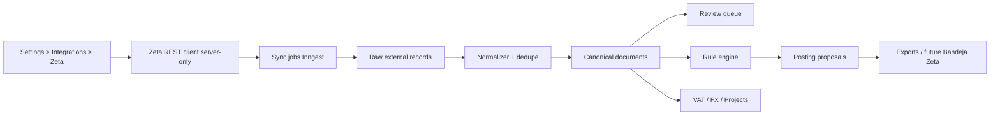

# Convertilabs × Zetasoftware — Spec de Specs-Driven Development v1
**Estado:** draft operativo para implementación  
**Fecha:** 2026-04-19  
**Owner:** RONTIL / Convertilabs  
**Audiencia:** Codex, ingeniería, producto, soporte técnico interno  
**Ámbito:** repositorio actual de Convertilabs + integración con Zetasoftware + piloto operativo para Rontil

---

## 0. Cómo debe usarse este documento

Este documento no es una nota de brainstorming.  
Es la especificación rectora para empezar a implementar, en orden, la dirección definida para Convertilabs.

### Orden de lectura obligatorio para Codex

1. `docs/agent_rules.md`
2. `docs/00-core-product-and-organization.md`
3. `docs/01-workflows-ux-and-surfaces.md`
4. `docs/02-accounting-tax-and-integrations.md`
5. `docs/03-platform-quality-and-roadmap.md`
6. Este documento
7. Recién después, el código puntual a tocar

### Regla de decisión

Si algo en el código actual contradice este documento y los docs oficiales de producto, no se “rebaja” la verdad para justificar la deuda.  
Se deja explícita la divergencia y se alinea el código en forma conservadora.

---

## 1. Resumen ejecutivo y decisiones duras

### 1.1 Qué es Convertilabs en esta etapa

Convertilabs **no** se transforma en ERP.  
Convertilabs sigue siendo:

- motor documental;
- motor de decisión contable;
- motor fiscal IVA Uruguay;
- bridge conservador hacia sistemas externos;
- memoria auditable de decisiones humanas.

### 1.2 Qué estamos resolviendo ahora

La dirección inmediata es esta:

1. **primero adaptar Convertilabs para recibir y manejar bien la estructura de Zetasoftware**;
2. **después** usar esa misma comprensión estructural para preparar la salida hacia Zeta;
3. **no** empezar por asientos definitivos ni por automatizaciones irreversibles.

### 1.3 Decisión principal de arquitectura

El primer carril operativo será **ingesta determinística de datos estructurados desde Zeta**, sin usar IA para extracción factual.

Eso implica:

- ventas desde Zeta -> documento estructurado interno;
- CFEs recibidos desde Zeta -> documento estructurado interno;
- materialización a `documents` y artefactos canónicos;
- clasificación contable/fiscal posterior con el motor determinístico de Convertilabs;
- IA solo como asistente futuro, no como parser del origen Zeta.

### 1.4 Decisiones de fuente por dominio

#### Ventas
La fuente principal para traer ventas será **API Comprobantes por Cliente**.

**Motivo:** ya devuelve encabezado, líneas, formas de pago y campos CFE en una sola consulta por período, pudiendo traer todos los clientes si `ClienteCodigo=""`.

#### Ventas, enriquecimiento opcional
La **API Facturas de Clientes** queda como API complementaria para:

- consultas específicas de ventas;
- `QueryVentas`;
- `VentasDetalladas` en reconcilios acotados;
- `VentaDetallada` por documento;
- `URLPDF` cuando convenga mostrar el PDF emitido.

#### Compras / documentos recibidos
La fuente principal será **API CFEs Recibidos**:

- `CFERECIBIDOS` para listado resumido paginado;
- `CFERECIBIDODETALLE` para el detalle completo de cada comprobante.

#### Salida futura hacia Zeta
La salida futura para posting contable será **API Bandeja de Entrada de Asientos**, no posting directo a contabilidad final.

### 1.5 Decisiones operativas obligatorias

- **REST es obligatorio** para integraciones nuevas.
- **SOAP no se usa** en código nuevo.
- **La colección Postman oficial de Zeta es la fuente para los nombres exactos de endpoints REST y wrappers de request/response.**
- **No se adivinan nombres de endpoints.**
- **No existe sandbox de Zeta para este proyecto.**
- Las pruebas de escritura se harán en **producción controlada**, con convención explícita de pruebas y limpieza.
- El repo **no debe** iniciar esta expansión sin una fase de estabilización previa de DB/deps/CI.

---

## 2. Problema real que estamos resolviendo

Hoy Convertilabs tiene una base fuerte de producto y arquitectura, pero la dirección del piloto Rontil necesita un cambio de foco:

- menos dependencia inicial de OCR/IA para los casos que ya existen estructurados en Zeta;
- mejor alineación con la realidad operativa del cliente;
- una entrada más segura para ventas y compras ya presentes en el sistema legacy;
- una base sólida para deduplicación, IVA, FX y posting posterior.

El problema no es “integrar por integrar”.

El problema es:

> lograr que Convertilabs trate los documentos que ya existen en Zetasoftware como documentos de primera clase dentro de su modelo canónico, con trazabilidad, deduplicación, FX confiable, IVA determinístico y preparación para bridge contable posterior.

---

## 3. Objetivos

## 3.1 Objetivos del primer tramo

1. Permitir conectar una organización de Convertilabs con Zetasoftware desde `settings > integrations`.
2. Probar conexión y persistir credenciales de forma segura.
3. Sincronizar catálogos mínimos necesarios para interpretación:
   - comprobantes;
   - locales;
   - contactos;
   - datos comerciales de cliente;
   - datos comerciales de proveedor;
   - plan de cuentas;
   - tasas de IVA;
   - cotizaciones;
   - tipos de CFE.
4. Importar ventas desde Zeta sin IA.
5. Importar CFEs recibidos desde Zeta sin IA.
6. Materializar esos orígenes a documentos canónicos dentro de Convertilabs.
7. Evitar duplicados de forma robusta.
8. Integrar esos documentos al workflow existente de review/posting/tax.
9. Preparar la salida futura a Bandeja de Entrada de Asientos.
10. Hacerlo sin romper el enfoque conservador del producto.

## 3.2 Objetivos del segundo tramo

1. Adjuntar proyecto interno a ventas y compras importadas.
2. Recalcular margen bruto estimado por proyecto.
3. Guardar snapshot FX oficial BCU por fecha de documento.
4. Comparar IVA aproximado interno contra DGI usando el motor existente.
5. Preparar export/posting futuro a Zeta con idempotencia.

---

## 4. No objetivos

No entra en este tramo:

- reescribir todo el reviewer;
- construir un ERP paralelo dentro de Convertilabs;
- inventar un “libro de ventas” alternativo como UX principal;
- crear una interfaz manual libre de asientos;
- emitir automáticamente comprobantes electrónicos desde Convertilabs;
- importar directo a contabilidad final de Zeta;
- cambiar el motor contable multi-línea vigente por una lógica de “una cuenta por documento”;
- depender de IA para leer lo que Zeta ya entrega estructurado;
- resolver rentabilidad completa por centros/jobs como primer PR.

---

## 5. Restricciones oficiales del producto que no se negocian

## 5.1 Restricciones de dominio

- Uruguay primero.
- Automatización conservadora.
- IA asiste, no decide.
- Reglas auditables mandan sobre IA.
- Historia hacia adelante: no reescribir historia cerrada.
- No asumir `fxRate = 1` salvo misma moneda.
- No saltar el rule engine.
- No inventar datos faltantes.

## 5.2 Restricciones de UX

- Mobile-first.
- Una decisión principal por pantalla.
- No mostrar internals como narrativa principal.
- No meter revisión factual, contable, fiscal y aprendizaje en una sola masa visual.
- No inventar dashboards decorativos.

## 5.3 Restricciones de integración externa

- Sin sandbox.
- Credenciales de Zeta solo server-side.
- Los nombres exactos de endpoints REST deben salir de la colección Postman oficial.
- La API de Zeta requiere disciplina de paginación e idempotencia.
- No programar polling agresivo ni consultas innecesarias.

---

## 6. Estado base del repo y gate obligatorio antes de empezar

## 6.1 Diagnóstico de base

El proyecto está sano en compilación, typecheck, lint y tests, pero no está listo para un cambio de enfoque grande sin estabilización previa.

### Problemas que son gate duro

1. **Deriva DB / migraciones / schema canónico**
2. **Drift de dependencias** (`next` manifiesto/lock/local)
3. **CI sin build productivo**
4. **Archivos hotspot demasiado grandes**
5. **Encapsulación mejorable de service role y repositorios**

## 6.2 Gate 0 — PR de estabilización técnica obligatorio

Antes de abrir el primer PR funcional de Zeta, debe existir un PR pequeño de estabilización con este scope exacto:

### A. Dependencias
- fijar `next` a la versión parcheada usada localmente;
- regenerar `package-lock.json`;
- asegurar consistencia entre `package.json`, `package-lock.json` y `node_modules` esperados por `npm ci`.

### B. DB parity
- decidir y documentar la base objetivo;
- llevar `db/schema` al estado real que el código necesita hoy;
- alinear migraciones y RLS;
- hacer pasar `npm run db:verify:parity` contra la base objetivo o documentar formalmente qué queda legacy y por qué.

### C. CI
- agregar `npm run build` al workflow de CI.

### D. Regla de refactor
- **no** empezar reescribiendo `modules/documents/review.ts`;
- **no** empezar reescribiendo `rules-admin.ts`;
- crear una nueva capa de integración aislada.

## 6.3 Definición de done del Gate 0

No se avanza a Zeta si no ocurre todo esto:

- `npm run lint` OK
- `npm run typecheck` OK
- `npm test` OK
- `npm run build` OK
- `npm run db:verify:parity` OK o excepción formal documentada
- CI actualizado y verde

---

## 7. Visión de arquitectura objetivo



### Principio rector

La integración Zeta no “vive” en la UI.  
La UI consume estados, runs y documentos ya materializados por dominio.

---

## 8. APIs oficiales de Zeta que sí vamos a usar

## 8.1 Protocolo y autenticación

### Protocolo
- usar REST;
- JSON;
- requests stateless;
- wrappers de request/response según convención oficial.

### Credenciales obligatorias por request
Todo request autenticado debe incluir:

- `DesarrolladorCodigo`
- `DesarrolladorClave`
- `EmpresaCodigo`
- `EmpresaClave`
- `RolCodigo`

`RolCodigo` recomendado: `1`.

### Restricción comercial importante
El acceso API está reservado a empresas que usan **Gestión PyME y Contabilidad**.

---

## 8.2 Semántica general de métodos

Zeta define cuatro métodos estándar:

- `Query`
- `Load`
- `Save`
- `Delete`

### Reglas que deben implementarse tal cual

- `Query` es paginado.
- `Load` es el paso previo recomendado/obligatorio cuando se actualiza un registro existente.
- `Save` espera la totalidad del payload relevante, no “patches” parciales.
- `Delete` es irreversible.

### Regla para el adapter
El adapter de Convertilabs no debe esconder estas diferencias detrás de una abstracción que pierda semántica.  
Cada endpoint debe exponer explícitamente qué soporta.

---

## 8.3 Matriz de uso por API

| Dominio | API Zeta | Uso en Convertilabs | Prioridad |
|---|---|---|---|
| Autenticación | Datos de Conexión | armado de payloads | P0 |
| Convención REST | Protocolos SOAP/REST + Postman | routing REST oficial | P0 |
| Ventas | Comprobantes por Cliente | fuente principal de ingesta de ventas | P0 |
| Ventas | Facturas de Clientes | enriquecimiento puntual, saldos, URL PDF | P1 |
| Compras recibidas | CFEs Recibidos | fuente principal de ingesta de compras/CFEs | P0 |
| Maestro comercial cliente | Datos Comerciales de Cliente | enriquecer ventas | P1 |
| Maestro comercial proveedor | Datos Comerciales de Proveedor | enriquecer compras | P1 |
| Contactos | Contactos | base de contrapartes | P0 |
| Configuración de comprobantes | Comprobantes | mapear tipo básico y comportamiento | P0 |
| Plan contable | Plan de Cuentas | preparación de mapping y salida futura | P1 |
| IVA | Tasas de IVA | mapping fiscal y contable | P1 |
| Monedas | Cotización de Monedas | snapshot y contraste de FX | P1 |
| Locales | Locales Comerciales | identificación operativa y filtros | P1 |
| Tipos de CFE | Tipos de CFE | interpretación legal/fiscal de CFEs | P1 |
| Tipos de asiento | Tipos de Asientos | pruebas controladas y outbound futuro | P2 |
| Outbound contable | Bandeja de Entrada de Asientos | posting futuro / smoke tests controlados | P2 |
| Lectura posterior | Consulta de Asientos | reconciliación futura de exportaciones | P2 |

---

## 9. Decisiones de fuente por flujo

## 9.1 Ventas — fuente principal

### API elegida
**Comprobantes por Cliente / Query**

### Razones
1. acepta `ClienteCodigo=""` para traer todos los clientes;
2. trabaja por período con `Mes` y `Anio`;
3. devuelve encabezado;
4. devuelve líneas;
5. devuelve formas de pago;
6. devuelve campos CFE (`CFETipo`, `CFEEstado`, `CFEAcuse`, `CFEMensaje`);
7. reduce el número de llamadas para materialización canónica.

### Qué entra en scope desde esta API
- ventas crédito;
- ventas contado;
- notas de crédito/devoluciones de venta si el tipo funcional corresponde;
- datos suficientes para documento canónico de venta.

### Qué no se toma automáticamente como documento principal
- recibos de cobranza;
- movimientos de stock puros;
- otros comprobantes que no representen documento comercial principal del flujo de margen/IVA.

Esos registros se pueden persistir como soporte más adelante, pero no deben invadir el primer flujo.

## 9.2 Ventas — APIs complementarias

### Facturas de Clientes
Se usa para:

- `QueryVentas` cuando convenga una lectura resumida de ventas;
- `VentasDetalladas` como reconciliación acotada o nightly, nunca como polling agresivo;
- `VentaDetallada` cuando exista una necesidad puntual de expandir un documento;
- `URLPDF` para obtener el PDF emitido, preferentemente bajo demanda.

### Regla dura
No usar `Facturas de Clientes` como fuente principal de polling detallado continuo si `Comprobantes por Cliente` ya resuelve el caso.

## 9.3 Compras / CFEs recibidos — fuente principal

### API elegida
**CFEs Recibidos**

### Estrategia
1. `CFERECIBIDOS` para listado paginado;
2. por cada registro nuevo o cambiado, `CFERECIBIDODETALLE`;
3. materialización a documento canónico de compra.

### Identidad externa obligatoria
La identidad fuerte será:

`EmisorRUT + CFETipo + CFESerie + CFENumero`

Ese compuesto es la base de deduplicación dura del origen.

## 9.4 Outbound futuro

### API elegida
**Bandeja de Entrada de Asientos**

### Razón
- es el punto previo a validación/importación definitiva;
- soporta `Save`, `Query`, `Load`, `Delete`;
- permite pruebas controladas sin pegar directo a contabilidad final.

### Regla dura
En v1 funcional de ingesta **no** se implementa todavía posting masivo a Zeta.  
Solo se deja la arquitectura lista y, si hace falta, se realizan smoke tests controlados.

---

## 10. Modelo canónico interno que debe respetarse

## 10.1 Principio de modelado

Un documento importado desde Zeta no es un “JSON guardado y listo”.  
Debe entrar al **modelo canónico de Convertilabs**.

La secuencia correcta es:

```text
Zeta raw
-> normalización
-> identidad y dedupe
-> documento canónico
-> contexto contable
-> regla / template
-> preview multi-línea
-> posting
```

## 10.2 Contrato canónico propuesto para documentos externos determinísticos

```ts
type ExternalDeterministicDocument = {
  provider: "zetasoftware";
  sourceKind: "zeta_sales" | "zeta_received_cfe";
  externalEntityType: string;
  externalKey: string;
  externalParentKey?: string | null;

  factualTrustMode: "external_deterministic";
  binaryAvailable: boolean;
  sourcePdfUrl?: string | null;

  identity: {
    strongKey: string;
    humanKey: string;
    duplicateHash: string;
  };

  document: {
    internalKind:
      | "sale_invoice"
      | "sale_credit_note"
      | "purchase_invoice"
      | "purchase_credit_note"
      | "unsupported_external_document";
    issueDate: string;
    dueDate?: string | null;
    series?: string | null;
    number?: string | null;
    reference?: string | null;
    localCode?: string | number | null;
    notes?: string | null;
  };

  counterparty: {
    role: "customer" | "vendor";
    externalCode?: string | null;
    name?: string | null;
    legalName?: string | null;
    rut?: string | null;
    email?: string | null;
  };

  currency: {
    zetaCurrencyCode: string | number;
    sourceRate?: number | null;
    sourceRateDate?: string | null;
    officialBcuRate?: number | null;
    fxStatus:
      | "same_currency"
      | "source_rate_ok"
      | "bcu_fallback"
      | "variance_warning"
      | "missing_rate_blocked";
  };

  tax: {
    cfeTypeCode?: string | number | null;
    cfeState?: string | null;
    cfeAck?: string | null;
    cfeMessage?: string | null;
    vatSubtotal?: number | null;
    vatTotal?: number | null;
    total?: number | null;
  };

  lines: Array<{
    sourceLineId?: string | null;
    description?: string | null;
    articleCode?: string | null;
    conceptCode?: string | null;
    quantity?: number | null;
    unitPrice?: number | null;
    net?: number | null;
    vat?: number | null;
    total?: number | null;
    vatCode?: string | number | null;
    vatRate?: number | null;
  }>;

  payments: Array<{
    paymentMethodCode?: string | null;
    currencyCode?: string | number | null;
    amountInPaymentCurrency?: number | null;
    amountInDocumentCurrency?: number | null;
  }>;

  raw: {
    payloadHash: string;
    observedAt: string;
    syncRunId: string;
  };
};
```

## 10.3 Regla de verdad

Para documentos Zeta deben coexistir tres capas:

1. **raw record** del origen;
2. **snapshot normalizado** para el dominio;
3. **documento canónico** de producto.

No se salta ninguna.

---

## 11. Identidad, deduplicación y control de cambios

## 11.1 Reglas generales

La deduplicación mal hecha rompe todo.  
Este es un bloque no negociable.

### Regla 1
Todo documento importado debe tener una **strong identity** externa.

### Regla 2
Además debe tener un **duplicate hash** humano/operativo para casos borde.

### Regla 3
Todo raw record debe guardar `payloadHash`.

### Regla 4
Si un documento ya existe y el `payloadHash` no cambió, no se reprocesa.

### Regla 5
Si el `payloadHash` cambió:
- si el documento no está finalizado, se actualiza conservadoramente y se reevalúa;
- si el documento está finalizado/posteado, **no se pisa historia**; se genera alerta de drift y se exige reapertura formal.

## 11.2 Identidad por flujo

### Ventas Zeta
Primary key preferida:
- `RegistroId` si el endpoint la devuelve de forma estable.

Fallback key:
- `ComprobanteCodigo + Serie + Numero + Fecha + ClienteCodigo + LocalCodigo`

Duplicate hash:
- hash SHA-256 del subconjunto normalizado de identidad + total + moneda

### CFEs recibidos
Primary key:
- `EmisorRUT + CFETipo + CFESerie + CFENumero`

Fallback human hash:
- mismo compuesto + `FechaEmision + MontoAPagar`

## 11.3 Cambio de origen luego de finalización

### Política oficial
Si Zeta cambia un documento que en Convertilabs ya quedó `posted_final` o equivalente:

- no auto-mutamos historia;
- no auto-recalculamos asientos finales;
- dejamos `source_change_pending_review = true`;
- registramos evento en `audit_log`;
- mostramos warning visible;
- requerimos reapertura formal para re-sync materializado.

---

## 12. Diseño de persistencia propuesto

> Regla: minimizar acoplamiento con hotspots existentes y crear una capa aislada de integración.

## 12.1 Tablas nuevas mínimas

### 12.1.1 `organization_integration_connections`

Una fila por organización y proveedor.

| columna | tipo sugerido | null | detalle |
|---|---|---:|---|
| `id` | uuid pk | no | id interno |
| `organization_id` | uuid fk | no | tenancy |
| `provider` | text | no | `zetasoftware` |
| `mode` | text | no | `read_only` / `read_write` |
| `status` | text | no | `disconnected` / `connected` / `paused` / `error` |
| `test_mode` | boolean | no | default `true` |
| `config_json` | jsonb | no | flags y defaults |
| `encrypted_credentials` | text/bytea | no | payload cifrado |
| `credentials_fingerprint` | text | no | hash no reversible para drift |
| `last_connection_test_at` | timestamptz | sí | auditoría |
| `last_connection_test_ok` | boolean | sí | health |
| `last_error` | text | sí | último error resumido |
| `created_at` | timestamptz | no | auditoría |
| `updated_at` | timestamptz | no | auditoría |

**Unique:** `(organization_id, provider)`

### 12.1.2 `integration_sync_runs`

Registro de cada corrida.

| columna | tipo sugerido | null | detalle |
|---|---|---:|---|
| `id` | uuid pk | no | run id |
| `organization_id` | uuid fk | no | tenancy |
| `provider` | text | no | `zetasoftware` |
| `stream` | text | no | `masters` / `sales_documents` / `received_cfes` / `outbound_bandeja` |
| `mode` | text | no | `manual` / `scheduled` / `backfill` / `reconcile` / `test` |
| `status` | text | no | `running` / `ok` / `partial` / `failed` |
| `request_window_json` | jsonb | sí | meses, fechas, páginas |
| `counters_json` | jsonb | no | fetched, upserts, duplicates, blocked |
| `error_summary` | text | sí | resumen |
| `started_at` | timestamptz | no | inicio |
| `finished_at` | timestamptz | sí | cierre |
| `triggered_by_actor_id` | uuid | sí | usuario o system actor |

### 12.1.3 `integration_sync_cursors`

Checkpoint por stream.

| columna | tipo sugerido | null | detalle |
|---|---|---:|---|
| `id` | uuid pk | no | id |
| `organization_id` | uuid fk | no | tenancy |
| `provider` | text | no | `zetasoftware` |
| `stream` | text | no | `masters` / `sales_documents` / `received_cfes` |
| `cursor_key` | text | no | ej. `sales:2026-04`, `cfes_recibidos:default` |
| `cursor_value_json` | jsonb | no | page, fechas, hash |
| `last_success_at` | timestamptz | sí | control |
| `last_full_reconcile_at` | timestamptz | sí | control |
| `updated_at` | timestamptz | no | control |

**Unique:** `(organization_id, provider, stream, cursor_key)`

### 12.1.4 `integration_raw_records`

Tabla de verdad del origen.

| columna | tipo sugerido | null | detalle |
|---|---|---:|---|
| `id` | uuid pk | no | id interno |
| `organization_id` | uuid fk | no | tenancy |
| `provider` | text | no | `zetasoftware` |
| `entity_type` | text | no | `sales_voucher`, `received_cfe`, `received_cfe_detail`, `contact`, etc. |
| `external_key` | text | no | identidad externa |
| `parent_external_key` | text | sí | para detalles subordinados |
| `payload_json` | jsonb | no | payload crudo normalizado |
| `payload_hash` | text | no | hash del payload |
| `observed_at` | timestamptz | no | cuándo se vio en la API |
| `first_seen_at` | timestamptz | no | primera vez |
| `last_seen_at` | timestamptz | no | última vez |
| `sync_run_id` | uuid fk | no | run de origen |
| `is_deleted_at_source` | boolean | no | v1 default `false` |
| `metadata_json` | jsonb | sí | page, month, year, endpoint |

**Unique:** `(organization_id, provider, entity_type, external_key)`

### 12.1.5 `document_source_refs`

Tabla 1:1 o 1:n controlada entre documento canónico y origen externo.

| columna | tipo sugerido | null | detalle |
|---|---|---:|---|
| `id` | uuid pk | no | id |
| `organization_id` | uuid fk | no | tenancy |
| `document_id` | uuid fk | no | documento canónico |
| `provider` | text | no | `zetasoftware` |
| `source_kind` | text | no | `zeta_sales` / `zeta_received_cfe` |
| `external_entity_type` | text | no | entidad origen |
| `external_key` | text | no | identidad externa |
| `raw_record_id` | uuid fk | no | último raw principal |
| `factual_trust_mode` | text | no | `external_deterministic` |
| `binary_available` | boolean | no | si hay binario accesible |
| `source_pdf_url` | text | sí | URL PDF si existe |
| `last_payload_hash` | text | no | hash materializado |
| `source_change_pending_review` | boolean | no | drift en docs finales |
| `created_at` | timestamptz | no | auditoría |
| `updated_at` | timestamptz | no | auditoría |

**Unique:** `(organization_id, provider, external_entity_type, external_key)`

### 12.1.6 `integration_document_links`

Opcional si `document_source_refs` no alcanza para algunos flujos.
Solo crear si en implementación real hace falta separar binding y metadata.

## 12.2 Reuso de tablas existentes

La meta es **reusar** todo lo posible del modelo actual:

- `documents`
- `document_invoice_identities`
- `document_line_items`
- `document_accounting_contexts`
- `posting_proposals`
- `journal_entries`
- `journal_entry_lines`
- `audit_log`
- `source_events` si aplica
- `ai_decision_logs` solo si más adelante entra asistencia explicativa

## 12.3 Qué NO crear salvo necesidad real

No crear, en primera instancia:

- un módulo paralelo de “ventas” separado del sistema documental;
- un duplicado completo de clientes/proveedores internos;
- un segundo reviewer específico para Zeta;
- un segundo sistema contable.

---

## 13. Configuración por organización

## 13.1 Ubicación funcional

`/app/o/[slug]/settings?tab=integrations`

## 13.2 Panel ZetaSoftware

Debe soportar:

- conectar / reconectar;
- modo `read_only` o `read_write`;
- bandera `test_mode`;
- probar conexión;
- sync manual de maestros;
- sync manual de ventas;
- sync manual de CFEs recibidos;
- último resultado de sync;
- errores recientes;
- flags de comportamiento.

## 13.3 Config flags mínimas

```json
{
  "salesSyncEnabled": true,
  "receivedCfeSyncEnabled": true,
  "masterSyncEnabled": true,
  "salesSourceStrategy": "comprobantes_por_cliente",
  "allowFacturasClientesEnrichment": true,
  "allowPdfOnDemand": true,
  "enableOutboundBandeja": false,
  "tipoAsientoTestCode": "TST",
  "tipoAsientoProdCode": null,
  "defaultLocalCodes": [1],
  "fxVarianceToleranceBps": 100,
  "projectAutolinkEnabled": false
}
```

## 13.4 Seguridad de credenciales

- cifrado app-layer antes de persistir;
- nunca enviar credenciales al cliente;
- nunca loggear claves;
- fingerprint para detectar cambio de credenciales;
- test de conexión siempre desde server-only.

---

## 14. Mapa de módulos y archivos sugeridos

## 14.1 Nuevo dominio aislado

```text
modules/
  integrations/
    zeta/
      client/
        rest-client.ts
        auth.ts
        endpoint-registry.ts
        errors.ts
      contracts/
        common.ts
        comprobantes-por-cliente.ts
        facturas-clientes.ts
        cfes-recibidos.ts
        bandeja-asientos.ts
        contactos.ts
        datos-comerciales-cliente.ts
        datos-comerciales-proveedor.ts
        plan-de-cuentas.ts
        tasas-iva.ts
        cotizaciones.ts
        comprobantes.ts
        tipos-cfe.ts
        locales.ts
      normalize/
        sales-normalizer.ts
        received-cfe-normalizer.ts
        master-normalizer.ts
      sync/
        sync-masters.ts
        sync-sales-documents.ts
        sync-received-cfes.ts
        sync-runner.ts
        cursors.ts
      materialize/
        materialize-sales-document.ts
        materialize-received-cfe.ts
        source-change-policy.ts
      outbound/
        bandeja-mapper.ts
        bandeja-test-mode.ts
      repositories/
        connection-repo.ts
        sync-run-repo.ts
        raw-record-repo.ts
        source-ref-repo.ts
      services/
        connection-service.ts
        zeta-health-service.ts
        pdf-url-service.ts
```

## 14.2 Módulos existentes a tocar con mínimo daño

```text
modules/documents/
  workflow-state.ts
  review-queue.ts
  processing.ts            # solo para soportar source deterministic path
  review.ts                # tocar lo mínimo e idealmente via adapters/query layer
  upload.ts                # NO mezclar lógica Zeta aquí

modules/accounting/
  classification-runner.ts
  learning-approval-service.ts

modules/tax/
  vat / reconciliation modules existentes

modules/organizations/
  settings / integrations read models
```

## 14.3 UI sugerida

```text
components/settings/
  integrations/
    zetasoftware-connection-card.tsx
    zetasoftware-sync-panel.tsx
    zetasoftware-run-history.tsx

components/documents/
  source-badge.tsx
  external-source-card.tsx
  zeta-document-facts-card.tsx
```

## 14.4 Rutas / endpoints internos sugeridos

```text
app/api/integrations/zeta/test/route.ts
app/api/integrations/zeta/sync/masters/route.ts
app/api/integrations/zeta/sync/sales/route.ts
app/api/integrations/zeta/sync/cfes-recibidos/route.ts
app/api/integrations/zeta/document/[documentId]/pdf-url/route.ts
```

**Nota:** si el proyecto ya centraliza orquestación vía server actions + Inngest, priorizar ese carril sobre endpoints adicionales.

---

## 15. Diseño del cliente REST de Zeta

## 15.1 Reglas

1. server-only;
2. sin imports desde UI;
3. request/response tipados por endpoint;
4. registry explícito de endpoints;
5. nombres exactos cargados desde la colección Postman o constants verificadas;
6. logs con masking;
7. reintentos limitados;
8. errores semánticos diferenciados.

## 15.2 Forma interna recomendada

```ts
type ZetaConnection = {
  desarrolladorCodigo: string;
  desarrolladorClave: string;
  empresaCodigo: string;
  empresaClave: string;
  rolCodigo: string; // default "1"
};

type ZetaEndpointCall<I, O> = {
  endpointKey: string;
  wrapperIn: string;
  wrapperOut: string;
  data: I;
};
```

## 15.3 Regla crítica sobre endpoints

Los endpoints REST en código deben salir de un `endpoint-registry.ts` único.

Ejemplo conceptual:

```ts
export const ZETA_ENDPOINTS = {
  querySaldosPendientesFacturaCliente:
    "https://api.zetasoftware.com/rest/APIs/RESTFacturaClienteV4QuerySaldosPendientes",
};
```

Pero **no** deben inventarse nombres nuevos sin verificación contra:

- colección Postman oficial;
- o smoke test real exitoso.

## 15.4 Error taxonomy recomendada

```ts
type ZetaIntegrationErrorCode =
  | "auth_invalid"
  | "connection_failed"
  | "endpoint_not_configured"
  | "rate_or_usage_blocked"
  | "validation_failed"
  | "malformed_response"
  | "page_overflow"
  | "unknown_external_reference"
  | "payload_wrapper_mismatch"
  | "sync_partial"
  | "not_supported_yet";
```

---

## 16. Flujo de sincronización de maestros

## 16.1 Objetivo

Tener el mínimo catálogo local para:

- interpretar comprobantes;
- mostrar nombres correctos;
- mapear contrapartes;
- preparar clasificación;
- preparar salida futura.

## 16.2 Orden sugerido

1. `Locales Comerciales`
2. `Comprobantes`
3. `Tipos de CFE`
4. `Contactos`
5. `Datos Comerciales de Cliente`
6. `Datos Comerciales de Proveedor`
7. `Plan de Cuentas`
8. `Tasas de IVA`
9. `Cotización de Monedas`

## 16.3 Estrategia de sync

### Primera corrida
- full sync inicial;
- paginada;
- persistencia raw completa.

### Corridas siguientes
- incremental por fecha cuando la API lo soporte;
- si no lo soporta, full acotada y dedupe por hash.

## 16.4 Regla para contactos

Zeta recomienda explícitamente:

- base local de contactos;
- `Query` completo inicial;
- luego consultas por fecha para incremental;
- evitar consultas constantes.

Convertilabs debe seguir eso exactamente.

---

## 17. Flujo de sincronización de ventas

## 17.1 Fuente principal

`Comprobantes por Cliente / Query`

## 17.2 Ventana de consulta

Como la API pide `Mes` y `Anio`, la estrategia será:

### Corrida scheduled normal
- mes actual;
- mes anterior;
- usando `FechaDesde` y `FechaHasta` para acotar ventana.

### Corrida nightly de reconciliación
- mes actual completo;
- mes anterior completo;
- comparación por identity + hash.

### Corrida manual
- rango configurable, pero siempre traducido a uno o más pares `Mes/Anio`.

## 17.3 Filtro funcional interno

No todo lo devuelto por la API se materializa como documento principal.

### Soportados v1
- ventas contado;
- ventas crédito;
- notas de crédito / devoluciones de venta que afecten ingresos/IVA.

### Excluidos v1 como documento principal
- recibos de cobranza;
- movimientos de stock puros;
- documentos auxiliares sin relevancia directa para flujo documental principal.

Estos pueden guardarse como raw y quedar para fase posterior.

## 17.4 Secuencia

```text
Query Comprobantes por Cliente
-> raw upsert
-> mapear ComprobanteCodigo contra catálogo de Comprobantes
-> descartar no soportados
-> construir identidad
-> dedupe
-> materializar documento canónico
-> crear/refrescar document_source_ref
-> crear line items
-> correr clasificación determinística
-> actualizar estado workflow
```

## 17.5 Regla de PDF

El PDF de venta no se baja eager.

### v1
- guardar capacidad de obtener `URLPDF`;
- resolver bajo demanda al abrir documento o mediante acción explícita;
- no bloquear materialización por ausencia de PDF.

## 17.6 Regla de confianza factual

Las ventas que entren desde Zeta son de `factualTrustMode = external_deterministic`.

Por lo tanto:

- no pasan por OCR;
- no pasan por extracción IA;
- pueden saltar `pending_factual_review` si todos los campos obligatorios vienen presentes;
- arrancan como `pending_assignment`, `ready_for_provisional_posting` o `blocked` según contexto.

---

## 18. Flujo de sincronización de CFEs recibidos

## 18.1 Fuente

- `CFERECIBIDOS`
- `CFERECIBIDODETALLE`

## 18.2 Ventana de consulta

### Scheduled
- desde último checkpoint menos ventana de seguridad;
- hasta fecha actual.

### Ventana de seguridad
Usar solapamiento de **3 días** para tolerar demoras o cambios de estado.

## 18.3 Secuencia

```text
CFERECIBIDOS paginado
-> por cada resumen nuevo o cambiado:
   -> CFERECIBIDODETALLE
   -> raw upsert summary
   -> raw upsert detail
   -> construir strong identity
   -> dedupe
   -> materializar documento de compra
   -> snapshot FX
   -> clasificación determinística
   -> workflow state
```

## 18.4 Reglas fiscales y de estados

Antes de usar un CFE recibido en procesos internos:

- validar estado local;
- validar estado DGI;
- validar estado receptor si aplica;
- si el comprobante es inconsistente o incompleto, degradar a `blocked`.

## 18.5 Binarios

Con la documentación revisada, la API pública consultada expone datos estructurados del CFE recibido, pero **no documenta** un endpoint específico para recuperar binario PDF/XML del comprobante recibido.

### Decisión v1
- el flujo soporta documentos estructurados sin binario;
- UI debe mostrar claramente “origen estructurado desde Zeta”;
- si luego aparece endpoint/documentación para XML/PDF, se agrega como enriquecimiento, no como prerequisito.

---

## 19. Materialización a workflow de documentos

## 19.1 Estados iniciales permitidos

La ingesta determinística puede materializar directamente en:

- `pending_assignment`
- `ready_for_provisional_posting`
- `locked` solo si el período o política lo exige
- `blocked`

### No usar como default
`pending_factual_review` no debe ser el default para orígenes estructurados confiables salvo que falte dato crítico.

## 19.2 Criterios

### `pending_assignment`
- factual completo;
- sin regla ganadora todavía;
- sin bloqueo fiscal grave.

### `ready_for_provisional_posting`
- factual completo;
- regla/template resueltos;
- FX resuelto;
- sin blocker fiscal crítico.

### `blocked`
- falta FX y no hay fallback aceptable;
- tipo documental no soportado;
- duplicado ambiguo;
- contrapartida esencial ausente;
- periodo no mutable;
- inconsistencia monetaria/fiscal.

## 19.3 Fuente factual vs enriquecimiento interno

### Campos de origen inmutables por default
- fecha emisión
- serie
- número
- RUT
- cliente/proveedor código
- moneda
- tipo de cambio de origen
- totales
- estados CFE
- líneas del comprobante de origen

### Campos internos editables
- concepto canónico;
- proyecto;
- familia operativa;
- template contable;
- override de regla;
- contexto de settlement;
- notas internas;
- override factual local explícito (solo con trazabilidad).

## 19.4 Overrides factuales

Si un usuario necesita corregir localmente un dato traído desde Zeta:

- no se pisa silenciosamente el snapshot de origen;
- se guarda override local separado;
- la UI debe mostrar “Dato de Zeta” y “Override local”.

---

## 20. Regla de clasificación contable y fiscal

## 20.1 La clasificación no cambia de filosofía

Sigue mandando el orden vigente:

1. `manual_override`
2. `document_override`
3. `vendor_concept_operation_category`
4. `vendor_concept`
5. `concept_global`
6. `vendor_default`
7. `assistant`
8. `manual_review`

## 20.2 Qué sí cambia

Para documentos Zeta:

- el factual input llega ya estructurado;
- la clasificación no depende de OCR;
- el rule engine recibe mejor contexto desde el inicio.

## 20.3 Regla para documentos de venta

La clasificación de venta debe apoyarse en:

- tipo básico de comprobante;
- cliente y/o categoría comercial;
- moneda;
- si abre saldo o es contado;
- proyecto asociado si existe;
- comportamiento CFE si hace falta fiscalmente.

## 20.4 Regla para documentos de compra

La clasificación de compra debe apoyarse en:

- tipo CFE;
- proveedor por RUT / código;
- condición comercial;
- IVA y literal tributario cuando aplique;
- proyecto asociado;
- evidencia de pago o ausencia de ella.

## 20.5 IA en este flujo

En v1:

- no usar IA para parsear payload Zeta;
- no usar IA para “adivinar” campos faltantes del origen;
- opcionalmente usar IA solo para explicación o sugerencia posterior, siempre detrás del motor determinístico.

---

## 21. FX y cotizaciones BCU

## 21.1 Regla madre

Convertilabs debe preservar:

- tasa de cambio que viene del documento/origen Zeta;
- tasa oficial BCU del día correspondiente;
- diferencia entre ambas.

## 21.2 Política operativa v1

### Si moneda base = moneda documento
- `fxStatus = same_currency`

### Si Zeta informa tipo de cambio y BCU también
- guardar ambas;
- calcular varianza;
- si excede tolerancia, `variance_warning`, no autocorregir.

### Si Zeta no informa tipo de cambio y BCU sí
- usar BCU como fallback operacional;
- marcar `bcu_fallback`.

### Si ninguna está disponible
- `missing_rate_blocked`.

## 21.3 Regla de persistencia

No crear un FX paralelo improvisado.

### Preferencia
Reusar el modelo/snapshot monetario existente del repo.

### Si el modelo actual no soporta dualidad de tasa
Extenderlo con:

- `source_rate`
- `source_rate_origin`
- `official_rate`
- `official_rate_origin`
- `variance_bps`
- `fx_status`

## 21.4 UI

En documento importado multi-moneda mostrar:

- tasa origen Zeta;
- tasa oficial BCU;
- warning si difiere;
- motivo de bloqueo si falta una confiable.

---

## 22. IVA y fiscalidad

## 22.1 Regla

Los documentos importados desde Zeta entran al mismo motor fiscal determinístico del producto.

## 22.2 Uso de Tasas de IVA

La API de Tasas de IVA de Zeta sirve para:

- interpretar códigos de IVA;
- mapear códigos contables de compras/ventas;
- mapear literales tributarios de compras/ventas.

## 22.3 No prometer filing

Convertilabs puede:

- calcular preview;
- correr IVA;
- comparar contra DGI;
- exportar.

No debe vender conciliación DGI como filing automático completo.

## 22.4 Casos bloqueados

- documento sin info fiscal crítica;
- CFE inválido o estado no confiable;
- moneda sin FX confiable;
- tipo documental no soportado.

---

## 23. Proyectos y margen

## 23.1 Tensión producto vs roadmap actual

Los docs oficiales marcan proyectos/jobs/rentabilidad como “preparado, no productizado”.  
Pero para Rontil esta capacidad sí es una necesidad clara.

## 23.2 Decisión práctica

Se incorpora en forma **acotada**, sin rediseñar el producto entero alrededor de rentabilidad.

### v1 acotado
- entidad `project` simple por organización;
- un documento puede tener `project_id` opcional;
- ventas y compras importadas pueden asociarse a proyecto;
- cálculo de margen simple:
  - ingresos asociados;
  - costos asociados;
  - margen bruto;
  - estimado post-IVA/impuestos si la política lo define.

## 23.3 Qué no entra todavía

- reparto multi-proyecto por línea;
- cost centers profundos;
- jobs complejos;
- profitability suite completa.

## 23.4 Relación con Zeta

Zeta no es la fuente principal del proyecto en v1.

### Regla
El proyecto se resuelve en Convertilabs:

- manualmente;
- o por heurística determinística basada en referencia/notas/cliente;
- nunca como inferencia silenciosa fuerte.

---

## 24. UX y superficies a tocar

## 24.1 Settings > Integrations

Agregar card/panel Zeta con:

- estado de conexión;
- modo;
- último sync;
- botones manuales;
- errores;
- health;
- test mode visible.

## 24.2 Documents

Agregar:

- badge de origen: `Zeta ventas`, `Zeta CFE recibido`;
- filtro por origen;
- indicador `Sin IA`;
- indicador `Sin binario` cuando corresponda;
- acceso a `Abrir PDF en Zeta` si existe URL.

## 24.3 Review

Para documentos Zeta:

- fast lane factual;
- primer paso colapsado por default;
- bloque de “Datos de origen” solo lectura;
- sección separada de “Enriquecimiento interno”.

## 24.4 Audit / Exports

Más adelante, mostrar runs de sync y futuros runs de Bandeja.

## 24.5 Mobile-first

No crear una pantalla desktop-only para integraciones.  
La card de settings y el badge de documentos deben ser funcionales en mobile.

---

## 25. Observabilidad y auditoría

## 25.1 Eventos mínimos en `audit_log`

- `zeta_connection_saved`
- `zeta_connection_tested`
- `zeta_sync_started`
- `zeta_sync_completed`
- `zeta_sync_failed`
- `zeta_raw_record_upserted`
- `zeta_document_materialized`
- `zeta_document_duplicate_skipped`
- `zeta_document_source_changed`
- `zeta_pdf_url_resolved`
- `zeta_bandeja_save_attempted`
- `zeta_bandeja_save_failed`

## 25.2 Qué no loggear
- claves;
- payloads completos con secretos;
- datos sensibles sin necesidad.

## 25.3 Qué sí conservar
- payload hash;
- external key;
- stream;
- contadores;
- errores resumidos;
- correlación con `sync_run_id`.

---

## 26. Seguridad

## 26.1 Secret management

Las credenciales de Zeta son críticas.

### Reglas
- cifrado antes de persistir;
- desencriptado solo en server-only;
- nunca en componentes client;
- nunca en logs;
- nunca en responses al browser.

## 26.2 RLS

Si se agregan tablas nuevas:

- respetar tenancy por `organization_id`;
- RLS obligatoria;
- service role solo para operaciones server-only justificadas.

## 26.3 Service role discipline

El reporte actual del repo marca uso extendido de service role como riesgo de encapsulación.

### Regla
La integración Zeta debe centralizar service-role access dentro de repositorios/servicios server-only, no repartirlo entre pages y componentes.

---

## 27. Testing sin sandbox de Zeta

## 27.1 Principio

Como no hay entorno de desarrollo externo, se trabajará con dos carriles:

### A. Lecturas reales en producción
No contaminan datos.

### B. Escrituras mínimas y controladas
Solo en Bandeja de Entrada de Asientos y bajo convención estricta.

## 27.2 Convención de pruebas controladas en Zeta

### Tipo de asiento de prueba
`TST`

### Run id
`ZT-YYYYMMDD-NN`

### Convención textual
- `Concepto`: `CVTLAB TEST <RUN_ID>`
- `Referencia`: `<RUN_ID>`
- proveedor sintético si hace falta:
  - código: `TST0001`
  - nombre: `CVTLAB PRUEBA <RUN_ID>`

## 27.3 Orden de pruebas real recomendado

1. **lecturas puras**  
   - Locales  
   - Contactos  
   - Comprobantes  
   - Ventas  
   - CFEs recibidos

2. **smoke de conexión y sync interno**  
   - sin escribir en Zeta

3. **smoke de Bandeja sin proveedor**  
   - Debe/Haber balanceados  
   - `RUT` y `Contacto` vacíos si no son necesarios

4. **smoke con proveedor sintético**  
   - solo si el paso anterior fue estable

5. **cleanup**

## 27.4 Cleanup de datos de prueba

### Si solo quedó en Bandeja
- usar `Delete` por `RegistroId` desde API o limpiar en la UI

### Si llegó a contabilidad final
- limpiar desde la herramienta de Zeta correspondiente (`Borrar Asientos`) usando tipo/asiento/origen

### Si hubo maestros sintéticos
Orden:
1. asientos/movimientos
2. datos comerciales
3. contacto
4. RUT / otros restos

## 27.5 Regla dura
No automatizar un flujo de pruebas destructivo si primero no existe un runbook manual claro de limpieza.

---

## 28. Estrategia de implementación por PRs

## 28.1 PR-00 — Estabilización técnica

**Objetivo:** dejar piso firme.

### Incluye
- Next y lock consistentes
- parity DB
- CI con build
- documentación breve del gate

### No incluye
- código de integración Zeta

## 28.2 PR-01 — Esqueleto de integración Zeta

**Objetivo:** conexión segura y health.

### Incluye
- nuevas tablas de conexión/runs/cursors/raw/source refs
- panel básico de settings
- cifrado de credenciales
- `test connection`
- client REST base
- endpoint registry base
- tests unitarios del cliente

### Done
- se puede guardar conexión
- se puede probar conexión contra una API simple
- se registra audit log
- no se exponen secretos

## 28.3 PR-02 — Sync de maestros mínimos

**Objetivo:** catálogos base.

### Incluye
- Locales
- Comprobantes
- Tipos de CFE
- Contactos
- Datos comerciales cliente/proveedor
- raw upserts
- runs y cursors

### Done
- sync manual exitoso
- contadores visibles
- raw records persistidos
- sin duplicados por rerun

## 28.4 PR-03 — Ingesta de ventas desde Comprobantes por Cliente

**Objetivo:** traer ventas estructuradas.

### Incluye
- fetch por período paginado
- normalizador de ventas
- identity + dedupe
- raw upsert

### Done
- ventas visibles en runs
- duplicates skip correcto
- no materializa todavía a `documents` si preferís aislar el PR

## 28.5 PR-04 — Materialización canónica de ventas

**Objetivo:** ventas importadas aparecen como documentos reales.

### Incluye
- documento canónico
- line items
- source refs
- workflow state
- badges UI

### Done
- una venta de Zeta aparece en Documents/Review
- sin IA
- factual trusted
- puede caer a `pending_assignment` / `ready_for_provisional_posting` / `blocked`

## 28.6 PR-05 — Enriquecimiento de ventas

**Objetivo:** mejorar el uso real.

### Incluye
- mapping de comprobantes
- `URLPDF` bajo demanda
- optional FacturasClientes enrichment
- tests de PDF on demand

## 28.7 PR-06 — Ingesta de CFEs recibidos

**Objetivo:** compras/CFEs recibidos estructurados.

### Incluye
- summary + detail
- dedupe fuerte por RUT/tipo/serie/número
- materialización a documentos de compra

### Done
- compra/CFE recibido aparece como documento canónico
- estados del CFE visibles
- bloqueo correcto si inconsistente

## 28.8 PR-07 — FX BCU + política monetaria del documento

**Objetivo:** tasa confiable.

### Incluye
- integración/servicio BCU o adaptación al módulo FX actual
- dualidad source rate / official rate
- warnings y blockers

### Done
- documento multi-moneda muestra ambas tasas
- no se asume `1`
- caso sin tasa queda bloqueado

## 28.9 PR-08 — Integración con clasificación y tax

**Objetivo:** que el flujo ya sirva para operación contable/fiscal.

### Incluye
- hook a classification runner
- tax preview
- explainability mínima

### Done
- documentos importados participan del flujo normal de asignación y preview

## 28.10 PR-09 — Proyectos y margen simple

**Objetivo:** cubrir necesidad Rontil sin inflar el producto.

### Incluye
- proyecto simple
- selector en documento
- cálculo de margen simple

### Done
- se puede asociar compra y venta al mismo proyecto
- se ve margen bruto básico

## 28.11 PR-10 — Preparación outbound Bandeja

**Objetivo:** dejar lista la salida.

### Incluye
- mapper `posting_proposals -> bandeja save lines`
- test mode
- no envío automático masivo todavía

### Done
- existe dry-run con payload válido
- smoke test controlado posible
- idempotencia definida

---

## 29. Acceptance criteria funcionales

## 29.1 Conexión

- una organización puede guardar conexión Zeta;
- test de conexión devuelve éxito o error claro;
- no hay secretos en UI ni logs.

## 29.2 Maestros

- se pueden sincronizar catálogos mínimos;
- rerun no duplica raw records;
- cambios actualizan por hash.

## 29.3 Ventas

- se pueden traer ventas del mes actual y anterior;
- se materializan como documentos sin IA;
- se deduplican por identity;
- muestran origen Zeta;
- si hay PDF URL, se puede resolver on demand.

## 29.4 CFEs recibidos

- se traen por rango;
- se detalla cada comprobante;
- se materializan como documentos de compra;
- se deduplican por RUT/tipo/serie/número.

## 29.5 Workflow

- documentos Zeta no pasan por OCR;
- se integran a Review;
- se bloquean si falta dato crítico.

## 29.6 FX

- documento multi-moneda nunca queda con tasa inventada;
- tasa de origen y tasa oficial quedan visibles;
- mismatch grande genera warning.

## 29.7 Auditoría

- cada run queda trazado;
- cada documento importado queda ligado a raw record;
- cada cambio de origen posterior queda auditado.

---

## 30. Estrategia de tests

## 30.1 Unit tests

### Cliente y auth
- armado de payload connection correcto
- masking de logs
- endpoint registry

### Normalizadores
- ventas -> canonical
- cfes recibidos -> canonical

### Dedupe
- mismo external key = update
- mismo human hash con distinto external key = warning
- finalizado + hash nuevo = drift, no overwrite

### FX
- same currency
- source ok
- bcu fallback
- missing blocked
- variance warning

## 30.2 Integration tests locales

- repos de raw records
- materialización a documentos
- source refs
- sync runs/cursors

## 30.3 Smoke tests reales con Zeta

### Read-only
- test connection
- maestros
- ventas
- cfes recibidos

### Write-limited
- Bandeja test mode con `TST`

## 30.4 Comandos mínimos a correr por PR relevante

- `npm run lint`
- `npm run typecheck`
- `npm test`
- `npm run build`

Y cuando toque persistencia:
- `npm run db:verify:parity`

---

## 31. Riesgos y mitigaciones

## 31.1 Riesgo: deriva DB actual
**Mitigación:** Gate 0 obligatorio.

## 31.2 Riesgo: no sandbox
**Mitigación:** lecturas primero, writes mínimos en Bandeja con convención de prueba.

## 31.3 Riesgo: polling excesivo / bloqueo API
**Mitigación:** scheduling conservador, ventanas acotadas, raw cache, reconciliación nightly.

## 31.4 Riesgo: source changes pisan historia
**Mitigación:** hash + source drift policy + reapertura formal.

## 31.5 Riesgo: UI se contamina con lógica de integración
**Mitigación:** módulos server-only y source refs.

## 31.6 Riesgo: duplicados entre upload manual y Zeta
**Mitigación:** `document_invoice_identities` + strong identity + duplicate hash cross-source.

## 31.7 Riesgo: ausencia de binarios en CFEs recibidos
**Mitigación:** soportar structured-only docs y no depender del binario.

---

## 32. Anti-patrones explícitamente prohibidos

- Crear una “mini app de ventas” aparte del sistema documental.
- Meter llamadas a Zeta desde componentes client.
- Resolver campos faltantes de Zeta con IA.
- Hacer auto-posting final a Zeta desde el primer tramo.
- Usar `Facturas de Clientes` como polling general si `Comprobantes por Cliente` ya resuelve.
- Reescribir archivos monstruosos como primer paso.
- Guardar secretos sin cifrar.
- Crear estados nuevos si los canónicos ya explican la situación.
- Pisar datos finales por cambios del origen.
- Asumir tipo de cambio 1.

---

## 33. Open questions que deben resolverse en los primeros smokes

1. **Colección Postman:** descargar y fijar los nombres exactos de todos los endpoints REST usados.
2. **Wrapper names:** confirmar nombre exacto de wrappers `...In` / `...Out` por endpoint.
3. **Estabilidad de ids:** verificar si `RegistroId` / `FacturaId` son estables entre consultas y endpoints.
4. **URL PDF:** confirmar comportamiento real de `URLPDF` y si requiere autenticación adicional.
5. **CFEs recibidos binarios:** confirmar si existe o no endpoint/documentación complementaria para XML/PDF.
6. **Mapeo de comprobantes Rontil:** identificar qué códigos reales usa Rontil para ventas y notas.
7. **Tolerancia FX:** definir umbral operativo aceptable para diferencia Zeta vs BCU.
8. **Proyectos:** definir naming y si habrá auto-sugerencia por referencia/cliente o solo asignación manual.
9. **Periodicidad segura:** validar con operación real si la cadencia scheduled elegida no genera fricción ni bloqueos.

---

## 34. Definition of done global del tramo

El tramo se considera cumplido cuando:

1. una organización puede conectar Zetasoftware desde settings;
2. Convertilabs puede traer ventas desde Zeta sin IA;
3. Convertilabs puede traer CFEs recibidos desde Zeta sin IA;
4. esos orígenes se materializan como documentos canónicos reales;
5. el sistema evita duplicados de forma robusta;
6. los documentos entran al workflow contable/fiscal normal;
7. se conserva trazabilidad completa del origen;
8. FX no se inventa;
9. CI y DB parity siguen verdes;
10. queda lista la arquitectura para outbound por Bandeja sin haber comprometido el foco del producto.

---

## Apéndice A — Mapping mínimo de campos

## A.1 Ventas desde Comprobantes por Cliente -> canónico

| Zeta | Canónico | Notas |
|---|---|---|
| `ComprobanteCodigo` | `document.source.comprobanteCode` | cruzar con catálogo de Comprobantes |
| `Serie` | `document.series` | |
| `Numero` | `document.number` | |
| `Fecha` | `document.issueDate` | |
| `MonedaCodigo` | `currency.zetaCurrencyCode` | mapear a moneda interna |
| `Cotizacion` | `currency.sourceRate` | si viene |
| `ClienteCodigo` | `counterparty.externalCode` | |
| `ClienteNombre` | `counterparty.name` | |
| `CFETipo` | `tax.cfeTypeCode` | |
| `CFEEstado` | `tax.cfeState` | |
| `CFEAcuse` | `tax.cfeAck` | |
| `CFEMensaje` | `tax.cfeMessage` | |
| `Notas` | `document.notes` | |
| línea `Concepto` | `lines[].description` | |
| línea `ArticuloCodigo` | `lines[].articleCode` | |
| línea `Cantidad` | `lines[].quantity` | |
| línea `PrecioUnitario` | `lines[].unitPrice` | |
| línea `Neto` | `lines[].net` | |
| línea `IVA` | `lines[].vat` | |
| línea `Total` | `lines[].total` | |
| pagos `FormaPagoCodigo` | `payments[].paymentMethodCode` | si aplica |

## A.2 Ventas desde Facturas de Clientes -> uso complementario

| Método | Uso |
|---|---|
| `QueryVentas` | resumen de ventas y notas |
| `VentasDetalladas` | reconciliación detallada diaria como máximo |
| `VentaDetallada` | expandir un documento puntual |
| `URLPDF` | resolver PDF emitido bajo demanda |

## A.3 CFEs recibidos -> canónico

| Zeta | Canónico | Notas |
|---|---|---|
| `RUT` / `EmisorRUT` | `counterparty.rut` | identidad fuerte |
| `DenominacionSocial` | `counterparty.name` | |
| `CFETipo` | `tax.cfeTypeCode` | |
| `Serie` / `CFESerie` | `document.series` | |
| `Numero` / `CFENumero` | `document.number` | |
| `FechaEmision` | `document.issueDate` | |
| `FechaVencimiento` | `document.dueDate` | |
| `Moneda` | `currency.zetaCurrencyCode` | |
| `TipoCambio` | `currency.sourceRate` | |
| `MontoAPagar` | `tax.total` | total operativo |
| `MontoCreditosFiscales` | `tax.vatTotal` | cuando venga en detalle |
| `EstadoLocal` | `tax.cfeState` | snapshot |
| `EstadoDGI` | `tax.cfeState` / metadata | snapshot |
| `EstadoReceptor` | `tax.cfeAck` / metadata | snapshot |
| `InformacionAdicional` | `document.notes` | |
| `FormaPago` | `document/payment context` | no inventar settlement si no es suficiente |

## A.4 Outbound futuro a Bandeja de Entrada de Asientos

| Convertilabs | Zeta Bandeja Save | Regla |
|---|---|---|
| export run line id | `RegistroId=0` para nuevos | nuevos inserts |
| posting group id | `AsientoId` | consistente entre Debe/Haber |
| `journalEntry.date` | `Fecha` | AAAA-MM-DD |
| configured asiento type | `TipoAsiento` | `TST` en test mode |
| proposal concept | `Concepto` | visible para cleanup |
| document currency | `Moneda` | código Zeta |
| fx snapshot | `TipoCambio` | si aplica |
| vendor/customer rut | `RUT` | opcional en smoke inicial |
| contact external code | `Contacto` | opcional en smoke inicial |
| account resolved | `Cuenta` | obligatoria |
| line amount | `Importe` | obligatoria |
| line side | `DebeHaber` | `D` / `H` |
| cost center | `CentroCostos` | si aplica |
| idempotency ref | `Referencia` | obligatorio de facto en nuestra implementación |
| local | `Local` | si aplica |
| tax literal | `LiteralTributario` | si aplica |

---

## Apéndice B — Pseudocódigo de materialización

```ts
async function syncSalesDocuments(orgId: string, window: SalesWindow) {
  const run = await startRun(orgId, "sales_documents", window);

  for (const monthWindow of expandMonthWindows(window)) {
    for await (const pagePayload of zeta.queryComprobantesPorCliente(monthWindow)) {
      for (const item of pagePayload.items) {
        const normalized = normalizeSalesVoucher(item);
        await upsertRawRecord(normalized.raw);

        if (!isSupportedSalesDocument(normalized)) {
          await countSkip(run, "unsupported");
          continue;
        }

        const dedupe = await resolveDuplicate(normalized.identity);

        if (dedupe.kind === "same_hash_same_doc") {
          await countSkip(run, "unchanged");
          continue;
        }

        if (dedupe.kind === "final_doc_changed") {
          await markSourceChangePendingReview(dedupe.documentId, normalized);
          await countSkip(run, "final_changed");
          continue;
        }

        const documentId = await materializeOrRefreshCanonicalDocument(normalized, dedupe);
        await linkSourceRef(documentId, normalized);
        await runDeterministicClassification(documentId);
        await advanceWorkflowState(documentId);
        await countOk(run, "materialized");
      }
    }
  }

  await finishRunOk(run);
}
```

---

## Apéndice C — Reglas para Codex al trabajar con este spec

1. No arranques por el reviewer gigante.
2. No toques persistencia sin actualizar schema + migración + parity.
3. No inventes endpoints REST.
4. No mezcles lógica Zeta en componentes UI.
5. No uses IA para parsear datos Zeta.
6. No cierres PRs sin evidencia proporcional.
7. No agregues UX compleja para features que todavía no son operativas.
8. Si hay duda entre magia y confiabilidad, elegí confiabilidad.
