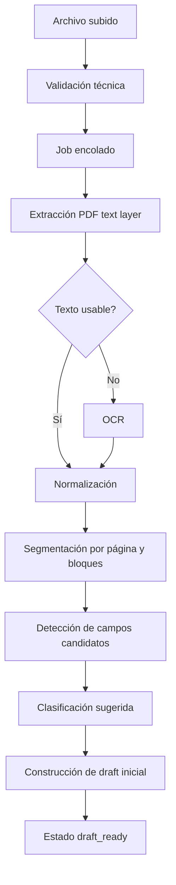

# Spec 02 - Pipeline de extracción documental

**Estado:** Draft  
**Prioridad:** P0  
**Dependencias:** `01-organization-tax-profile.md` para downstream fiscal/contable  
**Bloquea:** draft editable, clasificación utilizable, sugerencias

---

## 1. Propósito

Definir el pipeline técnico que transforma un archivo subido en:

- texto extraído,
- candidatos de campos,
- clasificación sugerida,
- draft persistente,
- trazabilidad completa del procesamiento.

---

## 2. Alcance

Este spec cubre:

- documentos PDF subidos al bucket privado,
- extracción de texto,
- OCR fallback cuando el PDF no tenga capa de texto usable,
- generación de artefactos de extracción,
- creación del draft inicial.

Este spec no cubre todavía:

- emisión de comprobantes,
- decisión contable definitiva,
- tratamiento fiscal definitivo,
- posting final al diario.

---

## 3. Principios

### 3.1 Procesamiento asíncrono
El pipeline MUST ejecutarse fuera del request principal del dashboard.

### 3.2 Persistencia por etapas
Cada etapa SHOULD persistir su output antes de pasar a la siguiente.

### 3.3 Idempotencia
Reintentar el procesamiento no debe duplicar entidades sin control.

### 3.4 Versionado
Cada corrida de procesamiento MUST quedar identificada.

### 3.5 Separación de “hecho detectado” versus “hecho confirmado”
Lo extraído por el sistema no es aún verdad de negocio. Es material para borrador.

### 3.6 IA acotada por snapshot de reglas
Si se usa LLM para intake documental, MUST ejecutarse server-side y MUST recibir
solo el snapshot resumido de reglas relevantes para la organizacion. No debe
recibir toda la normativa DGI en el prompt.

---

## 4. Flujo lógico

---

## 5. Estados del documento

### 5.1 Estados propuestos
- `uploaded`
- `queued`
- `extracting`
- `extracted`
- `draft_ready`
- `error`

### 5.2 Regla
El pipeline automático NO puede dejar el documento en `classified`.

---

## 6. Entidades propuestas

### `documents`
Campos mínimos:
- `id`
- `organization_id`
- `storage_path`
- `original_filename`
- `mime_type`
- `size_bytes`
- `status`
- `uploaded_by`
- `uploaded_at`
- `current_processing_run_id`
- `current_draft_id`

### `document_processing_runs`
Una corrida por intento.

Campos:
- `id`
- `document_id`
- `run_number`
- `triggered_by` (`upload`, `manual_retry`, `reprocess_after_profile_change`)
- `status`
- `started_at`
- `finished_at`
- `failure_stage`
- `failure_message`

### `document_extractions`
Artefacto técnico unificado.

Campos:
- `id`
- `processing_run_id`
- `document_id`
- `engine_type` (`pdf_text`, `ocr`, `hybrid`)
- `engine_name`
- `raw_text`
- `pages_json`
- `blocks_json`
- `detected_language`
- `text_quality_score`
- `ocr_used`
- `created_at`

### `document_field_candidates`
Candidatos detectados antes de validación humana.

Campos:
- `id`
- `document_id`
- `processing_run_id`
- `field_name`
- `field_value_json`
- `source_page`
- `source_bbox_json`
- `extraction_method`
- `confidence_score`

### `document_classification_candidates`
Campos:
- `id`
- `document_id`
- `processing_run_id`
- `candidate_type`
- `candidate_role` (`purchase`, `sale`, `other`)
- `confidence_score`
- `explanation`
- `rank_order`

---

## 7. Requisitos funcionales

### 7.1 Validación técnica inicial
Al subir un archivo, el sistema MUST validar:
- existencia del archivo,
- acceso permitido por organización,
- tamaño máximo,
- MIME soportado,
- hash del contenido.

### 7.2 Encolado
El sistema MUST crear un `document_processing_run` y ponerlo en cola.

### 7.3 Extracción
El sistema MAY usar un proveedor OCR/LLM para interpretar PDF e imagen, pero
MUST devolver un output estructurado validado antes de persistirlo como
artefacto usable.

### 7.4 OCR fallback
Si el texto embebido es inexistente o de baja calidad, el sistema MUST ejecutar OCR.

### 7.5 Normalización
El sistema MUST normalizar:
- saltos de línea,
- espacios,
- codificación,
- numerales,
- fechas candidatas,
- totales monetarios candidatos.

### 7.6 Segmentación
El sistema SHOULD guardar estructura por página y bloques para permitir highlight en la UI.

### 7.7 Candidatos
El sistema MUST generar campos candidatos y clasificación candidata, incluso si la confianza es baja.

### 7.7.1 Contrato de IA
Si el pipeline usa OpenAI en V1, SHOULD usar `gpt-4o-mini` mediante Responses
API con `json_schema` estricto para devolver:
- clasificación,
- hechos extraídos,
- importes,
- confidence,
- warnings,
- explicación breve.

### 7.8 Draft inicial
El sistema MUST crear un draft persistente, aunque tenga warnings.

### 7.9 Error manejable
Si el pipeline falla, el documento MUST quedar en `error` con detalle auditable.

---

## 8. Reglas de calidad

### 8.1 Umbral de texto usable
**OPEN:** definir umbral cuantitativo de “texto usable”.

Propuesta no cerrada:
- score por longitud útil,
- densidad de caracteres válidos,
- proporción de tokens legibles.

### 8.2 Umbral de OCR
**OPEN:** cuándo considerar reintento con motor alternativo.

### 8.3 Duplicados
**OPEN:** qué hacer si se sube exactamente el mismo PDF dos veces.

Opciones:
- permitir duplicado,
- alertar duplicado,
- bloquear por hash + organización.

---

## 9. Clasificación preliminar dentro del pipeline

El pipeline MUST devolver al menos:

- `document_role_candidate`: `purchase` / `sale` / `other`
- `document_type_candidate`: factura, nota de crédito, ticket, etc.
- `document_subtype_candidate`: local, exportación, exento, etc. cuando aplique y sea posible

**OPEN:** si la detección de subtipo vive en este pipeline o más tarde en el motor fiscal.

---

## 10. Draft inicial creado por el pipeline

El draft inicial MUST incluir:

- documento y preview
- texto extraído
- clasificación sugerida
- campos sugeridos
- warnings
- dependencias del perfil organizacional usado
- placeholders para sugerencia contable y fiscal si todavía no se calcularon

### Requisito importante
Si el perfil organizacional no alcanza para sugerencias contables/fiscales, el draft igual MUST existir, pero con esos pasos marcados como `blocked_by_missing_org_profile`.

---

## 11. Eventos de dominio

Eventos sugeridos:
- `document.uploaded`
- `document.processing_requested`
- `document.processing_started`
- `document.text_extracted`
- `document.ocr_applied`
- `document.field_candidates_generated`
- `document.classification_candidates_generated`
- `document.draft_created`
- `document.processing_failed`

---

## 12. APIs internas sugeridas

### `POST /api/documents/:id/process`
Encola procesamiento.

### `POST /api/documents/:id/reprocess`
Reintenta procesamiento.

### `GET /api/documents/:id/extraction`
Devuelve artefacto técnico.

### `GET /api/documents/:id/candidates`
Devuelve campos y clasificación candidatos.

---

## 13. Observabilidad

Métricas mínimas:
- tiempo promedio de procesamiento,
- % de documentos que requirieron OCR,
- % de documentos que llegan a `draft_ready`,
- tasa de errores por etapa,
- tiempo promedio hasta draft inicial disponible.

Logs estructurados:
- `document_id`
- `processing_run_id`
- `organization_id`
- `stage`
- `engine`
- `duration_ms`
- `result`

---

## 14. Escenarios de aceptación

### Escenario A - PDF con texto embebido
**Given** un PDF válido con capa de texto  
**When** se procesa  
**Then** se extrae texto sin OCR  
**And** se crea draft inicial

### Escenario B - PDF escaneado
**Given** un PDF sin texto usable  
**When** se procesa  
**Then** se aplica OCR  
**And** se crea draft inicial con `ocr_used = true`

### Escenario C - Perfil organizacional incompleto
**Given** un documento técnicamente procesable  
**And** la organización no tiene perfil fiscal completo  
**When** termina el pipeline  
**Then** se crea draft  
**And** los pasos fiscales/contables quedan bloqueados

### Escenario D - Error
**Given** una falla del motor OCR  
**When** no se puede recuperar el procesamiento  
**Then** el documento queda en `error`  
**And** se registra `failure_stage` y `failure_message`

---

## 15. Open questions

1. ¿Soportar solo PDF en V1 o también JPG/PNG ya subidos?
2. ¿Bloquear por hash duplicado o solo advertir?
3. ¿Habrá más de un motor OCR / parser?
4. ¿Se recalcula automáticamente si cambia el perfil organizacional?
5. ¿Qué nivel de highlight de origen necesita la UI?

---
