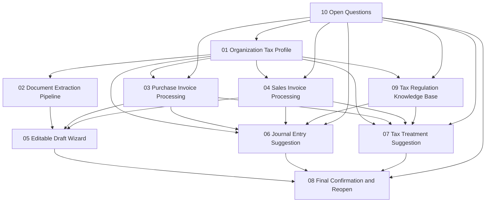

# Convertilabs - Paquete de especificaciones SDD v1

**Estado del paquete:** Draft / Blocked  
**Metodología:** Specs-Driven Development (SDD)  
**Fecha:** 2026-03-12  
**Objetivo:** dejar un paquete de especificaciones listo para entrar al repo, sin cerrar decisiones que todavía no fueron tomadas.

---

## 1. Qué corrige este paquete

La primera versión de los specs anteriores estaba demasiado centrada en la **factura de compra** como primer slice funcional. Eso sigue siendo una porción válida, pero quedó subespecificado un punto que condiciona todo el sistema:

1. **el perfil jurídico y tributario de la organización**, y
2. **la pata de factura de venta**, que no puede tratarse como un “después vemos”.

Por eso este paquete agrega dos specs base:

- `01-organization-tax-profile.md`
- `04-sales-invoice-processing.md`

La regla de diseño que surge de esto es simple:

> la forma jurídica de la organización, su encuadre tributario, su condición frente a CFE y sus perfiles de operaciones de venta/compraventa deben existir como datos maestros antes de pretender clasificar documentos “en serio”.

---

## 2. Cómo usar estos specs

Estos archivos están redactados para ser usados así:

1. **Producto + tributación + contabilidad** responden las preguntas abiertas.
2. Se cierran decisiones bloqueantes.
3. Recién después se generan subtareas técnicas y tickets de implementación.
4. Ningún dev debería inventar comportamiento donde el spec dice `OPEN`, `TBD`, `BLOCKED` o `NO DECIDIDO`.

En otras palabras: primero decidir el negocio, después escribir código. Ya bastante sufrimiento genera hacerlo al revés.

---

## 3. Estructura del paquete

### Fundacionales
- `01-organization-tax-profile.md`
- `02-document-extraction-pipeline.md`

### Flujos documentales
- `03-purchase-invoice-processing.md`
- `04-sales-invoice-processing.md`

### UX y persistencia
- `05-editable-draft-wizard.md`
- `08-final-confirmation-and-reopen.md`

### Motores de sugerencia
- `06-journal-entry-suggestion.md`
- `07-tax-treatment-suggestion.md`

### Normativa y reglas
- `09-tax-regulation-knowledge-base.md`

### Gobierno de decisiones
- `10-open-questions.md`

---

## 4. Dependencias entre specs

---

## 5. Principios obligatorios del sistema

### 5.1 Human-in-the-loop
Ningún documento debe quedar definitivamente clasificado, contabilizado o tributariamente tratado sin confirmación humana explícita.

### 5.2 Persistencia temprana
Todo resultado automático vive como **draft persistente**. No se pierde por cerrar modal, recargar o salir de la sesión.

### 5.3 Versionado
Cada cambio del usuario o del sistema genera historia. Nunca se pisa ciegamente la sugerencia previa.

### 5.4 Reversibilidad controlada
Se puede volver atrás incluso después de una confirmación parcial o final. Ese retroceso no destruye el pasado; crea una nueva revisión.

### 5.5 Separación de ejes
No mezclar en un mismo campo:
- forma jurídica,
- régimen tributario,
- condición frente a IVA,
- condición frente a CFE,
- perfil contable,
- tipo de documento.

### 5.6 Regla de “no inventar”
Si el sistema no tiene suficiente contexto normativo o de master data:
- debe degradar a borrador,
- pedir revisión,
- registrar incertidumbre,
- y jamás vender humo como certeza.

### 5.7 IA con contexto resumido, no normativa completa
En V1 el intake documental puede usar OpenAI `gpt-4o-mini`, pero:
- solo desde servidor,
- con salida estructurada estricta,
- usando snapshots resumidos por organizacion,
- y sin enviar toda la normativa uruguaya en el prompt.

---

## 6. Slice recomendado de implementación

### Slice 0 - bloqueante
- Perfil jurídico/tributario de organización
- Catálogos base
- Versionado de perfil
- Gating para evitar procesar sin encuadre suficiente

### Slice 1 - núcleo documental
- Upload ya existente
- Pipeline de extracción
- Draft persistente
- Modal wizard con autosave

### Slice 2 - factura de compra
- Clasificación
- Campos
- Sugerencia contable
- Sugerencia fiscal
- Confirmación final

### Slice 3 - factura de venta
- Definición de alcance real: ingestión vs emisión
- Perfiles de venta por organización
- Reglas específicas de tratamiento y asiento

### Slice 4 - base normativa viva
- Ingesta
- versionado
- diff
- revisión humana
- publicación de reglas derivadas

---

## 7. Riesgos ya detectados

1. **Confundir forma jurídica con régimen tributario.**  
   Ejemplo: `SAS` y `SRL` son tipos societarios; `Literal E / IVA mínimo` es un encuadre tributario, no una forma jurídica.

2. **Pretender clasificar ventas sin modelar la operación comercial.**  
   Una factura de venta no depende solo del PDF: depende del perfil de la empresa, el cliente, la operación y el tipo de comprobante habilitado.

3. **Dar por sentado que Convertilabs emitirá la factura de venta.**  
   Procesar una factura emitida por otro sistema y emitir CFE no son el mismo problema.

4. **Hacer el wizard antes del versionado.**  
   El resultado es un modal lindo con datos frágiles, o sea, un monumento al arrepentimiento humano.

---

## 8. Convenciones de redacción

- `MUST`: requisito obligatorio.
- `SHOULD`: recomendado; se puede desviar con decisión explícita.
- `MAY`: opcional.
- `OPEN`: pregunta abierta que impide cerrar comportamiento.
- `TBD`: definido en intención, no en detalle.
- `OUT OF SCOPE`: explícitamente fuera del corte actual.

---

## 9. Estado sugerido de los specs

| Archivo | Estado sugerido |
|---|---|
| 01-organization-tax-profile.md | Draft / Blocked |
| 02-document-extraction-pipeline.md | Draft |
| 03-purchase-invoice-processing.md | Draft |
| 04-sales-invoice-processing.md | Draft / Blocked |
| 05-editable-draft-wizard.md | Draft |
| 06-journal-entry-suggestion.md | Draft / Blocked |
| 07-tax-treatment-suggestion.md | Draft / Blocked |
| 08-final-confirmation-and-reopen.md | Draft |
| 09-tax-regulation-knowledge-base.md | Draft / Blocked |
| 10-open-questions.md | Active |

---

## 10. Criterio de salida de esta etapa

Estos specs quedan listos para pasar a implementación recién cuando:

- todas las preguntas `P0` y `P1` de `10-open-questions.md` tengan respuesta,
- exista una taxonomía inicial de organización aprobada,
- exista una decisión explícita sobre alcance de factura de venta,
- exista una decisión explícita sobre qué tributos cubre el V1,
- exista una definición de cuándo un documento queda “clasificado” versus “draft confirmado”.

---
